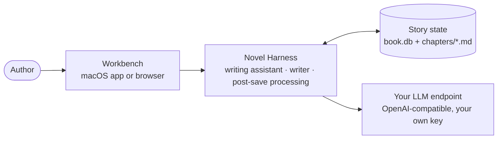
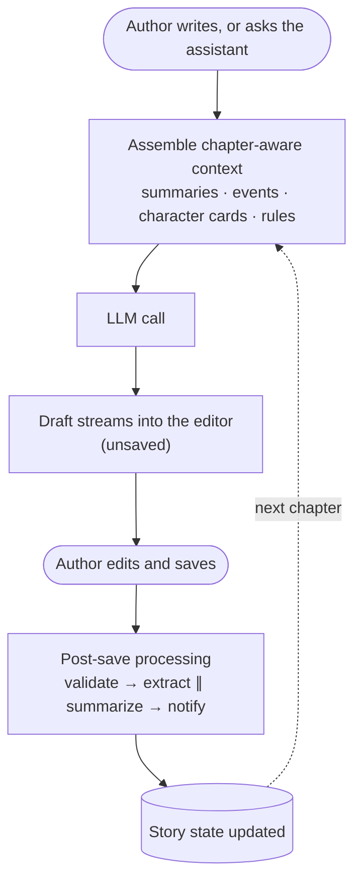
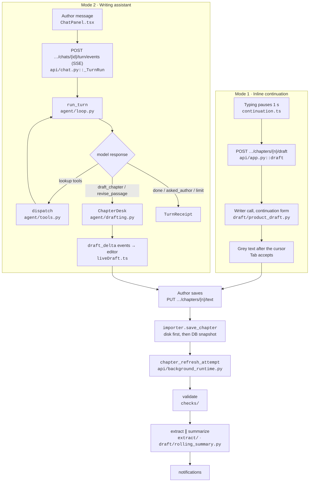
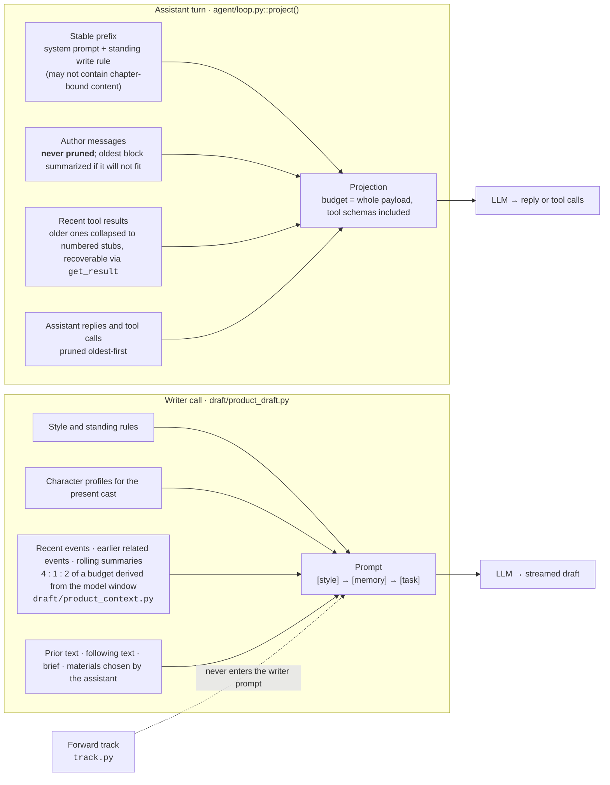
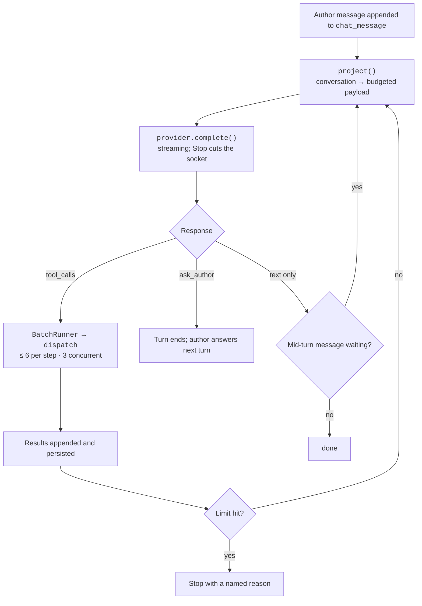
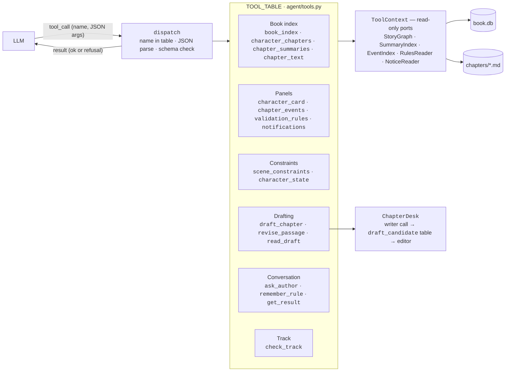
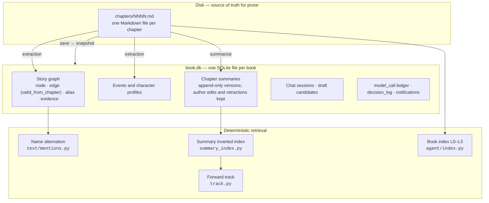
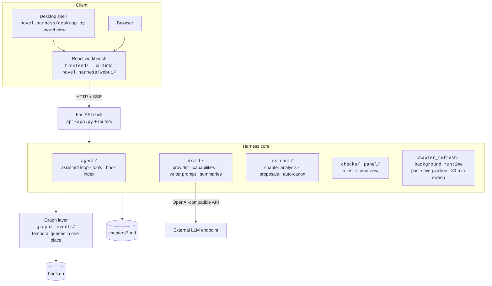
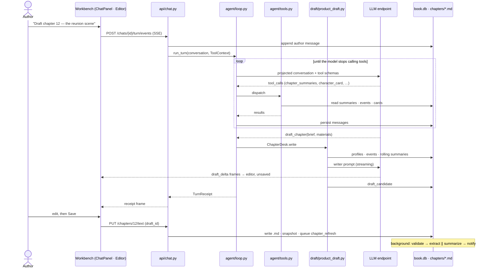
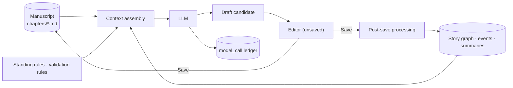

<div align="center">

# Novel Harness

**An AI harness for long-form fiction writing.**
It tracks character states chapter by chapter, maintains a relationship graph between characters, and keeps a summary for every chapter.

[](https://github.com/lxb12123/novel-harness/actions/workflows/ci.yml)
[](https://github.com/lxb12123/novel-harness/releases)
[](LICENSE)
[](pyproject.toml)
[](frontend/package.json)
[](#installation)
[](#model-providers)

English | [简体中文](README.zh-CN.md)

[Quick Start](#quick-start) · [How It Works](#how-it-works) · [Benchmarks](#benchmarks) · [Architecture](#architecture) · [Author Guide](#author-guide) · [Development](#development) · [Roadmap](#roadmap)

</div>

---

## Overview

Novel Harness is a local-first writing workbench for long-form fiction. It connects an LLM to the manuscript, story state, writing tools, and post-save processing instead of treating each writing session as an isolated chat.

Long-form writing is also a state-management problem. As a manuscript grows, character states, relationships, events, chapter summaries, and earlier details become increasingly difficult to keep available through conversation context alone.

Novel Harness keeps that information with the book. It uses deterministic retrieval instead of embeddings, lets model output enter the editor as a draft before the author saves it, and records the token usage and writing context of every model call.

### Project Overview



The author writes in the workbench. The harness assembles chapter-aware context, calls the author's own model endpoint, streams the result back into the editor as a draft, and — once the author saves — updates the story state that the next chapter will draw on.

## Features

1. **Two Writing Modes** — Inline continuation and a tool-using conversational writing assistant.
2. **Draft-First Editing** — Generated text enters the editor as an unsaved draft before the author decides whether to save it.
3. **Chapter-Based Story State** — Character states and story facts are tracked according to where they become valid in the manuscript, without requiring the author to enter chapter numbers manually.
4. **Deterministic Retrieval** — Exact name matching, summary indexes, hierarchical book navigation, and forward-impact lookup without embeddings or vector search.
5. **Post-Save Processing** — Validation, structured extraction, rolling summaries, and notifications run after manuscript changes.
6. **Custom Validation Rules** — Author-defined deterministic checks such as forbidden terms.
7. **Bring Your Own Model Endpoint** — OpenAI-compatible endpoints with per-call input, output, and cache token accounting.
8. **Local-First Storage** — Manuscript chapters remain Markdown files on disk, while derived state is stored in a single SQLite database.

## How It Works



**Two ways to write.** In *inline continuation*, the author pauses typing for a second and a grey continuation appears after the cursor; one model call, no tools. In the *writing assistant*, the author talks to a model that can look things up in the book — chapter list, character cards, events, summaries, prose, rules, notifications — and then draft a whole chapter or revise a passage.

**Drafts go to the editor, not to the book.** Whatever the writer produces streams into the left-hand editor and stays there as an unsaved draft with added lines marked green and removed lines red. The model has no tool that writes to disk. Only the author's Save writes a chapter.

**Saving is what teaches the harness.** After each save, a fixed pipeline runs in the background: validation (the author's own rules), then structured extraction (events, character states, relationships, aliases) in parallel with a rolling chapter summary, then notifications. A background sweep also runs every 30 minutes to fill in whatever is missing.

**Retrieval is deterministic.** The harness never guesses similarity. It matches names exactly, keeps an inverted index over chapter summaries, exposes a four-level book index the assistant descends on its own, and, when the author edits an earlier chapter, looks up which later chapters share its people and objects.

**Every model call is metered.** Input, output, and cache tokens, plus the chapter the call was made for, land in a ledger the author can open from the top bar.

<details>
<summary><strong>✍️ Writing Loop</strong></summary>

<br/>

One complete cycle, with the real entry points. Both modes converge on the same save path.



- **Mode 1** is a single model call with no tools and no disk write. The amount of preceding text sent is computed on the backend from the model's context window (`draft/assemble.py::product_tail_limit`), not hard-coded in the client.
- **Mode 2** starts by appending the author's message to `chat_message` and claiming a per-conversation slot (a second concurrent turn on the same conversation is refused with 409). The turn streams events over SSE; "Stop" is a separate `POST …/stop` so it still works if the stream drops; a message sent mid-turn goes through `POST …/say` into a mailbox and is merged at the next step boundary.
- **Save** writes the Markdown file first, then a snapshot row, then queues a `chapter_refresh_attempt`. The pipeline is lease/fence protected and persisted, so a process restart resumes it. Failed attempts are retried automatically up to 3 times; blocked ones (a rule fired) are not.

</details>

<details>
<summary><strong>🧠 Context Assembly</strong></summary>

<br/>

There are two context builders, and they are deliberately separate: the assistant's conversation is projected per turn; the writer's prompt is assembled per draft.



**What enters the assistant's context.** A stable prefix (system prompt plus the author's standing writing rule — by construction it cannot contain anything bound to a chapter), the author's messages, recent tool results, and the assistant's own replies and calls. Tool schemas are counted in the budget because they are part of the payload actually sent.

**How it is selected and what is omitted.** Pruning follows rebuildability, in a fixed order: old tool results first (re-querying returns fresher data), then old tool calls, then intermediate reasoning, and the author's words last — never. If even that does not fit, the oldest block of author messages is summarized; if it still does not fit, the turn stops with `context_full` rather than silently dropping something.

**What enters the writer's prompt.** Style and standing rules; profiles of the characters present; confirmed events from recent chapters, earlier related events, and rolling summaries of earlier chapters (budgeted 4 : 1 : 2 from the model's window, in that order so the stable part of the prompt stays cacheable); then the task — prior text, following text if the author is editing an earlier chapter, the brief and materials the assistant chose. When an entire chapter is being rewritten, the current text of that chapter is deliberately left out; it is only included when a single passage is revised.

**What persists between turns.** The conversation itself (append-only in SQLite), rules the assistant recorded with `remember_rule`, and everything in the story state. Tool results are not persisted into the story state; they are re-derived on demand.

**What is kept apart.** The forward track — later chapters that mention the same people and objects as the passage being edited — is used for checking, never for writing. A later chapter's summary may contain what a reader of this chapter should not know yet, so `draft/` is forbidden from importing `track.py` (`tests/test_track_isolation.py`).

</details>

<details>
<summary><strong>🤖 Harness / Agent Loop</strong></summary>

<br/>

The loop belongs to the model; the stopping conditions belong to the code. `agent/loop.py::run_turn` decides nothing about *which* tool to call — it projects the conversation, calls the model, dispatches whatever the model asked for, persists every new message, and stops when a limit is hit.



**Limits** (`TurnLimits`, defaults from code; the API layer raises `parallel_tools` from 1 to 3):

| Limit | Default | What it stops |
|---|---|---|
| `max_steps` | 8 | model calls per turn |
| `max_tokens` | 300,000 | input + output tokens per turn, including writer calls made by tools |
| `max_calls_per_step` | 6 | tool calls the model may request in one step |
| `repeat_limit` | 3 | identical `(tool, arguments)` calls |
| `tool_failure_limit` | 3 | consecutive failures, counted per tool and across tools |
| `unknown_name_limit` | 3 | distinct names that turned out not to be in the roster |

**Stopping conditions** (`StopReason`): `done`, `asked_author`, `step_limit`, `cost_limit`, `batch_too_wide`, `author_stopped`, `repeated_call`, `no_output`, `tool_stuck`, `context_full`, `model_unreachable`. Each has one author-facing sentence, defined in one place (`stop_wording()`).

**Failure handling.** A tool that is unknown, receives malformed JSON, fails schema validation, or refuses returns `ok=False` as a normal result that the model sees and can correct; it is not an exception. Provider errors are classified by HTTP status (auth / quota / unreachable / upstream / unknown), never by parsing the provider's error text.

**Persistence and resume.** Every message is written to `chat_message` as soon as it exists. If the process dies mid-turn, the next turn finds the tool calls that still lack results, runs them, and continues. Every completed model call is recorded in the `model_call` ledger via a required `ledger` callback; an interrupted streaming call is recorded with its token counts left empty rather than estimated.

**Streaming.** The turn is exposed as `text/event-stream` with three frame types (`turn`, `receipt`, `failed`); the last frame is the same `TurnReceipt` the non-streaming route returns. Draft text arrives as `draft_delta` events and is typed into the editor at the pace it arrives.

</details>

<details>
<summary><strong>🔧 Tool System</strong></summary>

<br/>

The tool table *is* the permission boundary. The function schemas sent to the model are generated from `TOOL_TABLE` in `agent/tools.py`; there is no second copy. Every tool returns narrowed Pydantic types — names and scalars, never raw graph nodes — and none of them writes prose to disk.



| Group | Tool | Answers |
|---|---|---|
| Book index (cheap → expensive) | `book_index` | chapter titles and the roster |
| | `character_chapters` | in which chapters several people appear together (text mentions and confirmed events, reported separately) |
| | `chapter_summaries` | rolling summaries for a chapter range, and which chapters lack one |
| | `chapter_text` | the prose of one chapter, read from disk |
| Panels | `character_card` | basic info, aliases, current situation, relations, events for one character |
| | `chapter_events` | confirmed events in a chapter range |
| | `validation_rules` | the rule catalog and the latest check for a chapter |
| | `notifications` | open notifications and pending proposals |
| Constraints | `scene_constraints` | who is present in a chapter, counted from its text |
| | `character_state` | where someone is and what state they are in, as of a chapter |
| Drafting | `draft_chapter` | writes a whole chapter from a brief and materials; result streams to the editor |
| | `revise_passage` | rewrites, inserts after, or deletes one located passage |
| | `read_draft` | returns a draft's full text by id (the most expensive call) |
| Conversation | `ask_author` | stops the turn with a question and short options |
| | `remember_rule` | records a standing rule with an expiry the model must state |
| | `get_result` | brings back a tool result that was collapsed out of context |
| Track | `check_track` | checks a passage against later chapters that share its people and objects |

Drafting tools take a `brief` and `materials` — instructions for the writer, not prose — so the model cannot hand the harness a paragraph and ask it to overwrite a chapter. `draft_chapter` and `revise_passage` are the only tools marked concurrent; a batch of three drafts runs in parallel.

</details>

<details>
<summary><strong>📚 Story State</strong></summary>

<br/>



**Persistent state** lives in two places. The manuscript is Markdown on disk — the author may edit it in any editor, and a sync reads changes back. Everything derived lives in `book.db`: a story graph (7 node labels: Character, Location, Faction, Foreshadow, Object, StateDim, Chapter; 7 edge types such as `LOCATED_AT`, `RELATED_TO`, `HAS_STATE`, `OWNS`), events with participants and knowers, character profiles, chapter summaries, conversations, draft candidates, the call ledger, and an append-only `decision_log` of every confirmation the author made.

**Time is a chapter number.** Each fact records the chapter from which it holds. "Where is this character as of chapter 151" is answered by one query — the latest fact in that slot whose `valid_from_chapter` is not later than 151 — implemented exactly once in `graph/queries.py`. The author never types a chapter number; it is computed from where the supporting quote sits in the manuscript.

**Facts have a scope.** `CANON` (confirmed; enters prompts), `PROVISIONAL` (extracted, awaiting confirmation; shown greyed, never asserted), `PLANNED` (the author's future; never enters a prompt), `REJECTED`. Extraction results that hit no exception bucket are promoted to `CANON` automatically and can be corrected afterwards; a proposal card is only raised when the machine would overrule something the author edited by hand, or for a new character / a low-confidence protagonist.

**Turn-scoped state** — projections, tool results, the mailbox — lives only for the duration of a turn. **Conversation history** is append-only in `chat_session` / `chat_message` with an optimistic-concurrency check.

**Retrieval** is four deterministic paths: exact matching of registered names and aliases; an inverted index from chapter summaries to the entities they mention; a four-level book index (titles and roster → co-occurrence chapters → summaries → prose) the assistant descends on its own; and the forward track, which finds later chapters relevant to a passage being edited. There is no embedding model and no vector store.

</details>

## Benchmarks

No benchmark results are published yet. The benchmark suite below describes the planned evaluation framework; earlier internal evaluations were retired together with the features they measured. Historical raw records remain preserved for reference.

The question the suite is meant to answer: *does writing through Novel Harness produce more consistent long-form fiction than writing with the same model directly?*

| Benchmark | Measures | Status |
|---|---|---|
| Character Consistency | identity, personality, relationships, and abilities remain stable over a long manuscript | Under development |
| Plot Consistency | timeline, event, state, and causal contradictions | Under development |
| Long-Term Recall | whether a fact established early is still used correctly many chapters later | Under development |
| Context Efficiency | input, output, cached, and retrieved tokens per chapter | Under development |
| Retrieval Accuracy | whether the right character or fact is found when needed | Under development |
| Continuity | adjacent chapters read as a natural continuation | Under development |
| Instruction Adherence | style, viewpoint, and standing rules hold over time | Under development |
| Cost | tokens and API spend for a novel of fixed length | Under development |
| Latency | wall-clock time per writing turn and per chapter | Under development |

<details>
<summary><strong>Benchmark Methodology</strong></summary>

<br/>

**Arms.** Plain LLM vs. Novel Harness, extensible to Plain LLM vs. LLM + full history vs. Novel Harness. All arms must use the same model and model version, the same story setup, the same writing tasks, the same target length, temperature, reasoning setting, and number of runs. The harness arm may not use a stronger model than the baseline.

**Three layers of evaluation.**

1. *Deterministic checks* — names, ages, locations, relationships, dates, objects, and events that have already happened are verified by exact matching against the ground truth. Same discipline as the engine itself: set membership, no interpretation.
2. *LLM judge* — character consistency, continuity, style, and instruction adherence are scored blind with a fixed rubric and fixed prompt, with A/B order randomized.
3. *Human evaluation* — reserved for a formal round.

**The three results worth showing first.** Long-Term Recall as recall accuracy vs. chapter distance (a fact from chapter 1 checked at chapters 5, 10, 20, 50); Context Efficiency as average input tokens per chapter, total tokens per novel, and tokens per 1,000 generated words; Character / Plot Consistency as errors per 10k words, split into character errors, plot contradictions, continuity errors, and instruction violations.

**Reproducibility record.** Each run records provider, model, model version, temperature, reasoning configuration, git commit SHA, dataset version, date, and number of runs, and keeps machine-readable results (JSON / JSONL / CSV).

**Integrity rules.** No selective dropping of bad runs, no baseline prompt weakened after the fact, no information given to the harness arm that the baseline does not get, no model swap between arms, no hand-edited judge output, no reporting only the best run.

**Instruments already in the repository.**

- `model_call` ledger — input, output, and cache tokens for every call, with the chapter and capability it served. This is the raw material for Context Efficiency and Cost.
- `synth/build.py` — builds a synthetic 12-chapter booklet into a real database, for tests that must not use a copyrighted novel.
- `scripts/roster_coverage.py` with `docs/M1_ROSTER_METRIC.md` — a pre-registered metric for how many name mentions the roster resolves.
- `runs/*.jsonl` — raw records of the retired leak-rate gate, kept frozen.

</details>

<details>
<summary><strong>Detailed Results</strong></summary>

<br/>

TBD. Two earlier pre-registered gates existed and were retired with the features they measured:

- `docs/EVAL_PROTOCOL.md` and its amendments — a leak-rate gate for a knowledge-boundary feature that was removed on 2026-08-25. See `docs/EVAL_PROTOCOL_RETIREMENT.md`.
- `docs/M3_GATE_PROTOCOL.md` — a false-positive gate for built-in consistency rules, all of which have since been removed. See `docs/M3_GATE_PROTOCOL_RETIREMENT.md`.

Their protocols are frozen and must not be reused for new measurements; a new benchmark requires a new pre-registration committed before any result exists.

</details>

## Architecture



Three layers matter: the **workbench** (one React app, served by the desktop shell or a browser), the **FastAPI shell** (routes only; no business logic), and the **harness core**, which sits on a graph layer that is the only code allowed to write temporal SQL. The manuscript stays on disk beside the database.

<details>
<summary><strong>🎛 Harness Core</strong></summary>

<br/>

| Package | Role |
|---|---|
| `agent/` | The writing assistant: `loop.py` (turn loop, limits, projection), `tools.py` (tool table and dispatch), `ports.py` (the read-only `ToolContext`), `index.py` (four-level book index), `panels.py` (right-panel readers), `drafting.py` (`ChapterDesk`: writer call, candidates, streaming to the editor), `model.py` (streaming adapter with cancellation), `store.py` (conversation persistence), `rules.py` (standing rules) |
| `draft/` | Model access and the writer: `provider.py` (the single OpenAI-compatible exit), `capabilities.py` (endpoint registry, budgets, reasoning dialects), `product_draft.py` (chapter → draft, the only implementation), `product_context.py` / `product_assemble.py` (memory budget and prompt layout), `rolling_summary.py`, `length.py` (bilingual length policy), `windows.py` (model window discovery) |
| `extract/` | Post-save chapter analysis: strict JSON models, deterministic evidence location, alias resolution, proposals, automatic promotion to canon, retry accounting |
| `checks/` | Validation rules as pure functions `check(ctx) -> list[Issue]`; the catalog, the author-defined `forbidden_literal`, and the service that runs them |
| `panel/` | Scene view and constraint derivation used by both writing modes |
| `chapter_refresh.py` · `api/background_runtime.py` | The fixed post-save DAG and the dispatcher that runs it, with leases and fencing tokens |
| `summary_index.py` · `track.py` · `advisory_review.py` | Inverted index over summaries; forward track for edits to earlier chapters; an after-save advisory check that only notifies |
| `declare.py` · `importer.py` · `onboarding.py` · `focus.py` | Author declarations anchored by quotes; TXT import and disk sync; new-book bootstrap; which chapter the author is currently on |

</details>

<details>
<summary><strong>🖥 Frontend & Desktop</strong></summary>

<br/>

- **Stack**: React 18, Vite, TypeScript, CodeMirror 6 (editor), TanStack Query (server state), Zustand (coordinates only), `@xyflow/react`.
- **Layout**: top bar (settings, activity log, a status light for background processing) · left rail (bookshelf and chapter list) · centre editor, which splits in half when the writing assistant is open · right panel with five tabs: Roster, Rules, Events, Summary, Notifications.
- **Editor behaviours**: grey inline continuation after a 1 s pause; drafts typed in at arrival pace; unsaved changes shown as a diff against the last saved version.
- **Build**: `npm run build` emits into `src/novel_harness/webui/` — inside the Python package — so `uv build` ships the workbench and FastAPI serves it at `/`. Vite's `outDir` and `api/app.py::_DIST` are pinned to each other by a test.
- **Desktop shell**: `novel_harness/desktop.py` calls `api/launch.py::prepare()` (create or migrate the database, bind a port), runs the server on a worker thread, and opens one pywebview window on the system WebKit view. PyInstaller packages it; `scripts/build_dmg.sh` produces the DMG. Logs go to `~/Library/Logs/Novel Harness/novel-harness.log` because a windowed app has no terminal.
- **Contract test**: `tests/test_frontend_contract.py` dumps real API responses into `frontend/src/__fixtures__/api.json`; component tests consume the same file, so a backend shape change fails on both sides.

</details>

<details>
<summary><strong>💾 Persistence</strong></summary>

<br/>

- **Manuscript**: `chapters/NNNN.md` under the book's folder. Chapter numbers come from file order on import; titles come from the first line. The author may edit these files in any editor; the workbench reconciles on focus.
- **Database**: one SQLite file per book, WAL mode, foreign keys on. Schema changes are numbered migrations under `src/novel_harness/migrations/`; before any migration runs on a non-empty database, a backup is written next to it (`book.db.升级前备份-<date>-第N版.db`, via `VACUUM INTO`).
- **Temporal facts**: edges store only `valid_from_chapter`; "current as of chapter N" is derived at read time by `graph/queries.py`. A test suite forbids temporal SQL anywhere else.
- **Append-only records**: `decision_log` (author confirmations), `chat_message`, chapter summary versions. Edits and retractions add rows; nothing is deleted.
- **Settings**: `~/.config/novel-harness/settings.json` (0600), separate from the book so one machine can serve several books and a key never travels with a manuscript.
- **Desktop locations**: database in `~/Library/Application Support/Novel Harness/`, books in `~/Documents/Novel Harness/`.

</details>

<details>
<summary><strong>🔌 Model Providers</strong></summary>

<br/>

All model traffic goes through one function, `draft/provider.py::complete()`, using the OpenAI-compatible chat-completions protocol. The author supplies an endpoint, a model name, and a key in *AI Settings → Connection*.

A capability registry (`draft/capabilities.py`) records, for exact endpoint + model routes that have been verified, the context window, output limit, and which reasoning dialect the route accepts. Routes currently registered:

| Endpoint | Models |
|---|---|
| `api.openai.com` | `gpt-5.6`, `gpt-5.6-sol`, `gpt-5.6-terra`, `gpt-5.6-luna` |
| `api.deepseek.com` | `deepseek-v4-pro`, `deepseek-v4-flash` |
| `api.anthropic.com` (OpenAI-compatible endpoint) | `claude-opus-5`, `claude-sonnet-5`, `claude-fable-5`, `claude-opus-4-8`, `claude-opus-4-7`, `claude-opus-4-6`, `claude-sonnet-4-6`, `claude-opus-4-5`, `claude-sonnet-4-5`, `claude-haiku-4-5` |
| `openrouter.ai` | `anthropic/claude-opus-4.8` |
| `opencode.ai/zen/go` | `deepseek-v4.1-flash` |

Any other OpenAI-compatible route works but is treated as unknown: reasoning is kept off, and the context window is taken from the author's own *Context window* setting rather than guessed. Structured-output calls request `response_format: json_object` and fall back per route if the endpoint rejects it. Cache-token fields from different vendors are normalized into one `CacheUsage` record.

</details>

<details>
<summary><strong>Sequence · "Draft this chapter" through the assistant</strong></summary>

<br/>



</details>

<details>
<summary><strong>Data Flow</strong></summary>

<br/>

Where information moves, as opposed to when. The manuscript feeds context; the model produces a draft; only a save feeds the story state, which then feeds the next context.



</details>

## Quick Start

1. **Install** — download the latest `NovelHarness-<version>-macOS-arm64.dmg` from [Releases](https://github.com/lxb12123/novel-harness/releases), drag *Novel Harness* into *Applications*, then right-click → Open the first time (see [Installation](#installation) for why).
2. **Start a book** — the first screen offers a blank book or *Import an existing novel* from a TXT file. Chapters are split automatically on headings such as `第一章`, `Chapter One`, or `Ch. 3`.
3. **Connect a model** — open ⚙ *AI Settings → Connection*, enter the endpoint, model, and API key, then *Apply*. The status light beside the pen turns green; background processing starts within seconds.
4. **Write** — type in the editor; pause for a second and a grey continuation appears (Tab accepts). Open the writing assistant to draft a chapter or revise a passage; its draft appears in the editor. *Save* writes the chapter and triggers post-save processing.

## Installation

### macOS (Apple silicon)

Download the DMG from [Releases](https://github.com/lxb12123/novel-harness/releases) and drag the app into *Applications*. Books are stored in `~/Documents/Novel Harness/`; the database in `~/Library/Application Support/Novel Harness/`; logs in `~/Library/Logs/Novel Harness/`.

<details>
<summary><strong>macOS says "damaged and can't be opened"</strong></summary>

<br/>

The app is signed ad-hoc and not notarized (no Apple developer certificate), so Gatekeeper blocks the first launch. Nothing is broken. Either:

- right-click the app in *Applications* → **Open** → **Open**, once; or
- run in Terminal: `xattr -dr com.apple.quarantine "/Applications/Novel Harness.app"`

</details>

### Build from source (all platforms — web workbench)

Requires Python 3.12, [uv](https://docs.astral.sh/uv/), and Node 22. There is no Windows or Linux desktop package yet; on those platforms the workbench runs in the browser.

```bash
git clone https://github.com/lxb12123/novel-harness.git
cd novel-harness
uv sync
cd frontend && npm ci && npm run build && cd ..
uv run python -c "from pathlib import Path; from novel_harness.api.launch import launch; launch(Path('book.db'))"
```

This creates `book.db`, starts the server on `127.0.0.1`, and opens the workbench in a browser. The server has no authentication and binds to localhost only.

To build the macOS package yourself: `bash scripts/build_dmg.sh` (Mac only; produces a DMG for the current architecture).

## Author Guide

The workbench is designed for authors who do not use a terminal. The essentials:

- **Workbench layout** — bookshelf and chapter list on the left, the manuscript in the centre, and five panels on the right: *Roster*, *Rules*, *Events*, *Summary*, *Notifications*. The writing assistant opens beside the editor.
- **What runs after Save** — the chapter is checked against the author's rules, its events and character states are extracted into the roster and events panels, and a chapter summary is generated. Everything the machine writes is visible in those panels and can be edited or retracted.
- **The status light** — grey means no model is connected (click it to configure); green means idle; yellow means background processing is running.
- **Activity log** — every model call, extraction run, and confirmation, with the chapter it concerned and the tokens it used, is listed under the log entry in the top bar.
- **Your files** — chapters are plain Markdown files in the book's folder and can be opened in any editor; the workbench picks up external edits.

A full author guide is planned under `docs/`; until then, the workbench's own empty states explain the next step at each panel.

## Project Structure

```text
novel-harness/
├── src/novel_harness/   # engine, FastAPI shell, desktop shell, migrations, built web UI
├── frontend/            # React workbench (Vite + TypeScript + CodeMirror 6)
├── desktop/             # PyInstaller spec and icons for the macOS package
├── docs/                # ARCHITECTURE.md (entry point), ADRs, protocols, plans
├── tests/               # pytest suite, including architecture guards and contract tests
├── scripts/             # build_dmg.sh, demo.sh heartbeat, measurement scripts
├── synth/               # synthetic booklet builder (instrument, not shipped)
└── runs/                # frozen raw records of retired evaluations
```

<details>
<summary><strong>📁 Detailed Project Structure</strong></summary>

<br/>

```text
src/novel_harness/
├── agent/               # writing assistant: loop, tools, ports, index, panels, drafting, model, store, rules
├── api/                 # FastAPI shell: app.py + routers (chat, extraction, review, validation,
│                        #   notifications, activity, characters, reconcile, background_status),
│                        #   deps.py (assembly), launch.py (prepare/launch), background_runtime.py
├── checks/              # rule catalog, custom forbidden_literal, validation service
├── draft/               # provider, capabilities, windows, product_draft, product_context,
│                        #   product_assemble, rolling_summary, summarize, length, generate, passage
├── events/              # event and character-profile models and stores
├── extract/             # chapter analysis models/prompt, evidence location, aliases,
│                        #   proposals, auto_canon, runner, service, retry control
├── graph/               # StoryGraph interface, SQLite store, queries.py (temporal SQL, once), models
├── migrations/          # numbered SQL migrations
├── panel/               # scene view, scope, constraints
├── text/                # chapterize, anchor (para_index, quote, occurrence), mentions, language
├── webui/               # built frontend (generated; not in git)
├── advisory_review.py   # after-save advisory check against later chapters (notify only)
├── chapter_refresh.py   # fixed post-save DAG with leases and fencing
├── declare.py           # author declarations anchored by quotes
├── desktop.py           # pywebview shell
├── focus.py             # which chapter the author is on; frontier chapter
├── importer.py          # TXT import, chapter files, sync
├── onboarding.py        # new-book bootstrap
├── settings.py          # BYOK settings file
├── summary_index.py     # inverted index over chapter summaries
├── summary_schedule.py  # 30-minute sweep planning
├── track.py             # forward track for edits to earlier chapters
└── db.py, ids.py, decisions.py, project.py, corrections.py, notices.py, …

frontend/src/
├── components/          # TopBar, LeftRail, CenterEditor, CodeEditor, ChatPanel, RightPanel,
│                        #   RosterTab, SummaryTab, ProposalReviewTab, SettingsDrawer, ModelGuide, …
├── api/                 # client, hooks (TanStack Query), turnStream (SSE), types
├── __fixtures__/        # api.json — dumped from the real backend by pytest
├── continuation.ts      # inline continuation trigger policy
├── liveDraft.ts · typewriter.ts · editMarks.ts · diff.ts   # drafts streaming into the editor
└── chat.ts · store.ts · language.ts · …

docs/
├── ARCHITECTURE.md      # system design and the authoritative "current state" section
├── UI_ARCHITECTURE.md   # workbench design and route contract
├── adr/                 # architecture decision records (0001–0053)
├── EVAL_PROTOCOL*.md · M3_GATE_PROTOCOL*.md   # frozen, retired evaluation protocols
├── ROADMAP.md · PLAN.md · M4_DESIGN.md
```

</details>

## Development

Read `docs/ARCHITECTURE.md` first, then the ADR for anything you intend to change. `CLAUDE.md` lists the project's conventions and the mistakes that matter most.

| Task | Command |
|---|---|
| Environment | `uv sync` (Python 3.12) · `cd frontend && npm ci` (Node 22) |
| Backend, hot reload | `NH_DB=book.db uv run uvicorn novel_harness.api.app:app --port 8000 --reload` |
| Frontend, hot reload | `cd frontend && npm run dev` (proxies `/api` to port 8000) |
| Tests | `uv run pytest -q` · `uv run ruff check .` · `cd frontend && npm test` |
| Integration build | `cd frontend && npm run build` then launch via `novel_harness.api.launch.launch` |
| Package | `uv build` (wheel includes the built web UI) · `bash scripts/build_dmg.sh` (macOS) |
| End-to-end heartbeat | `bash scripts/demo.sh` |

Contract between frontend and backend: after changing an API response shape, run `NH_UPDATE_FIXTURES=1 uv run pytest tests/test_frontend_contract.py` and review the diff of `frontend/src/__fixtures__/api.json`. See `frontend/README.md` for the frontend workflow.

CI runs lint, pytest, the frontend build and tests, and a packaging check that the wheel contains the web UI. Tagging `X.Y.Z` builds the macOS package on GitHub's Apple-silicon runners and attaches it to a release.

## Roadmap

Current milestone status is tracked in [`docs/ROADMAP.md`](docs/ROADMAP.md); the authoritative description of what exists today is the *current state* section of [`docs/ARCHITECTURE.md`](docs/ARCHITECTURE.md#当前状态).

- **Benchmark suite** — the framework above, with a pre-registered protocol committed before any result.
- **Real-book acceptance** — remaining acceptance items (for example chapter splitting against a table of contents) on a full-length manuscript.
- **Desktop packages beyond Apple silicon** — Intel macOS, Windows, and Linux are not packaged; notarization requires a developer certificate.
- **Author guide** under `docs/`.
- **PyPI** — deliberately deferred until the package name is final.

## Contributing

Issues and pull requests are welcome. Before changing code:

1. Read [`docs/ARCHITECTURE.md`](docs/ARCHITECTURE.md) and the relevant [ADR](docs/adr/); several features were removed on purpose and each removal records the condition under which it would return.
2. Keep the rules interface: a validation rule is a pure function `check(ctx: CheckContext) -> list[Issue]`, anchored by `(para_index, quote_text, occurrence_k)`, never by character offsets.
3. Run `uv run pytest -q`, `uv run ruff check .`, and `cd frontend && npm test` — the suite includes architecture guards that fail on temporal SQL outside `graph/`, on numbers copied between documents, and on chatty UI copy.

## License

[Apache License 2.0](LICENSE).
