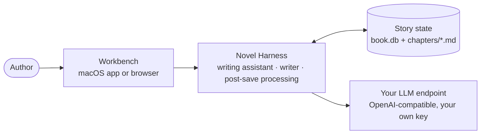
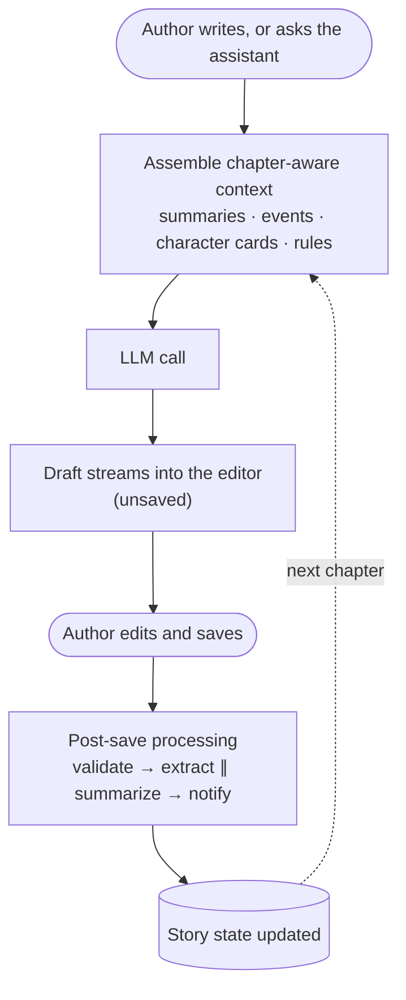
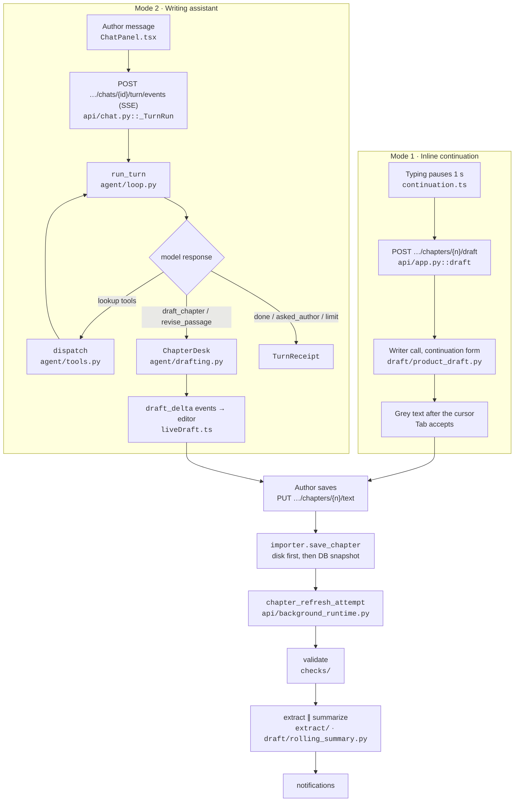
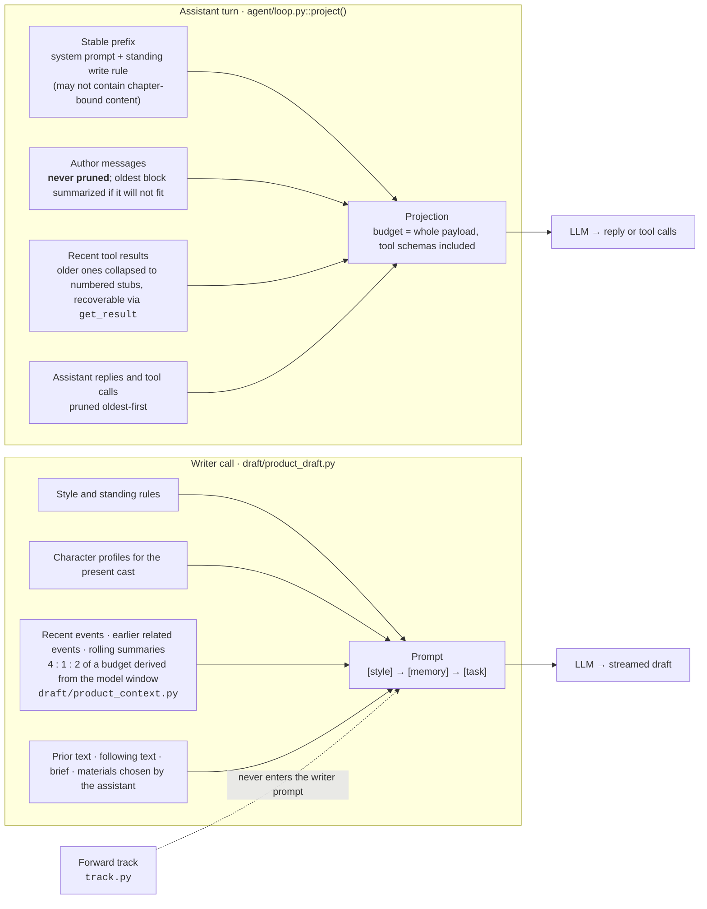
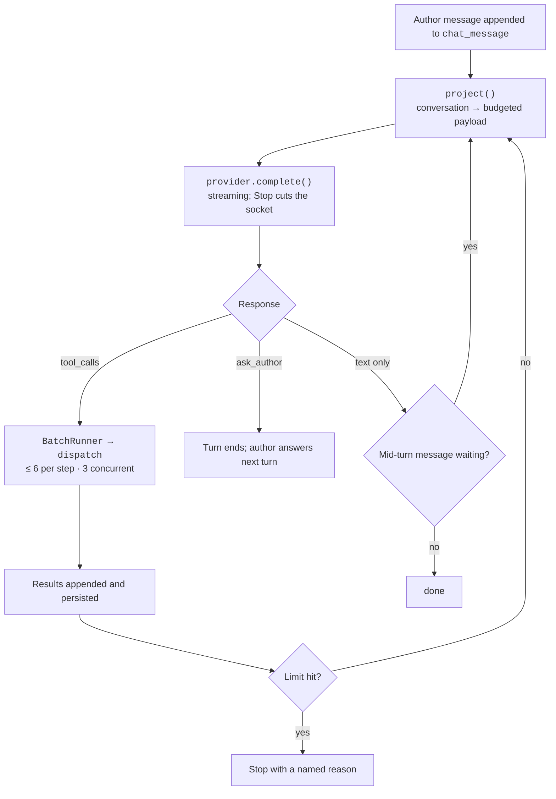
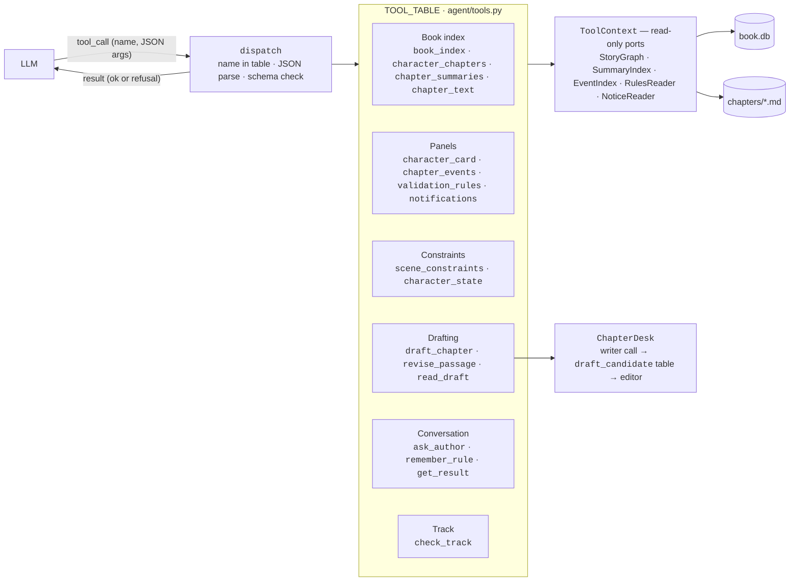
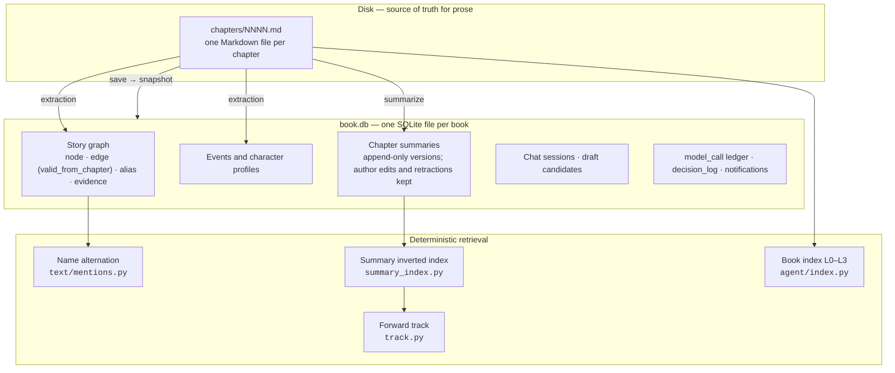
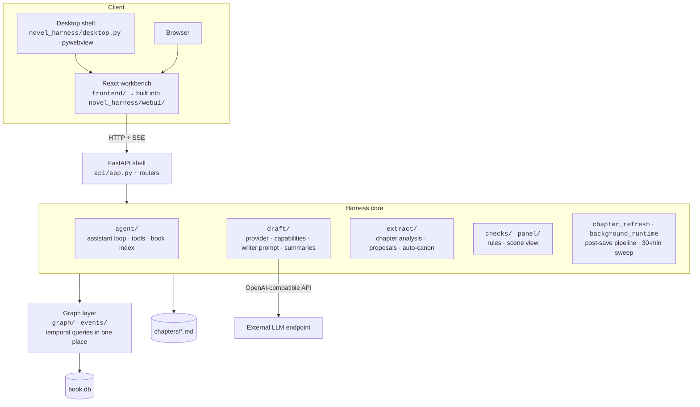
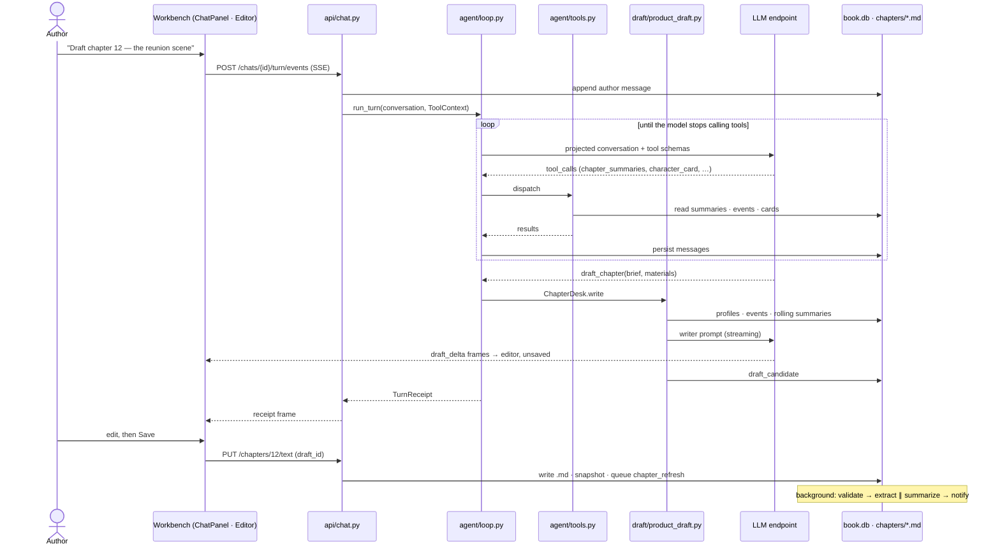
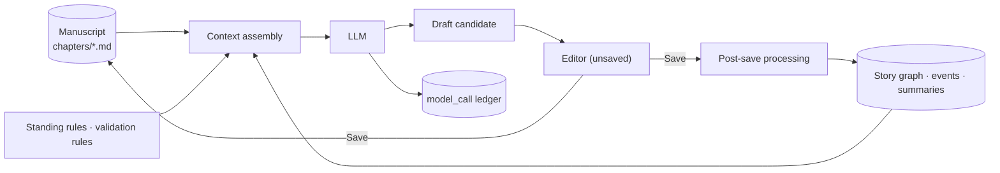

<div align="center">

# Novel Harness

**面向长篇小说写作的 AI Harness。**
按章节记录人物状态，维护人物关系图谱，并为每一章保存总结。

[](https://github.com/lxb12123/novel-harness/actions/workflows/ci.yml)
[](https://github.com/lxb12123/novel-harness/releases)
[](LICENSE)
[](pyproject.toml)
[](frontend/package.json)
[](#安装)
[](#模型服务)

[English](README.md) | 简体中文

[快速开始](#快速开始) · [工作原理](#工作原理) · [评测](#评测) · [架构](#架构) · [作者指南](#作者指南) · [开发](#开发) · [路线图](#路线图)

</div>

---

## 概述

Novel Harness 是一个面向长篇小说的本地优先写作工作台。它把 LLM 接到正文、故事状态、写作工具和保存后的整理流程上，而不是把每次写作都当成一段彼此孤立的对话。

长篇写作同样是一个状态管理问题。随着篇幅增长，人物状态、人物关系、事件、章节总结和早先细节，越来越难仅依赖对话上下文长期维持。

Novel Harness 把这些信息跟随书稿保存。检索采用确定性机制而不是 embedding；模型生成的内容先作为草稿进入编辑器，由作者决定是否保存；每次模型调用的 token 用量和对应写作上下文都有记录可查。

### 项目全貌



作者在工作台里写作。Harness 组装与当前章节相关的上下文，调用作者自己配置的模型端点，把结果以草稿形式流回编辑器；作者保存之后，故事状态随之更新，供下一章使用。

## 功能

1. **两种写作方式** — 行内续写，以及可调用工具的对话式写作助手。
2. **草稿优先** — 生成内容先以未保存草稿进入编辑器，再由作者决定是否写入书稿。
3. **按章节维护故事状态** — 人物状态和故事事实根据其在正文中的生效位置记录，作者无需手工填写章号。
4. **确定性检索** — 使用称呼匹配、总结索引、分层书内目录和后续章节反查，不使用 embedding 或向量检索。
5. **保存后自动整理** — 书稿保存后执行检验、结构化抽取、滚动总结和通知。
6. **自定义检验规则** — 支持禁用词等由作者定义的确定性检查。
7. **自带模型端点** — 支持 OpenAI-compatible endpoint，并记录每次调用的输入、输出和缓存 token。
8. **本地优先存储** — 正文以 Markdown 文件保存在磁盘，派生状态保存在单文件 SQLite 中。

## 工作原理



**两种写作方式。** *行内续写*：作者停笔一秒，光标后出现灰色续写建议；一次模型调用，不调用工具。*写作助手*：作者与模型对话，模型可以查阅书内资料——章目录、角色卡、事件、章节总结、正文、检验规则、通知——然后起草整章或修改某一段。

**草稿进入编辑器，而不是直接写入书稿。** 写手生成的文字流入左侧编辑器，以未保存草稿的形式停留，新增行标绿、删除行标红。模型没有任何写入磁盘的工具；只有作者的「保存」会写入章节。

**保存是 Harness 学习的时机。** 每次保存后，后台运行一条固定流水线：检验（作者自定义的规则），随后结构化抽取（事件、人物状态、关系、别名）与章节滚动总结并行，最后生成通知。后台每 30 分钟另有一轮全书扫描，补齐缺失的部分。

**检索是确定性的。** Harness 不做相似度猜测：精确匹配称呼，对章节总结建立倒排索引，提供一份四层书内目录供助手自行逐层深入；作者修改早先章节时，反查后续哪些章节涉及同样的人物和物件。

**每次模型调用都有记录。** 输入、输出与缓存 token，以及这次调用服务的章节，都记入账本，作者可从顶栏的活动记录查看。

<details>
<summary><strong>✍️ Writing Loop · 写作循环</strong></summary>

<br/>

一次完整循环，标注真实入口。两种方式最终汇入同一条保存路径。



- **方式一**是一次模型调用，不带工具，不写磁盘。送给模型的上文长度由后端按模型上下文窗口计算（`draft/assemble.py::product_tail_limit`），前端不写死。
- **方式二**先把作者的消息追加进 `chat_message`，并占住该对话的并发位（同一段对话同时只跑一轮，第二轮返回 409）。一轮以 SSE 流式返回事件；「停止」是独立的 `POST …/stop`，流断开后仍然有效；一轮进行中发出的消息经 `POST …/say` 进入信箱，在下一步的边界并入对话。
- **保存**先写 Markdown 文件，再写快照行，然后下一张 `chapter_refresh_attempt` 单。流水线带租约与 fencing token 并持久化，进程重启后可续跑。失败的单最多自动重试 3 次；被规则拦下（BLOCKED）的不重试。

</details>

<details>
<summary><strong>🧠 Context Assembly · 上下文组装</strong></summary>

<br/>

上下文有两个 builder，且有意分开：助手的对话按轮投影；写手的 prompt 按稿组装。



**助手上下文里有什么。** 稳定前缀（系统提示 + 作者的常驻写作要求；按构造不可能含有绑定章号的内容）、作者的消息、近期工具结果、助手自己的回复与调用。工具 schema 计入预算，因为它们是实际发出的 payload 的一部分。

**如何选择、省略什么。** 剪枝按「可重建性」以固定顺序进行：先剪旧的工具结果（重新查询会得到更新的数据），再剪旧的工具调用，再剪中间推理；作者的话排在最后——从不剪。仍然装不下时，把最旧的一段作者消息压成摘要；还装不下则以 `context_full` 停止，而不是静默丢弃。

**写手 prompt 里有什么。** 文风与常驻规则；在场人物的资料；近期章节的已确认事件、更早的相关事件、更早章节的滚动总结（按模型窗口倒推预算，比例 4 : 1 : 2，顺序固定以保持前缀可缓存）；然后是任务——上文、修改早先章节时的下文、助手写的简报与挑选的资料。整章重写时，该章现有正文有意不给写手；只有修改单个段落时才带入。

**跨轮保留什么。** 对话本身（SQLite 中只增不改）、助手用 `remember_rule` 记录的规矩，以及故事状态里的全部内容。工具结果不进入故事状态，需要时重新推导。

**什么被隔开。** 后向轨道——与正在修改的段落涉及同样人物和物件的后续章节——只用于核对，从不用于写作。后续章节的总结可能包含本章读者尚不该知道的内容，因此 `draft/` 禁止 import `track.py`（`tests/test_track_isolation.py`）。

</details>

<details>
<summary><strong>🤖 Harness / Agent Loop · 循环</strong></summary>

<br/>

循环归模型，停止条件归代码。`agent/loop.py::run_turn` 不决定调用*哪个*工具——它投影对话、调用模型、派发模型要求的工具、落库每一条新消息，并在触及上限时停止。



**上限**（`TurnLimits`，取自代码默认值；API 层把 `parallel_tools` 从 1 放开到 3）：

| 上限 | 默认 | 拦住什么 |
|---|---|---|
| `max_steps` | 8 | 一轮内的模型调用次数 |
| `max_tokens` | 300,000 | 一轮内输入 + 输出 token，含工具触发的写手调用 |
| `max_calls_per_step` | 6 | 一步内模型可请求的工具调用数 |
| `repeat_limit` | 3 | 相同 `(工具, 参数)` 的重复调用 |
| `tool_failure_limit` | 3 | 连续失败次数，按工具和跨工具各计一份 |
| `unknown_name_limit` | 3 | 被证明不在角色册上的不同称呼数 |

**停止条件**（`StopReason`）：`done`、`asked_author`、`step_limit`、`cost_limit`、`batch_too_wide`、`author_stopped`、`repeated_call`、`no_output`、`tool_stuck`、`context_full`、`model_unreachable`。每种各有一句给作者的话，措辞只在一处定义（`stop_wording()`）。

**失败处理。** 工具名不在表里、参数不是合法 JSON、不合 schema、或工具拒绝，都作为 `ok=False` 的正常结果返回给模型，由模型自行纠正；不抛异常。模型服务错误按 HTTP 状态码分类（auth / quota / unreachable / upstream / unknown），不解析服务商的错误文本。

**持久化与续跑。** 每条消息一产生就写入 `chat_message`。进程在一轮中途退出时，下一轮找到尚缺结果的工具调用，补跑后继续。每次完成的模型调用都经必填的 `ledger` 回调写入 `model_call` 账本；被中断的流式调用照样记账，token 数留空而不估算。

**流式。** 一轮以 `text/event-stream` 暴露，帧类型三种（`turn`、`receipt`、`failed`）；最后一帧与非流式路由返回的是同一个 `TurnReceipt`。稿件文字以 `draft_delta` 事件到达，按到达速度在编辑器中逐字显示。

</details>

<details>
<summary><strong>🔧 Tool System · 工具系统</strong></summary>

<br/>

工具表就是权限边界。发给模型的 function schema 由 `agent/tools.py` 的 `TOOL_TABLE` 生成，没有第二份。每条工具的出参都收窄为 Pydantic 类型——名称与纯量，从不返回原始图节点——且没有任何一条工具把正文写入磁盘。



| 分组 | 工具 | 回答什么 |
|---|---|---|
| 书内目录（由廉价到昂贵） | `book_index` | 章标题与角色册 |
| | `character_chapters` | 几个人同时出现在哪些章（正文提及与已确认事件分别报告） |
| | `chapter_summaries` | 指定章节区间的滚动总结，以及哪些章尚无总结 |
| | `chapter_text` | 一章正文，从磁盘读取 |
| 面板 | `character_card` | 某人物的基本信息、别名、处境、关系、经历过的事件 |
| | `chapter_events` | 章节区间内已确认的事件 |
| | `validation_rules` | 规则目录与某章最近一次检验 |
| | `notifications` | 待处理通知与待确认提案 |
| 约束 | `scene_constraints` | 某章正文中数出的在场人物 |
| | `character_state` | 截至某章，某人在哪、处于什么状态 |
| 起草 | `draft_chapter` | 按简报与资料写整章；结果流入编辑器 |
| | `revise_passage` | 对定位到的一段正文做替换、其后插入或删除 |
| | `read_draft` | 按编号取回某稿全文（最昂贵的一条） |
| 对话 | `ask_author` | 以一个问题和几个简短选项结束本轮 |
| | `remember_rule` | 记录一条常驻规矩，模型必须同时给出失效条件 |
| | `get_result` | 取回已从上下文中收起的工具结果 |
| 轨道 | `check_track` | 把一段正文与涉及同样人物、物件的后续章节核对 |

起草类工具收的是 `brief` 与 `materials`——给写手的指示，不是正文——所以模型无法递一段文字给 Harness 去覆盖某一章。`draft_chapter` 与 `revise_passage` 是仅有的两条标记为可并发的工具；一批三稿并行执行。

</details>

<details>
<summary><strong>📚 Story State · 故事状态</strong></summary>

<br/>



**持久状态**分两处。正文是磁盘上的 Markdown——作者可以用任何编辑器修改，同步会把改动读回。派生的一切都在 `book.db`：故事图谱（7 类节点：Character、Location、Faction、Foreshadow、Object、StateDim、Chapter；7 类关系，如 `LOCATED_AT`、`RELATED_TO`、`HAS_STATE`、`OWNS`）、带参与者与知情者的事件、人物档案、章节总结、对话、候选稿、调用账本，以及只增不改的 `decision_log`（作者的每一次确认）。

**时间就是章号。** 每条事实记录它从第几章起成立。「截至第 151 章此人在哪」由一条查询回答——该槽位中 `valid_from_chapter` 不晚于 151 的最后一条——全系统只在 `graph/queries.py` 实现一次。作者从不输入章号；章号由支撑引语在正文中的位置算出。

**事实有作用域。** `CANON`（已确认，进 prompt）、`PROVISIONAL`（抽取所得，待确认；灰显，从不断言）、`PLANNED`（作者的未来计划，从不进 prompt）、`REJECTED`。没有落入例外分类的抽取结果自动升为 `CANON`，事后可改；只有当机器要覆盖作者亲手改过的内容、出现新人物、或主角信息置信度偏低时，才生成提案卡。

**轮内状态**——投影、工具结果、信箱——只在一轮内存在。**对话历史**在 `chat_session` / `chat_message` 中只增不改，带乐观并发检查。

**检索**是四条确定性路径：精确匹配已登记的名称与别名；从章节总结到其提及实体的倒排索引；四层书内目录（标题与角色册 → 同场章节 → 总结 → 正文），由助手自行深入；以及后向轨道，为正在修改的段落找出相关的后续章节。没有 embedding 模型，也没有向量存储。

</details>

## 评测

目前尚未发布 Benchmark 结果。下面展示的是计划中的评测框架；早期内部评测已随其所针对的功能一同退役。历史原始记录仍冻结保留，仅供追溯。

评测要回答的问题：*通过 Novel Harness 写作，是否比直接用同一个模型写作得到更一致的长篇？*

| Benchmark | 衡量什么 | 状态 |
|---|---|---|
| Character Consistency | 长篇写作后人物身份、性格、关系、能力是否保持一致 | 建设中 |
| Plot Consistency | 是否出现时间线、剧情、状态或因果冲突 | 建设中 |
| Long-Term Recall | 早期确立的设定到后面的章节能否正确使用 | 建设中 |
| Context Efficiency | 每章的输入、输出、缓存与检索 token | 建设中 |
| Retrieval Accuracy | 需要人物或设定时能否准确找到 | 建设中 |
| Continuity | 相邻章节是否自然连续 | 建设中 |
| Instruction Adherence | 文风、视角、常驻规则是否长期保持 | 建设中 |
| Cost | 写固定长度小说需要多少 token 与 API 成本 | 建设中 |
| Latency | 一个写作回合、一章各花多少时间 | 建设中 |

<details>
<summary><strong>Benchmark Methodology · 评测方法</strong></summary>

<br/>

**对照组。** Plain LLM 对比 Novel Harness，可扩展为 Plain LLM / LLM + 全量历史 / Novel Harness 三组。各组必须使用同一模型与版本、同一套小说设定、同一写作任务、相同目标长度、temperature、reasoning 设置与运行次数。Harness 组不得使用比基线更强的模型。

**三层判分。**

1. *确定性检查*——姓名、年龄、地点、关系、时间、物品、已发生事件，与 ground truth 精确匹配。与引擎自身相同的纪律：只做集合判断，不做解释。
2. *LLM Judge*——人物一致性、连续性、文风、指令遵循，盲评，固定 rubric 与固定 prompt，A/B 顺序随机。
3. *人工评测*——留给正式一轮。

**最值得先展示的三项结果。** Long-Term Recall：召回准确率随章节距离的变化（第 1 章的设定在第 5、10、20、50 章各查一次）；Context Efficiency：每章平均输入 token、每本总 token、每 1,000 生成字的 token；Character / Plot Consistency：每万字错误数，分为人物错误、剧情矛盾、连续性错误、指令违反。

**复现记录。** 每次运行记录 provider、模型、模型版本、temperature、reasoning 配置、git commit SHA、数据集版本、日期、运行次数，并保留机器可读结果（JSON / JSONL / CSV）。

**诚信规则。** 不选择性删除差结果，不事后削弱基线 prompt，不给 Harness 组基线拿不到的信息，不在组间换模型，不手改 Judge 输出，不只公布最好的一次。

**仓库里已有的仪器。**

- `model_call` 账本——每次调用的输入、输出与缓存 token，以及所服务的章节与能力。这是 Context Efficiency 与 Cost 的原始材料。
- `synth/build.py`——把一本 12 章的合成小册子建成真实的库，供不得使用有版权小说的测试使用。
- `scripts/roster_coverage.py` 与 `docs/M1_ROSTER_METRIC.md`——角色册能解析多少称呼提及的预注册度量。
- `runs/*.jsonl`——已退役的泄漏率门槛的原始记录，冻结保留。

</details>

<details>
<summary><strong>Detailed Results · 详细结果</strong></summary>

<br/>

TBD。曾有两道预注册门槛，随其所测功能一同退役：

- `docs/EVAL_PROTOCOL.md` 及其修正案——针对一项 2026-08-25 已移除的知识边界功能的泄漏率门槛。见 `docs/EVAL_PROTOCOL_RETIREMENT.md`。
- `docs/M3_GATE_PROTOCOL.md`——针对内置一致性规则的误报门槛，这些规则此后全部移除。见 `docs/M3_GATE_PROTOCOL_RETIREMENT.md`。

两份协议冻结保留，不得复用于新的测量；新的评测需要在任何结果存在之前提交一份新的预注册。

</details>

## 架构



三层最重要：**工作台**（一份 React 应用，由桌面壳或浏览器承载）、**FastAPI 壳**（只有路由，不装业务）、**Harness 核心**，后者建立在图层之上——图层是唯一允许写时态 SQL 的代码。正文留在磁盘上，与数据库并存。

<details>
<summary><strong>🎛 Harness Core · 核心</strong></summary>

<br/>

| 包 | 职责 |
|---|---|
| `agent/` | 写作助手：`loop.py`（回合循环、上限、投影）、`tools.py`（工具表与派发）、`ports.py`（只读的 `ToolContext`）、`index.py`（四层书内目录）、`panels.py`（右栏读取工具）、`drafting.py`（`ChapterDesk`：写手调用、候选稿、流向编辑器）、`model.py`（带取消的流式适配器）、`store.py`（对话持久化）、`rules.py`（常驻规矩） |
| `draft/` | 模型访问与写手：`provider.py`（唯一的 OpenAI-compatible 出口）、`capabilities.py`（端点注册表、预算、reasoning 方言）、`product_draft.py`（章节 → 稿件，唯一实现）、`product_context.py` / `product_assemble.py`（记忆预算与 prompt 布局）、`rolling_summary.py`、`length.py`（双语长度策略）、`windows.py`（模型窗口发现） |
| `extract/` | 保存后的章节分析：严格 JSON 模型、确定性证据定位、别名解析、提案、自动升 canon、重试控制 |
| `checks/` | 检验规则，纯函数 `check(ctx) -> list[Issue]`；目录、作者自定义的 `forbidden_literal`、运行规则的服务 |
| `panel/` | 两种写作方式共用的场景视图与约束推导 |
| `chapter_refresh.py` · `api/background_runtime.py` | 保存后的固定 DAG 及其调度器，带租约与 fencing token |
| `summary_index.py` · `track.py` · `advisory_review.py` | 总结倒排索引；修改早先章节时的后向轨道；保存后只发通知的事后核对 |
| `declare.py` · `importer.py` · `onboarding.py` · `focus.py` | 以引语为锚的作者声明；TXT 导入与磁盘同步；新书初始化；作者当前所在章节 |

</details>

<details>
<summary><strong>🖥 Frontend & Desktop · 前端与桌面</strong></summary>

<br/>

- **技术栈**：React 18、Vite、TypeScript、CodeMirror 6（编辑器）、TanStack Query（服务端状态）、Zustand（只放坐标）、`@xyflow/react`。
- **布局**：顶栏（设置、活动记录、后台整理状态灯）· 左栏（书架与章目录）· 中栏编辑器，写作助手打开时对半分 · 右栏五个页签：角色册、检验规则、事件、章节总结、通知。
- **编辑器行为**：停笔 1 秒出现灰色行内续写；稿件按到达速度逐字显示；未保存的改动与上次保存版本对照显示为 diff。
- **构建**：`npm run build` 输出到 `src/novel_harness/webui/`——Python 包内——因此 `uv build` 自带工作台，FastAPI 在 `/` 提供服务。Vite 的 `outDir` 与 `api/app.py::_DIST` 由一条测试钉在一起。
- **桌面壳**：`novel_harness/desktop.py` 调用 `api/launch.py::prepare()`（建库或迁移、绑端口），在工作线程上运行服务，并在系统 WebKit 视图上打开一扇 pywebview 窗口。由 PyInstaller 打包，`scripts/build_dmg.sh` 生成 DMG。日志写入 `~/Library/Logs/Novel Harness/novel-harness.log`，因为窗口应用没有终端。
- **契约测试**：`tests/test_frontend_contract.py` 把真实 API 响应导出到 `frontend/src/__fixtures__/api.json`；组件测试读同一份文件，后端形状一变，两侧都会失败。

</details>

<details>
<summary><strong>💾 Persistence · 持久化</strong></summary>

<br/>

- **正文**：书目录下的 `chapters/NNNN.md`。章号来自导入时的文件顺序；标题取首行。作者可用任何编辑器修改这些文件，工作台在获得焦点时对账。
- **数据库**：每本书一个 SQLite 文件，WAL 模式，外键开启。Schema 变更是 `src/novel_harness/migrations/` 下的编号迁移；在非空库上执行任何迁移之前，先在旁边写一份备份（`book.db.升级前备份-<日期>-第N版.db`，经 `VACUUM INTO`）。
- **时态事实**：边只存 `valid_from_chapter`；「截至第 N 章的当前状态」在读取时由 `graph/queries.py` 推导。测试套件禁止在别处出现时态 SQL。
- **只增不改的记录**：`decision_log`（作者确认）、`chat_message`、章节总结版本。修改与撤回都是追加行，不删除。
- **设置**：`~/.config/novel-harness/settings.json`（0600），与书分离，一台机器可服务多本书，密钥不随书稿流转。
- **桌面版位置**：数据库在 `~/Library/Application Support/Novel Harness/`，书在 `~/Documents/Novel Harness/`。

</details>

<details>
<summary><strong>🔌 Model Providers · 模型服务</strong></summary>

<br/>

所有模型流量经过一个函数 `draft/provider.py::complete()`，使用 OpenAI-compatible 的 chat-completions 协议。作者在 *AI 设置 → 模型服务* 中填写服务地址、模型和密钥。

能力注册表（`draft/capabilities.py`）记录已核实的「端点 + 模型」路由的上下文窗口、输出上限，以及该路由接受的 reasoning 方言。当前登记的路由：

| 端点 | 模型 |
|---|---|
| `api.openai.com` | `gpt-5.6`、`gpt-5.6-sol`、`gpt-5.6-terra`、`gpt-5.6-luna` |
| `api.deepseek.com` | `deepseek-v4-pro`、`deepseek-v4-flash` |
| `api.anthropic.com`（OpenAI-compatible 端点） | `claude-opus-5`、`claude-sonnet-5`、`claude-fable-5`、`claude-opus-4-8`、`claude-opus-4-7`、`claude-opus-4-6`、`claude-sonnet-4-6`、`claude-opus-4-5`、`claude-sonnet-4-5`、`claude-haiku-4-5` |
| `openrouter.ai` | `anthropic/claude-opus-4.8` |
| `opencode.ai/zen/go` | `deepseek-v4.1-flash` |

其他 OpenAI-compatible 路由可以使用，但按未知处理：reasoning 保持关闭，上下文窗口取作者在设置中填写的「上下文窗口」，不做猜测。结构化输出调用请求 `response_format: json_object`，端点拒绝时按路由退回。各家不同的缓存 token 字段归一为一份 `CacheUsage` 记录。

</details>

<details>
<summary><strong>Sequence · 「让助手起草本章」时序</strong></summary>

<br/>



</details>

<details>
<summary><strong>Data Flow · 数据流</strong></summary>

<br/>

信息流向，而非时间顺序。正文喂给上下文；模型产出草稿；只有保存才喂给故事状态，故事状态再喂给下一次上下文。



</details>

## 快速开始

1. **安装** — 从 [Releases](https://github.com/lxb12123/novel-harness/releases) 下载最新的 `NovelHarness-<版本>-macOS-arm64.dmg`，把 *Novel Harness* 拖入 *Applications*，第一次打开时右键 → 打开（原因见[安装](#安装)）。
2. **开始一本书** — 首屏可以新建空白书，或从 TXT 文件*导入现有小说*。章节按 `第一章`、`Chapter One`、`Ch. 3` 之类的标题自动切分。
3. **连接模型** — 打开 ⚙ *AI 设置 → 模型服务*，填写服务地址、模型和 API 密钥，点击*应用*。笔尖旁的状态灯变绿，后台整理在数秒内开始。
4. **写作** — 在编辑器中输入；停笔一秒出现灰色续写（Tab 采纳）。打开写作助手可起草整章或修改段落，稿件出现在编辑器中。*保存*写入章节并触发保存后整理。

## 安装

### macOS（Apple 芯片）

从 [Releases](https://github.com/lxb12123/novel-harness/releases) 下载 DMG，把应用拖入 *Applications*。书存放在 `~/Documents/Novel Harness/`；数据库在 `~/Library/Application Support/Novel Harness/`；日志在 `~/Library/Logs/Novel Harness/`。

<details>
<summary><strong>macOS 提示「已损坏，无法打开」</strong></summary>

<br/>

应用为 ad-hoc 签名，未经 Apple 公证（没有开发者证书），Gatekeeper 会拦下第一次启动。应用本身没有问题。任选一种：

- 在 *Applications* 中右键应用 → **打开** → **打开**，一次即可；或
- 在终端执行：`xattr -dr com.apple.quarantine "/Applications/Novel Harness.app"`

</details>

### 从源码构建（全平台 — Web 工作台）

需要 Python 3.12、[uv](https://docs.astral.sh/uv/) 与 Node 22。目前没有 Windows 或 Linux 桌面包；这些平台上工作台在浏览器中运行。

```bash
git clone https://github.com/lxb12123/novel-harness.git
cd novel-harness
uv sync
cd frontend && npm ci && npm run build && cd ..
uv run python -c "from pathlib import Path; from novel_harness.api.launch import launch; launch(Path('book.db'))"
```

这会建立 `book.db`，在 `127.0.0.1` 上启动服务，并在浏览器中打开工作台。服务没有认证，只监听本机。

自行打包 macOS 应用：`bash scripts/build_dmg.sh`（仅限 Mac；产物只对当前架构有效）。

## 作者指南

工作台面向不使用终端的作者。要点如下：

- **工作台布局** — 左侧是书架与章目录，中间是正文，右侧五个面板：*角色册*、*检验规则*、*事件*、*章节总结*、*通知*。写作助手在编辑器旁打开。
- **保存后发生什么** — 本章按作者的规则检验，其中的事件与人物状态被抽取进角色册与事件面板，并生成章节总结。机器写下的一切都在这些面板中可见，可修改、可撤回。
- **状态灯** — 灰色表示尚未连接模型（点击即可配置）；绿色表示空闲；黄色表示后台整理进行中。
- **活动记录** — 每次模型调用、抽取运行和确认，连同所涉章节与消耗的 token，都列在顶栏的活动记录中。
- **作者的文件** — 章节是书目录下的普通 Markdown 文件，可用任何编辑器打开；工作台会读取外部修改。

完整的作者指南计划放在 `docs/` 下；在此之前，工作台各面板的空态会说明下一步。

## 项目结构

```text
novel-harness/
├── src/novel_harness/   # 引擎、FastAPI 壳、桌面壳、迁移、构建后的 Web UI
├── frontend/            # React 工作台（Vite + TypeScript + CodeMirror 6）
├── desktop/             # macOS 包的 PyInstaller spec 与图标
├── docs/                # ARCHITECTURE.md（入口）、ADR、协议、计划
├── tests/               # pytest 套件，含架构守卫与契约测试
├── scripts/             # build_dmg.sh、demo.sh 心跳、度量脚本
├── synth/               # 合成小册子构建器（仪器，不随包分发）
└── runs/                # 已退役评测的原始记录，冻结保留
```

<details>
<summary><strong>📁 Detailed Project Structure · 详细结构</strong></summary>

<br/>

```text
src/novel_harness/
├── agent/               # 写作助手：loop、tools、ports、index、panels、drafting、model、store、rules
├── api/                 # FastAPI 壳：app.py + 各路由（chat、extraction、review、validation、
│                        #   notifications、activity、characters、reconcile、background_status），
│                        #   deps.py（装配）、launch.py（prepare/launch）、background_runtime.py
├── checks/              # 规则目录、自定义 forbidden_literal、检验服务
├── draft/               # provider、capabilities、windows、product_draft、product_context、
│                        #   product_assemble、rolling_summary、summarize、length、generate、passage
├── events/              # 事件与人物档案的模型与存储
├── extract/             # 章节分析模型/prompt、证据定位、别名、提案、auto_canon、runner、service、重试控制
├── graph/               # StoryGraph 接口、SQLite 存储、queries.py（时态 SQL，唯一一处）、模型
├── migrations/          # 编号 SQL 迁移
├── panel/               # 场景视图、作用域、约束
├── text/                # chapterize、anchor（para_index、quote、occurrence）、mentions、language
├── webui/               # 构建后的前端（生成物，不入库）
├── advisory_review.py   # 保存后与后续章节的事后核对（只通知）
├── chapter_refresh.py   # 保存后的固定 DAG，带租约与 fencing
├── declare.py           # 以引语为锚的作者声明
├── desktop.py           # pywebview 壳
├── focus.py             # 作者当前所在章节；前沿章
├── importer.py          # TXT 导入、章节文件、同步
├── onboarding.py        # 新书初始化
├── settings.py          # BYOK 设置文件
├── summary_index.py     # 章节总结倒排索引
├── summary_schedule.py  # 30 分钟扫描的计划
├── track.py             # 修改早先章节时的后向轨道
└── db.py、ids.py、decisions.py、project.py、corrections.py、notices.py、…

frontend/src/
├── components/          # TopBar、LeftRail、CenterEditor、CodeEditor、ChatPanel、RightPanel、
│                        #   RosterTab、SummaryTab、ProposalReviewTab、SettingsDrawer、ModelGuide、…
├── api/                 # client、hooks（TanStack Query）、turnStream（SSE）、types
├── __fixtures__/        # api.json —— 由 pytest 从真实后端导出
├── continuation.ts      # 行内续写触发策略
├── liveDraft.ts · typewriter.ts · editMarks.ts · diff.ts   # 稿件流入编辑器
└── chat.ts · store.ts · language.ts · …

docs/
├── ARCHITECTURE.md      # 系统设计，以及权威的「当前状态」一节
├── UI_ARCHITECTURE.md   # 工作台设计与路由契约
├── adr/                 # 架构决策记录（0001–0053）
├── EVAL_PROTOCOL*.md · M3_GATE_PROTOCOL*.md   # 冻结的已退役评测协议
├── ROADMAP.md · PLAN.md · M4_DESIGN.md
```

</details>

## 开发

先读 `docs/ARCHITECTURE.md`，再读与要改动的部分相关的 ADR。`CLAUDE.md` 列出了项目约定和最重要的几类错误。

| 任务 | 命令 |
|---|---|
| 环境 | `uv sync`（Python 3.12）· `cd frontend && npm ci`（Node 22） |
| 后端，热更新 | `NH_DB=book.db uv run uvicorn novel_harness.api.app:app --port 8000 --reload` |
| 前端，热更新 | `cd frontend && npm run dev`（把 `/api` 代理到 8000 端口） |
| 测试 | `uv run pytest -q` · `uv run ruff check .` · `cd frontend && npm test` |
| 集成构建 | `cd frontend && npm run build`，然后经 `novel_harness.api.launch.launch` 启动 |
| 打包 | `uv build`（wheel 含构建后的 Web UI）· `bash scripts/build_dmg.sh`（macOS） |
| 端到端心跳 | `bash scripts/demo.sh` |

前后端契约：改动 API 响应形状后，运行 `NH_UPDATE_FIXTURES=1 uv run pytest tests/test_frontend_contract.py` 并检查 `frontend/src/__fixtures__/api.json` 的 diff。前端工作流见 `frontend/README.md`。

CI 运行 lint、pytest、前端构建与测试，以及「wheel 里包含 Web UI」的打包检查。打 `X.Y.Z` tag 会在 GitHub 的 Apple 芯片机器上构建 macOS 包并挂到 Release。

## 路线图

里程碑状态见 [`docs/ROADMAP.md`](docs/ROADMAP.md)；当前已实现内容的权威描述是 [`docs/ARCHITECTURE.md`](docs/ARCHITECTURE.md#当前状态) 的「当前状态」一节。

- **评测套件** — 上文的框架，在任何结果产生之前先提交预注册协议。
- **真书验收** — 在完整长篇上补完剩余的验收项（例如切章数与目录对照）。
- **Apple 芯片之外的桌面包** — Intel macOS、Windows、Linux 尚未打包；公证需要开发者证书。
- **作者指南**，放在 `docs/` 下。
- **PyPI** — 有意推迟，等包名最终确定。

## 参与贡献

欢迎 Issue 与 Pull Request。改动代码之前：

1. 读 [`docs/ARCHITECTURE.md`](docs/ARCHITECTURE.md) 与相关 [ADR](docs/adr/)；若干功能是有意移除的，每一次移除都记录了它回来的条件。
2. 保持规则接口：一条检验规则是纯函数 `check(ctx: CheckContext) -> list[Issue]`，以 `(para_index, quote_text, occurrence_k)` 定位，绝不使用字符偏移。
3. 运行 `uv run pytest -q`、`uv run ruff check .` 与 `cd frontend && npm test`——套件含架构守卫，会拦住 `graph/` 之外的时态 SQL、文档间抄录的数字，以及聊天口气的界面文案。

## 许可证

[Apache License 2.0](LICENSE)。
