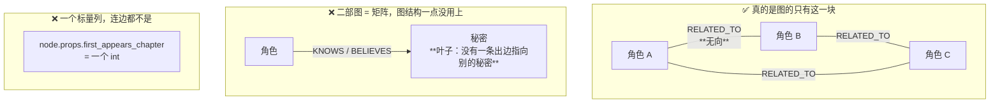
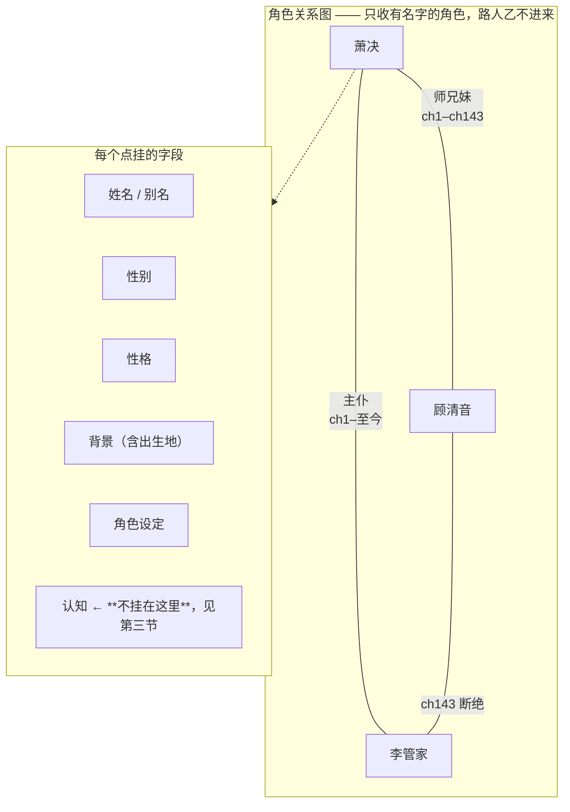
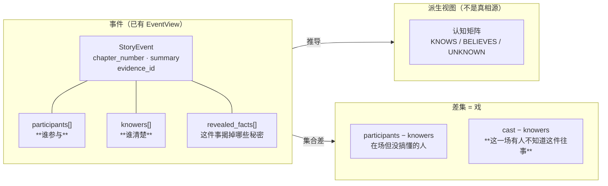
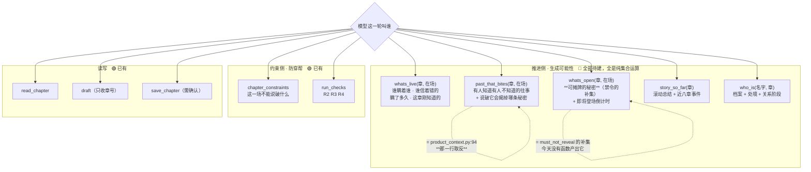

# 2026-08-06 图谱该长什么样 + 推进侧工具表

**决定了什么**：把「哪些东西值得做成图、哪些不值得」画清楚，并定下模式二工具表要
**长出推进侧**。配套盘点见 [`2026-08-06-引擎能力差最后一厘米没接线.md`](2026-08-06-引擎能力差最后一厘米没接线.md)。

**为什么**：我说「认知矩阵块、秘密块、未来实体块做成图谱就是浪费，作用不大」，
核实之后**这个判断是对的，而且理由比我说的更硬**（见下面第一张图）。

> ⚠️ **这份文件不是权威**（`docs_dev/README.md`）。里面标 🔴 的都是设计意图，
> 不是现状。要变成工程约束得进 `docs/` 或开 ADR。

---

## 一、今天的「图谱」到底是什么形状

三条实据：

- `Secret` 节点**没有一条出边指向别的 Secret**——它是叶子，图结构一点没用上
- `KNOWS(角色→秘密)` 是**二部图，二部图就是矩阵**。代码里那个类
  **本来就叫 `KnowledgeMatrix`**（`panel/knowledge.py`），名字早就承认了
- 「未来实体」是 `props.first_appears_chapter` **一个标量**（`graph/models.py:262`）

**所以真正用得上图结构的只有角色之间的 `RELATED_TO`**——任意拓扑、2 跳遍历、按类型过滤。

**但它今天也是残的**：
- `declare_related` **没有写入口**（`declare.py:33` 明写推到 M5）
- `RELATED_TO` **是无向的**（`graph/models.py:179`），所以「A 是 B 的**师父**」
  这种有角色的关系 **v1 表达不了**（`models.py:199` 诚实写明）

## 二、角色图谱应该长什么样 🔴

**字段这一半已经有了**：`CharacterProfileView{gender, personality, background,
character_notes, main_character}`（`events/models.py:201`）。

**连线那一半还没有**，而且要动两处：写入口（`declare_related`）+ 有向/带角色的关系类型。
后者要动 `RELATED_TO` 的无向约定 —— **那是 [ADR 0008](../docs/adr/0008-related-to-is-undirected.md) 定死的**，
真要改得先读那份 ADR 里「为什么无向」的论证（对称关系两侧各声明一次，
有向存储会让「断绝师门」只闭合一个方向）。**别顺手改。**

**「路人乙不进来」这条已经成立**：花名册只收有名字的条目，
[ADR 0018](../docs/adr/0018-cast-is-derived-not-declared.md) 又把在场改成从正文推——
没名字的配角天然进不了。

## 三、认知：用事件的集合表示，而不是挂在角色上 🔴

我的提法是「一个事情谁清楚、谁参与，这样的细粒度包含在事件里边」。
**核实结果：这个 schema 已经有了一半。**

**已经有的**：`EventView{event, participants, knowers, revealed_facts}`
（`events/models.py`）——**「谁参与」和「谁清楚」本来就是分开的两个字段**。

**主从关系应该定成**：

> **事件是真相源，认知矩阵是它的派生视图。**

这个仓库已经这么干过两次，形状完全一样：
- `CURRENT` **是推导不存储**（ARCHITECTURE §5：「推导少一整类数据不一致」）
- 正文在磁盘、**DB 永远不是真相源**（ADR 0007）

「事件是源、认知是派生」是同一个思想的第三次应用。
查询性能不丢（写事件时顺带更新派生表），而「他是怎么知道的」从一个指针变成一整个场面。

**两个已知冲突，还没解：**

1. **`event_participant` 表不是时态的**（`migrations/002_m4_events.sql:107`，
   主键只有 `event_id+character_id`，没有 `valid_from`/`valid_to`/`scope`/`status`），
   只有 `event_knower` 五列齐全。所以事件层的「在场」是**永恒事实**——
   跟「细粒度包含在事件里」冲突。
2. **未来事件表示不了**：`ProvisionalEventSpec` 强制要 `evidence_id`（没写的正文没有证据）；
   `PLANNED` 边被三处断言挡在读路径外。**「作者打算怎么解」引擎今天一个字读不到。**
3. **`BELIEVES` 怎么塞进事件**：错误认知不是「参与了某事」，是「被告知了一个假的」。
   事件要带类型 + `claimed_value` 才表达得了。**误会是网文最大的戏剧来源之一，不能丢。**

## 四、推进侧工具表 🔴

**这张是重点。** 原来那张七个工具的表全是「别写错」，一个「接下来写什么」都没有。

**推进侧五个工具没有一个需要新数据**——素材全在矩阵、事件、档案里，缺的只是归约函数。

`P3` 尤其便宜：`draft/product_context.py:94` 的 `cast_ids <= knower_ids`
（**安全过滤器**）取反就是 `cast_ids - knower_ids ≠ ∅`（**张力发生器**）。
同一个 frozenset 运算，换个符号方向。今天这些事件被那行代码**丢掉**。

`P2` 同理：`must_not_reveal` 是 `any(state is not KNOWS)` 的布尔归约，
它的取反就是「在场全员已知 = 这一场可以摊牌的秘密」——**今天没有任何函数产出它**。

### 措辞纪律

对应 `panel/__init__.py` 那句「它不说『你错了』，它说『这是你告诉过我的』」——
推进侧的说法是：

> **它不说「接下来写这个」，它说「此刻你手上有这些牌」。**

引擎的活是把可能性摆出来，**不是替作者选**。选哪张、怎么写，是模型和作者的活
（而且「哪条张力最该用」是语义判断，撞 ADR 0005 铁律）。

## 五、可算但今天没人算的（15 条里最有价值的 6 条）

全部纯集合/比较运算，**零语义判断，不撞铁律 2**：

| 能算什么 | 靠什么算 |
|---|---|
| A 知道、B 不知道、两人同场 | `KnowledgeState` 三态按列分区（`models.py:160`） |
| B 持有会被当场戳破的错误信念 | `believed_value`（`models.py:649`），可直接进 prompt |
| **瞒了多久**（ch88 知道，现在 ch152 = 压了 64 章的雷） | `since_chapter`（`models.py:641`），纯减法 |
| 可摊牌的秘密 | `must_not_reveal` 那个 `any()` 取反 |
| 有人知道有人不知道的往事 + 说破会揭掉哪条秘密 | `product_context.py:94` 取反 × `EventView.revealed_facts` |
| 下一个登场倒计时 | `constraints.py:325` 排序键，今天只被渲染成禁令 |

## 什么情况下要推翻

- **推进侧做出来后，如果我觉得「牌太多，反而不知道打哪张」**——
  说明要的是**排序**不是更多条目。但排序很可能是语义判断（撞 ADR 0005），届时要重新裁。
- **事件为主这条**：如果派生表和事件真的漂了（同一个问题两个答案），
  说明「派生」没做对，那时要么强制每次现算，要么退回边为主。
