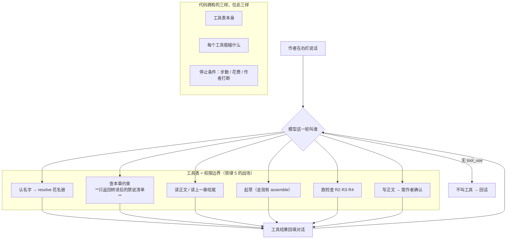

# 2026-08-06 模式二的编排定为单 Agent 工具循环

**决定了什么**：模式二（agent harness，作者在右栏跟 agent 说话）走**单 Agent 工具循环**，
**循环归模型，不归代码**——「起草→检查→改」这个环会发生，但它是模型跑出来的结果，
不是代码写死的流水线。不上 LangGraph，不上 LangChain。

**为什么**：起因是桌面那份《Agent 编排架构：LangChain 与 LangGraph 整理》。
拿它自己的 §3.1 六问对本项目，六问里五个指向同一个答案：

| 它的问题 | 我们 | 指向 |
|---|---|---|
| 流程能否明确写死？ | 不能——要的是 Claude Code 形状 | 要 agent |
| 需要循环返回前一步？ | 需要，**但循环在模型的 tool loop 内完成** | 不要状态图 |
| 中途失败必须继续？ | **必须**（当天改的口径，见下面「执行 resume」一节） | **不要图**，但要持久化 |
| 需要等人工？ | 要作者确认写正文，但那是**一次同步确认** | 不要 interrupt/resume |
| 多角色要独立上下文？ | 不要，查约束/跑检查/读正文全是纯函数 | 保持单 Agent |
| 跨机器、超长任务？ | 单用户单机 | 不要分布式 |

第三问我当天就自己翻掉了（**要执行 resume**），但结论没变——**变的是理由**，见下面那一节。
翻掉之后「不上 LangGraph」反而更成立：我们要的 resume 是线性的，它的 Checkpoint 是为图设计的。

**放弃了什么**（这条最值钱）：

- **放弃了 LangGraph。** 它的 Checkpoint 会变成第二个真相源，直撞 ADR 0007
  （正文在磁盘、SQLite 唯一真相源）。而且它的 §5.1 State 表那些字段我们**已经有了、而且更强**：
  `character_states` / `timeline_events` 在我们这儿是带闭开区间的时态图，
  `retrieved_context` 是集合差集不是检索，`validation_issues` 带三元组锚。
  一个内存里的 State dict 比这弱一个量级——**我们不缺 State，缺的只是一个 tool loop。**
- **放弃了 LangChain。** 它的三个卖点我们各自已有：统一模型接口 = `draft/provider.py`
  （OpenAI 兼容是我自己的显式决定）、工具定义 = 一个 `dict[str, Callable]`、
  agent 循环 ≈ 五十行 `while`。换来一棵依赖树，进的是把「陌生机器 `uvx novel-harness` 能跑」
  当 M0 验收的项目——**这跟当初砍 Neo4j / Qdrant 是同一条理由**，不能对那俩成立、对它就不成立。
- **放弃了照抄那份文档的 §5 落地图。** 它是照 Neo4j + Qdrant 画的，那两个 ADR 0001/0002
  实测之后砍掉的（bench 在 `docs/adr/bench/`）。照抄等于把砍掉的东西请回来。
- **放弃了把 Evaluator–Optimizer 写成外部循环。** 见下面那一节，这是我这几轮里改过的一个判断。
- **放弃了把数据源包装成 Agent。** 那份文档 §5.2 自己就是这么说的：
  数据库和文件系统首先应被视为工具。

**什么情况下要推翻它**：原来的第一条触发器（「崩了几十轮白跑 ≥ 3 次」）**当天就作废了**——
我直接决定要执行 resume，而且它不需要图（见下）。剩下的触发器改成这两条，
满足**任意一条**才回头重新评估图编排：

- **出现真正的并行 fan-out**：多个工具/子任务同时在飞、而且要等它们**全部**回来才能往下走。
  线性 loop 的「一串 message + 缺哪个 result」表示不了部分完成的并行分支——那才是
  Checkpoint 真正在解决的问题。
- 工具表长到某个工具**必须有独立上下文**才不污染主对话（那时是 Supervisor/子图的问题，
  不是持久化的问题）。

两条都没到，`while` + 停止条件 + 一张 message 表就是正确答案，而且它是可测的纯函数。

---

## 形状



## 为什么 Evaluator–Optimizer 不写成外部循环

**我一开始画错了**，画成了写死的流水线。写死长这样：

```python
draft = llm(write_prompt)              # 代码说：先起草
for i in range(3):                     # 代码说：最多改 3 轮
    issues = run_checks(draft)         # 代码说：起草完就检查
    if not issues:
        break
    draft = llm(fix_prompt(draft, issues))   # 代码说：有问题就整章重写
```

三个它做不到、而写作时天天发生的场景：

1. **「帮我看看第 89 章有没有问题」**——外部循环第一行就起草，而我根本没要起草。工具版只调 T5。
2. **检查报了一条 R3**——外部循环整章重写。工具版拿着 issue 的
   `(para_index, quote_text, occurrence_k)` 锚只改那一段；整章重写会顺手改掉我满意的部分。
3. **中途插一句「不对，让顾清音先走」**——外部循环在第 2 轮里看不见新消息，工具版下一轮就读到。

**代价是真的**，别装作没有：停止条件从 `range(3)`（精确，「最多改 3 轮」）
退化成 `MAX_STEPS`（粗，管整个会话）。失控时烧掉 40 步而不是 3 轮。
接受它，因为上面三条天天发生，而「模型改了 5 轮而不是 3 轮」几乎不发生。

**把反例留在这儿是有意的**：下次看到「起草→检查→改」这个环，第一反应还是会去写死那个 `for`。

## 会话与执行 resume（2026-08-06 定）

**对话无限长；可以开多个会话；会话支持 resume；而且要的是执行 resume，不只是接着聊。**

分清两种，否则第二种看起来像在推翻上面的结论：

| | 存什么 | 我们 |
|---|---|---|
| 会话 resume | 一串 message，下次打开接着聊 | 要 |
| 执行 resume | 崩在半路，从断点继续跑完 | **也要**（当天补的） |

**但它不需要图。** LangGraph 的 Checkpoint 贵在图有东西要快照：执行到哪个节点、
条件边走了哪支、并行 fan-out 谁完成了。**线性 tool loop 没有这些**，它的执行态就是
「一串 message + 哪几个 `tool_call` 还缺 `tool_result`」。resume = 看尾巴、补跑缺的、继续循环，
大约二十行。用 LangGraph 拿这个能力，90% 的机制是空转的。

**幂等这关已经过了**（那份文档 §4.2 点名的风险）：

| 工具 | 重放代价 |
|---|---|
| T1 / T2 / T3 / T5 | 只读或纯函数，**重放免费** |
| T4 起草 | 多花一次模型调用，无副作用 |
| **T6 写正文** | **唯一有副作用的**，而它天然幂等 |

T6 幂等是白捡的：`UNIQUE (chapter_id, text_sha256)` 已经在库里（`001_init.sql:328`），
同一段文本写两次不会多出一行，只把 `is_current` 指回去。而且 T6 本来就要作者确认——
**那是天然的 checkpoint 边界**。唯一真实损失：崩在 `complete()` 在飞时那次响应没了，
resume 重发同一份 messages，代价一次重复调用。

**这个决定改了两件事，别漏：**

1. **对话历史从内存里的东西变成要落库的数据**，于是污染窗口从「一次会话」变成「永远」——
   会话能无限长、能隔三个月回来。所以下面那条 T4 只收章号**从建议升级成必须**。
2. **message 历史进 SQLite，正文仍在磁盘。** T6 的产物是磁盘写，**不是 checkpoint 写**——
   否则就有了第二个正文真相源，撞 ADR 0007。没有持久化时这是理论风险，现在是真风险。

## 两处还没定

1. **工具表就是权限边界。** Claude Code 给 `Read` 是安全的；这里给一个通用的「读图谱节点」
   工具**就是泄漏**——agent 一调就把 PLANNED 秘密的正文读进对话历史，之后每轮起草都带着它。
   所以 T2 只能返回转译后的显示名，永不返回原始 `Node`。
   **这条必须变成约束（ADR），留在这个文件夹里不算数**——`docs_dev/` 不是权威。
2. ~~跨章上下文污染二选一~~ —— **2026-08-06 已定，走的是第三条路，两个选项都不要了。**

   问题：约束逐章算，对话跨章累积。一个会话里从第 40 章聊到第 90 章，第 90 章那次 T2 的
   返回还躺在 context 里。而且方向是 fail-open 的最坏那侧——
   **`ch40 的 must_not_reveal ⊇ ch90 的`**（到第 90 章更多人已经知道了），
   模型看着那份更短的清单去写第 40 章，就会以为「只有这两条不能说」。

   原来的两个选项（换章即清对话 / 工具结果带章号自动失效）都不要。走这条：

   > **T4（起草）不接受「约束」参数，只接受章号。约束由后端当场从 `scene_view(chapter)` 算。**

   **现有 `/draft` 已经是这个形状**——客户端只发 `mode / goal / cast / length`，
   `must_not_reveal` 是路由自己算的，客户端**没有机会**传。于是陈旧的约束文本可以留在
   历史里污染模型的**推理**，但它**进不了实际的起草 prompt**。

   这跟铁律 5 是同一条：完整 PLANNED 只能由后端转译，模型碰不到原件，
   自然也无法把过期的原件递回来。

   **残余代价（接受）**：模型可能基于陈旧认知说出「这一章你可以说破 X」这种话——
   推理被污染，但写出来的正文受的是当前章的约束。那是「话说错了」不是「稿子崩了」，
   而且我看得见。

## 已知缺口

`draft/` 整个包里 `tools` / `tool_calls` / `tool_choice` **一次都没出现**，
`provider.complete()` 是单轮无工具的。所以这不是接线，是要在 `draft/` 旁边长一个新层。
这一层不依赖上面第 2 条的答案，可以先做。
