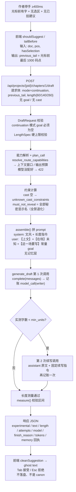
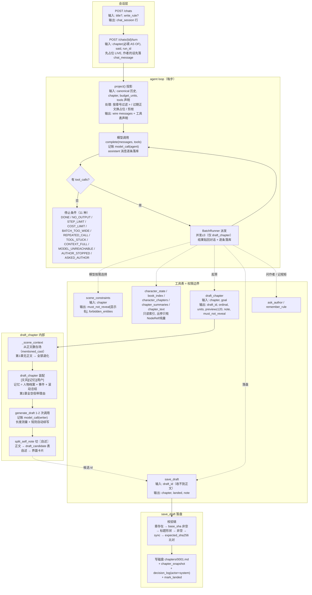

# 查清两种模式从零写第一章的数据流程

> 整理说明：本文件从 Codex 原始 JSONL 会话中提取，只保留用户与 DeepSeek 的可见消息；系统提示、环境注入、内部推理、工具调用和工具原始输出已省略。对话正文未改写。

- 日期：2026-08-15
- 模型：deepseek-v4-flash
- Codex 任务 ID：01a0052e-389e-7742-a753-71f5f09fd2a2
- 工作目录：`/Users/lixibin/Desktop/novel-harness`
- 可见消息：用户 3 条，DeepSeek 5 条
- 原始记录：[JSONL](/Users/lixibin/.codex/sessions/2026/08/15/rollout-2026-08-15T07-28-30-01a0052e-389e-7742-a753-71f5f09fd2a2.jsonl)

---

## 用户 · 2026-08-15 07:30:17 EDT

你需要去查一下这个项目，两个模式下模仿一个用户从零开始写第一章，它的数据是怎么的？地递给的后他具体会做什么事情？我想知道他的数据是哪些，他输出的数据是怎么样的中途会不会对数据做什么流程和验证明白我的意思吗？我其实就是想要知道两个模式从零开始他的数据在跑什么，然后灌输的是什么内容什么的，我想知道他的底层原理都要。

---

## DeepSeek（过程更新） · 2026-08-15 07:31:11 EDT

The project is clear now: 模式一 is 行内续写 (inline continuation), 模式二 is the novel-agent (工具循环). Let me trace the actual code paths and data formats in detail.

---

## DeepSeek · 2026-08-15 07:35:59 EDT

我把两条路都从代码追了一遍。先给结论：**模式一（行内续写）是一条"单次调用 + 过期计数器"的短路径；模式二（写作助手）是一个"模型自己调工具、代码只管停止条件"的 agent 循环**。下面按"从零开始写第一章"这条场景，把数据从哪来、中间做了什么处理/验证、输出长什么样、最后落在哪，逐层拆开。所有结论都有对应文件，关键位置我会标出来。

## 两个模式先分清

| | 模式一：行内续写 | 模式二：novel-agent（写作助手） |
|---|---|---|
| 人机界面 | 中栏 CodeMirror 编辑器，停手 400ms 出 ghost text | 中栏右半边 ChatPanel，作者跟 agent 对话 |
| 触发 | 作者停手 400ms + 光标前有字 + 无选区 + 无已挂建议 | 作者发一句话（`POST …/turn` 或 SSE 流） |
| 编排 | 无编排：一次 `/draft` 调用（最多两次，短了才续一次） | `agent/loop.py` 的 while 循环：模型决定调哪个工具，代码管 11 种停止条件 |
| 产出落点 | **哪里都不落**，只进编辑器缓冲区（Tab 接受、Esc 拒绝） | 一稿先进 `draft_candidate` 表，`save_draft` 才写磁盘 |
| 底层 ADR | ADR 0015（行内续写是起草路径的短档） | ADR 0019/0021/0022/0023/0024（工具循环六条边界） |

## 模式一：数据全链路

**前端（`frontend/src/continuation.ts` + `CenterEditor.tsx`）**

- 作者停手 400ms（`IDLE_MS=400`），且光标前有实质内容、没有选区、没有已挂建议时才发请求（`shouldSuggest`，默认"不问"，因为每次问都是作者自己的钱）。
- 取光标前**最后 1000 个码点**做 `previous_tail`（`TAIL_LIMIT=1000`）。
- 发请求前 `askRef++`，回来时对不上就丢掉——**这就是"取消"**：不需要增量失效，只需要过期那次别落地（ADR 0015）。

**请求体**（`frontend/src/api/hooks.ts` 的 `useContinuation`）：

```json
POST /api/projects/{pid}/chapters/1/draft
{
  "mode": "continuation",
  "previous_tail": "窗外的雪落下来。",
  "length": { "language": "zh", "min_units": 60, "target_units": 140, "max_units": 260 }
}
```

注意：**没有 `goal`、没有 `cast`**。`goal` 被后端换成常量"顺着上文往下写，接住作者已经起的头，不要另起一段新情节"（ADR 0015 D3，防止作者把伏笔写进自由文本入口）；`cast` 留空 = "不知道谁在场"，约束走**全禁退化态**（D4：`must_not_reveal` 取全部秘密，方向是 fail-closed——多禁一条只是少写一段，漏禁一条是崩人设）。

**后端处理（`api/app.py` 的 `/draft` 路由 → `draft/product_draft.py::draft_chapter` → `draft/assemble.py`）**

1. 请求校验：`DraftRequest` 的 validator——续写模式下 `goal` 必须为空，否则 422。
2. 能力解析：`resolve_route_capabilities` + `plan_call`（算输出预算、要不要流式），模型没配好直接 422 并告诉作者去"AI 设置"。
3. 约束计算：cast 为空 → `unknown_cast_constraints`，返回全禁清单（只有秘密**显示名**，永远不是内容 tell）。
4. 拼 prompt：`assemble()` 产出两条消息：

```json
[
  {"role": "system", "content": "你是一位中文长篇小说的写作搭档…篇幅精确控制在 60–260 字…"},
  {"role": "user", "content": "【上文】\n窗外的雪落下来。\n\n【在场】\n未知。因此这一段不得说破任何尚未公开的秘密。\n\n【这一场要写】\n顺着上文往下写，接住作者已经起的头，不要另起一段新情节。"}
]
```

   续写模式**不带已确认记忆**（记忆回执明确写"行内续写不带已确认记忆，上文就是此刻最相关的上下文"）——查档案 + 近八章事件 + 滚动总结对一次 400ms 的提示太贵。
5. 生成（`draft/generate.py::generate_draft`）：第一次调用；如果实测字数低于 `min_units`（60 字），**自动追加第二次续写调用**（把第一次原文贴成 assistant 消息 + 一段固定续写指令），最多两次。每次调用 `measure()` 量字数、校验不超硬上限。
6. 记账：**每一次真实调用落一行 `model_call`**（capability=`writer`，schema `m5.draft.v1`，带章号、prompt 哈希/字节数、token、耗时）。供应商没报 usage 就留 NULL，绝不编。
7. 返回（响应体就是前端契约）：

```json
{
  "experimental": true,
  "note": "实验状态：未经 kill-gate 裁决…",
  "text": "雪落了一夜，檐角挂起薄冰。",
  "memory": { "assembled": false, "note": "行内续写不带已确认记忆…" },
  "length": { ... },
  "attempts": 1,
  "model": "deepseek-v4-flash",
  "finish_reason": "stop",
  "prompt_tokens": 1234,
  "completion_tokens": 180
}
```

8. 前端 `cleanSuggestion`（只去首尾空白，**不去重**——去重要判断"两句是不是同一句"，那是语义判断，被禁止）→ ghost text。接受才进正文；**它永远不会是 canon**（D5：要进图只有 `declare` 一条路）。

**中间验证清单**：请求形状（extra=forbid，防模型/前端多传约束参数）、长度硬上限、form 白名单（PRODUCT/X0/X1/X2）、自定义文风禁词（`WRITE_RULE_FORBIDDEN_HINTS`：秘密/不知道/泄露/剧透/伏笔/设定——防止约束漏给对照组）、在场解析失败 → 422、模型调用失败 → 502、超长 → `truncated`。

## 模式二：agent 循环的数据与处理

**从零开始的入口**：建书有两种（工作台 bootstrap 或 `nh init` + `nh import`）。空白书会生成 `chapters/0001.md`，内容只有一行 `第一章`（`importer.empty_chapter_text`——章标题是切章的锚，属于作者）。所以"从零写第一章"在模式二里，**草稿可以生成，但落盘前必须已有这一章的文件**。

**建会话 + 跑一轮**（`api/chat.py`）

- `POST /api/projects/{pid}/chats` `{title?, write_rule?}` → 建 `chat_session` 行。`write_rule`（作者开头的文风要求）进**稳定前缀**（第二条 system 消息）。
- `POST …/chats/{id}/turn` `{chapter: 1, said: "…", run_id}`。`chapter` 是**必填**、是 AS OF 查询坐标（作者此刻写到第几章），**不写进任何一行数据**。`run_id` 是前端造的，让"停"只停得掉它想停的那一轮。
- `_TurnRun`：先占并发位，把作者那句话**先落库**（`chat_message` append-only，乐观并发 `UNIQUE(session_id, seq)`），再跑。

**loop 每一轮发给模型的到底是什么**（`agent/loop.py::project` → `run_turn`）

1. 投影：`project(canonical, chapter=1, budget_units, tools=declarations)`。先 `[稳定前缀]`（系统提示词 + write_rule，永远不含禁说清单），再拼历史消息，再**把整张工具表声明**（约 4000 字）附上。预算量的是**整份 payload**，不是只有对话（ADR 0023）。
2. 三种中间处理都发生在投影这一步：**按章号过滤**（绑在更后面章上的工具返回丢掉，方向是 fail-open 那侧不能留）、**过期正文换占位**（作者在编辑器里改过 → 换成"重新读一次"，边界三）、**按预算剪枝**（顺序写死：老 tool_result → 老 tool_call → agent 中间推理 → 最后才碰作者的话；剪完还装不下就 `CONTEXT_FULL` 停下来，**绝不砍作者说的话**）。
3. 模型调用：`complete(messages, tools=…)`，支持工具调用。**每次调用记账**（capability=`agent`，schema `m5.agent.v1`），assistant 消息（含 tool_calls）**逐条落库**——这就是 resume 的全部前提。
4. 派发：`BatchRunner` 并行跑（最多 3 个并发，只有 `draft_chapter` 允许并发；`save_draft` 是屏障，永远串行），结果贴回对话，逐条落库。
5. 停止条件（11 种，`StopReason`）：说完了 / 一句话都没有 / 步数上限 8 / 花费上限 30 万 token / 一批超过 6 个工具 / 同一工具同样参数重复 3 次 / 工具连续失败或花名册外撞名累计 3 次 / 上下文塞满 / 模型联系不上 / 作者按停 / 停下来问作者（`ask_author` 一出，这一轮当场结束）。

**工具表 = 权限边界**（`agent/tools.py`，11 个，模型能做的就是这张表）：

| 工具 | 输入 | 输出（出参只含显示名/纯量，`Node` 和 `props` 一个都不出去） |
|---|---|---|
| `scene_constraints` | 章号 | `{chapter, cast, cast_derived, must_not_reveal: [秘密显示名], forbidden_entities: [{name, first_appears_chapter}]}` |
| `character_state` | 章号 + 称呼 | `{character: NodeRef, location, states, is_dead, has_appeared}` |
| `draft_chapter` | 章号 + goal | `{chapter, draft_id, ordinal, units, preview(≤120字), note, must_not_reveal}`——**没有正文** |
| `book_index` | — | 章标题 + 花名册（`roster_total: 0` 必须带说明，不能读成"书里没人"） |
| `character_chapters` | 几个人 | 同框章列表，mention 轴 / 事件轴分开，各自说自己瞎没瞎 |
| `chapter_summaries` | 章号区间 | 滚动总结 + "哪几章有正文却没摘要" |
| `chapter_text` | 章号 | 一章正文（从磁盘读，ADR 0007） |
| `save_draft` | 只收候选 id | `{chapter, landed, note}`——模型交不出一段正文去盖章 |
| `read_draft` | 候选 id | 全文（最贵，只在合并两版时调） |
| `ask_author` | 问句 + 2–5 个短选项 | 问句原样交回，这一轮结束 |
| `remember_rule` | 规矩 + "管到什么时候" | 记进 canonical（章号由引擎填，模型和作者都碰不到） |

所有入参 Pydantic 都是 `extra="forbid"`：模型幻想出一个 `must_not_reveal` 参数会被当场拒——**约束只能由后端当场从 `scene_view(chapter)` 算**（边界二：起草工具只收章号）。

**`draft_chapter` 内部（`agent/drafting.py` → `draft/product_draft.py`）**

1. `_scene_context`：从第 N 章正文**数出在场称呼**（`mentioned_cast`，和 R2 同一条正则 alternation，零语义判断）。第 1 章如果没有正文/文件 → cast 空 → 全禁退化（`cast_derived=false` 明说"这一章的正文还读不到"）。
2. `draft_chapter` 装配：产品档走 `assemble_product`，消息顺序是 `[文风][记忆][用户]`（跨章不变的文风排最前，前缀缓存才有效）。记忆层（`build_product_context`）：在场人物档案 + 近八章/更早的已确认事件 + 更早章节滚动总结。**第 1 章时这三样全是空的，但回执带着理由**（"已装配…profiles: 0, recent_events: 0, rolling_summaries: 0"——空和没查是两句话）。
3. 用户消息：`【上文】`（第 1 章传空串，`_previous_tail` 明确"第 1 章送空串，不拿别的章冒充"）+ `【在场】` + `【这一场要写】` + `【本场设定要点】`（图谱段：认知矩阵 + 禁说秘密显示名 + 未登场实体名）。
4. 生成：产品档长度 2000/2500/3000 字，reasoning OFF（`/draft` 是 HIGH；agent 这条路 OFF 是因为未登记模型只有 OFF，HIGH 会当场报错）。一次生成，短了最多续一次。
5. 产出切分：写手在同一稿第一行写 `〖自述〗…`，`split_self_note` 把它切成 `(正文, 自述)`；正文进 `draft_candidate` 表（含 `base_sha256`——起草那一刻磁盘版本的哈希，NULL = 章还不存在），自述上卡片。工具只把 id + 预览 + 自述交回对话，**一整章正文永远不进对话历史**（无状态接口下它会被每一轮重发）。

**`save_draft` 落盘校验链（`agent/drafting.py::_land`）**——这是模式二里"中途验证"最硬的一段：

1. 第 N 章必须已存在（否则拒：**新章要作者自己起标题**，标题是切章锚）；
2. `base_sha256` 非空（起草时章不存在而落盘时存在 = 作者刚建章，不覆盖）；
3. 章开头必须是恰好一行章标题（切不成一章就拒）；
4. 稿子非空；
5. 先 `sync` 整本书（把磁盘现在这版先落快照，否则覆盖即真丢）；
6. `save_chapter(expected_sha256=base_sha)`——作者在起草后改过这一章就拒；
7. 写成后：落 `decision_log`（`actor=system`，可查可退），`mark_landed`。

每一步失败都返回**说得出口的中文原因**给模型，让它决定下一句跟作者说什么。

**从零写第一章的特例汇总**（两个模式都适用）：没有上文（空串，不冒充）；没有记忆窗口和滚动总结（空，带理由）；花名册为空、没有已确认事件（`roster_total: 0` 明说，模型不能读成"没问题"）；约束退化全禁（fail-closed）；模式二里草稿可以生成但落盘会被拒（章要先存在）；模式一里光标前没字时 `shouldSuggest` 直接不发请求。

## 底层原理（贯穿两模式）

- **声明优于抽取**（ADR 0004）：秘密/伏笔是作者意图，不在文本特征里。图谱里的数据只从声明和证据来，模型永远拿不到秘密内容（tell），只拿显示名。
- **时态图 + 章号由证据决定**（约束 10）：所有"第 N 章"查询都是 `state_at` 的闭开区间 `[valid_from, valid_to)`；`valid_from` 由引语在正文里的位置算出，作者永不填章号——所以对话里的 `chapter` 永远只是 AS OF 查询坐标。
- **只做集合判断**（ADR 0005）：在场=字符串计数、同框=集合求交、重名=歧义计数，引擎没有任何"这句话什么意思"的判断。
- **fail-closed**：算不准就多禁；系统不确定时默认闭嘴而不是提问。
- **工具表就是权限边界**（ADR 0019 边界一）：`ToolContext` 上只有只读 `StoryGraph`，没有连接、没有写入面——"模型改不了作者 canon"是类型保证不是纪律。
- **循环归模型，停止条件归代码**：不写死"起草→检查→改"流水线；Evaluator-Optimizer 写成外部循环恰恰是那天否掉的方案。
- **对话进 SQLite、正文留磁盘**（边界三/ADR 0007）：候选表是第五个落盘面，但只存正文不存上下文；`chat_message` 只增不改。
- **投影按章号参数化**（边界五）："最近"只决定取多少，"第几章"决定取什么；起草工具只收章号，杜绝过期约束回灌。
- **账目完整**：每一次调用（对话、起草、续写）都落 `model_call`，取消/中断也照记，供应商没报就不编数——日志页是"花了多少"的唯一真相。

想亲眼看数据流，最快的两个入口：`bash scripts/demo.sh`（两条泳道：seed 声明链 + 引语→章号→规则链），以及 `tests/test_chat_api.py` / `tests/test_agent_tools.py`（用剧本模型把一轮的 wire 消息和工具返回逐条钉死）。核心实现分别在 [agent/loop.py](/Users/lixibin/Desktop/novel-harness/src/novel_harness/agent/loop.py)、[agent/tools.py](/Users/lixibin/Desktop/novel-harness/src/novel_harness/agent/tools.py)、[draft/product_draft.py](/Users/lixibin/Desktop/novel-harness/src/novel_harness/draft/product_draft.py) 和 [api/chat.py](/Users/lixibin/Desktop/novel-harness/src/novel_harness/api/chat.py)。

---

## 用户 · 2026-08-15 13:26:24 EDT

你给我这两个模式下的mermaid流程图，我想要根据这个来进行分析每个步骤输入的数据以及输出的数据，我会根据这个来完善流程

---

## DeepSeek · 2026-08-15 13:27:05 EDT

两张图我都按"每步输入 → 处理 → 输出"的粒度画好了，节点里直接标了数据形状。你可以拿图去逐格对照源码：模式一的关键实现是 [assemble.py](/Users/lixibin/Desktop/novel-harness/src/novel_harness/draft/assemble.py) 和 [generate.py](/Users/lixibin/Desktop/novel-harness/src/novel_harness/draft/generate.py)，模式二是 [loop.py](/Users/lixibin/Desktop/novel-harness/src/novel_harness/agent/loop.py)、[tools.py](/Users/lixibin/Desktop/novel-harness/src/novel_harness/agent/tools.py)、[drafting.py](/Users/lixibin/Desktop/novel-harness/src/novel_harness/agent/drafting.py)、[chat.py](/Users/lixibin/Desktop/novel-harness/src/novel_harness/api/chat.py)。

## 模式一：行内续写



## 模式二：novel-agent 写作助手



两张图里值得你重点分析的几个"数据形状"：

模式一：**进模型的口只有两条消息**（system 文风 + user 上文/在场/目标），响应是纯文本 + 账目；它没有状态、没有落盘，唯一的中间校验是"长度不够就续一次"。

模式二：**进模型的口是"投影"不是历史**——同一段 canonical 对话在每章视角下投影不同（按章号过滤、过期正文换占位、剪枝）；工具返回里 `draft_chapter` 刻意不含正文，只有 `id + preview + note`，正文只存在候选表里；落盘那一步的校验链（Q）是模式二全部"验证"最集中的地方。

如果需要，我可以再把某个子图（比如 S4 的装配细节或 S2 的投影剪枝顺序）单独拆成一张更细的图。

---

## 用户 · 2026-08-15 19:12:46 EDT

你把这两个图的代码还有你上边查的那些内容就是这个图的代码放到最上边，然后上面查的内容放到下边写一个文档放到我常用的那个地方去。

---

## DeepSeek（过程更新） · 2026-08-15 19:13:48 EDT

找到了：你的常用文档目录是 `~/Documents/Codex/`（里面就放着 Novel Harness 的需求文档和分析文档）。我把文档写到这里。

---

## DeepSeek · 2026-08-15 19:14:38 EDT

文档已经写好了，放在你的常用文档目录里：

[Novel-Harness-两个模式数据流分析.md](/Users/lixibin/Documents/Codex/Novel-Harness-两个模式数据流分析.md)

结构按你的要求排的：

**最上边**是两张 Mermaid 图的代码：
- 模式一（行内续写）：从停手触发 → 请求 → 校验 → 约束 → 拼 prompt → 生成 → 长度续写 → 响应 → ghost text，每个节点都标了输入/输出数据。
- 模式二（novel-agent）：会话层 → agent loop → 工具表 → `draft_chapter` 内部 → `save_draft` 落盘，五个子图加完整连线。

**下边**是之前查到的全部内容，整理成了九个章节：两个模式对比、模式一数据全链路（带请求/响应 JSON 实例）、模式二 agent 循环详解（投影、工具表、起草内部、落盘校验链）、从零写第一章的特例、底层原理清单、关键源码索引表、相关 ADR 列表。

文件直接放在 `~/Documents/Codex/` 根目录，和你之前那份 `Novel_Harness_完整聊天与Claude开发需求.md` 在一起。如果你想换个名字、或者放到某个子文件夹（比如按日期分目录），说一声我就挪。

