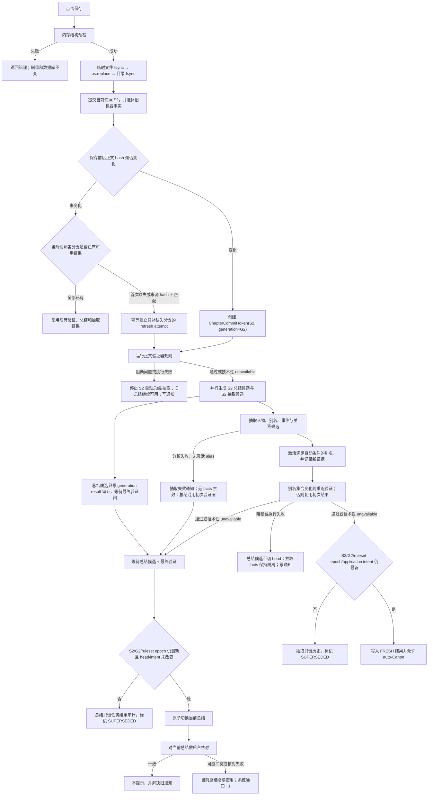

# 保存、验证、总结、抽取与 Canon/别名纠错闭环 Implementation Plan

> **2026-08-25：100% 完成。** Task 1–18 全部落地。
>
> ⚠️ **正文里那些 `- [ ]` 别信** —— 只有 Task 8 的步骤当时打了勾（54 个），
> 其余 56 个从没人回来打。**判据是代码**：四份 ADR（0028–0031）在、
> `validation_ruleset_state` 在（`project.py`）、`chapter_refresh_run` 在、
> `event_summary_head` 在、reconciliation outbox 在（`system_notifications.py`）、
> 双 autopilot 已删、自定义规则在（`checks/custom.py`）。
>
> 后续修订见 [`2026-08-18-总结自治与正文对齐闭环.md`](2026-08-18-总结自治与正文对齐闭环.md)（也已 100%）。

> **For agentic workers:** REQUIRED SUB-SKILL: Use superpowers:subagent-driven-development
> (recommended) or superpowers:executing-plans to implement this plan task-by-task. Steps use
> checkbox (`- [ ]`) syntax for tracking.

**Goal:** 把“保存正文”改造成一条按不可变正文快照运行、能防晚到覆盖、能自动更新三类总结、能核对冲突并统一通知、能自动登记且可纠正人物别名，并让自动 Canon 的地点、状态、关系都具备修改、撤回和改归属入口的完整闭环。

**Architecture:** 磁盘 Markdown 仍是正文真相源；保存先做零副作用结构预检，再原子替换文件并提交内容寻址快照。后续工作只消费同一个 `ChapterCommitToken`：正文验证器先作闸门，通过后总结与抽取并行；所有机器结果在生效前用 `source_snapshot_id + source_generation + ruleset_epoch/hash + fencing_token` 做 CAS，总结另校验 `expected_head`。三类总结使用 append-only 版本和显式 head，语义核对只产生统一系统通知，永不控制总结是否可用。

**Tech Stack:** Python 3.12、FastAPI、Pydantic、SQLite、React 18、TypeScript、TanStack Query、Vitest、pytest。

---

## 0. 文档地位与实施前置

本文件位于 `docs_dev/`，是维护者实施任务，不是架构权威。实现代码前必须先新增 ADR，再同步权威文档。原因是本次产品裁决明确改变了四项既有决定：

1. 保存键开始触发付费总结与抽取，推翻 `ARCHITECTURE.md` 和 `UI_ARCHITECTURE.md` 中“只在离章时 autopilot、禁止挂保存键”的决定。
2. 新增“总结与正文/证据核对”语义模型，但它是只告警的窄能力，不进入 `checks/`、不阻断总结或 Canon；这是对 ADR 0005“LLM Validator 推到 v2”的窄例外。
3. 明确无冲突的别名允许自动入档、作者事后纠正；歧义才待确认。这修改了 ADR 0004“别名聚类必须先确认”的一部分。
4. 自动 Canon 只有在对应事实类型具备可发现的修改、撤回、改归属和审计入口后才能开放；这是正式执行 ADR 0020 已满足的推翻条件，补齐当前 `LOCATED_AT/HAS_STATE/RELATED_TO` 无纠错路由的缺口。

实施顺序必须遵守 ADR 0020 的保护顺序：**编辑、撤回、改归属、历史和来源展示先落地，自动生效后接通。** Canon 情节摘要以及自动地点、状态、关系边的纠错入口没有完成前，不得开放保存触发的自动 Canon。

实施前必须新增四份独立 ADR：

- `docs/adr/0029-save-triggers-snapshot-refresh.md`：保存触发、成本合并、固定协调器和 CAS。
- `docs/adr/0030-versioned-summaries-and-advisory-reconciliation.md`：三类总结版本、作者优先和只告警核对。
- `docs/adr/0031-auto-alias-with-reversible-correction.md`：无歧义别名自动入档、歧义隔离和纠错回放。
- `docs/adr/0032-reversible-auto-canon-edges.md`：地点、人物状态和人物关系的类型受限纠错，以及“先可逆、后自动”的启用闸。

不引入 Neo4j、Qdrant、Temporal、LangGraph 或通用 Workflow Runtime。协调器只表达这一条固定章节刷新 DAG。

## 1. 三种“验证”必须分开

| 名称 | 输入 | 发生时间 | 结果的权力 |
|---|---|---|---|
| 章节结构预检 | 尚未写盘的 Markdown 字符串 | 写盘前 | 失败则拒绝保存，磁盘和数据库都不修改 |
| 正文验证器规则 | 已提交的不可变正文快照 | 新 hash 提交后 | 阻断问题或规则崩溃会停止本快照的自动总结和抽取；技术性 unavailable 不阻断 |
| 总结核对 | 已生效总结版本 + 对应正文/证据 | 总结生效后 | 只能写系统通知；不得撤销总结、阻止使用或修改 Canon |

“总结可能与正文不一致”和“正文触发了 R2/R3”不是同一个状态，不共用表、不共用 UI 文案，也不共用闸门。

## 2. 最终端到端流程



补充规则：

- 保存成功立即返回，不等待模型。
- `changed=false` 只表示不用建新 snapshot/generation，不表示可以跳过第一次整理。保存仍执行 `ensure_refresh_coverage`：没有章节总结 head、当前 ruleset/generation 没有验证报告、或没有 current extraction application 时，只为缺失分支幂等排队；已有结果标 REUSED，不重复付费。作者主动撤回形成的 RETRACTED summary head 算“已有明确决定”，不会因同 hash 保存而自动复活。
- 同章保存频繁发生时，等待 2 秒静默窗口；尚未开始的旧快照任务直接 `SUPERSEDED`，只运行最新快照，避免每次 Ctrl-S 都付费。
- 已经发给模型的旧任务不强行取消，但晚到结果永远不能成为 current，也不能写入 `FRESH`/Canon。
- 若抽取新登记了 alias，初次验证因称呼尚未解析而未报告的问题可能在二次验证出现。总结调用可以与抽取并行完成，但只能先写 `summary_generation_result`，不能创建 summary version；二次验证阻断时不得切 summary head。alias 本身是可纠正的身份索引，可以保留生效，相关故事 facts 继续隔离。
- 抽取在任何 alias 生效前失败时，不让总结候选永久卡住：抽取分支记 FAILED/通知且不产生 facts，summary 使用初次 validation gate 继续 CAS。若已有 alias delta 落地后才失败，则必须先完成二次验证，不能走这条退路。
- 第一次尚无任何总结时，Writer 使用有界的当前章原文作为诚实 fallback；不得伪造一条“临时总结”。首次模型总结成功后再原子切换。
- 正文变更期间已有上一版总结时，继续使用上一版，直到新版本成功切换；界面不展示“生成中”状态。
- “作者优先”是针对已经排队/运行的机器任务，不是永久 pin：作者编辑会击败此前任务；以后正文再次产生新 generation 时会以该作者版作为新的 expected head，若作者不再修改，新正文的机器总结可以正常替换它。
- “撤回当前总结”后 Writer 使用原文 fallback，不自动复活已撤回的旧机器总结；只有作者点击“重新总结”或再次保存新正文才生成新版本。

三类总结统一遵循下面的产品口径：

| 内容 | 正文/证据变化时 | 作者修改后 | 核对来源 |
|---|---|---|---|
| 章节滚动总结 | 为最新 chapter snapshot 生成机器版本；成功前沿用旧 current | 立即追加 AUTHOR 版本并切 head | 对应快照的整章正文 |
| 待确认情节摘要 | 旧 snapshot 的 PENDING proposal 保持审计状态但 `currentness=OBSOLETE`；新抽取事件建立新机器版本 | 只保存摘要，proposal 仍 PENDING | 该事件的 evidence quote |
| Canon 情节摘要 | 旧证据失效的事件停火；新 FRESH/Canon 事件建立对应机器版本，不做 LLM 跨快照事件配对 | 立即追加 AUTHOR 版本、切 head、bump canon version | 当前事件的 evidence 集合 |

机器生成和作者编辑形成的 current 版本都要核对。保存产生 S2 后，即使 head 暂时还是 S1 总结，也要核对“当前 head 总结 vs 当前 S2 正文”；新 S2 总结切 head 后再核对新 hash 对，旧通知自动解决。

“每章始终有当前总结”在工程上拆成两层，避免数据库伪造摘要：

- 每个 chapter 必须有一行 `chapter_summary_head`；`current_summary_id` 可以指向 ACTIVE 总结、RETRACTED tombstone，首次未生成时为 NULL。不是“整行不存在”，否则 expected-null 的第一次 CAS 会更新零行。
- Writer 的 `CurrentChapterMemory` 永远非空：ACTIVE head 返回总结；无 head 或 tombstone 返回有界 raw-text fallback，并明确 `kind=raw_text_fallback`。

因此始终可用的是“当前章节记忆”，不把原文谎称成模型总结。UI 默认只显示真实总结；fallback 只是 Writer 的内部退路。

## 3. 必须长期成立的不变量

1. `ChapterCommitToken` 是保存后所有自动任务的唯一正文输入；任务不得运行中重新读取“当前正文”。token 同时带不可变 `source_snapshot_id` 和单调 `source_generation`。
2. `changed` 比较保存前后当前 `text_sha256`，不能用 `snapshot_created`；每次 hash 真正切换都递增 `chapter.snapshot_generation`。从 S2 还原到历史已有的 S1 也属于变化和新 generation，防止第一轮 S1 的晚到任务在 S1→S2→S1 后通过快照 CAS（ABA）。
   现有 Git-index 式 `(mtime_ns,size)` 只继续作为 reconcile 判断“要不要读盘算 hash”的快路；保存请求已经带完整正文，直接算精确 hash，不再走 stat。mtime 永远不参与总结/抽取新鲜度或 CAS。
3. 结构预检失败时，目标文件字节、`chapter.text_sha256` 和当前快照均不变化。
4. 文件系统与 SQLite 无法组成跨系统原子事务。`os.replace()` 一旦成功，即使随后目录 `fsync()` 或数据库同步失败，也必须以 `202 + saved_to_disk=true + indexed=false` 诚实返回“正文已写盘但持久性/索引确认失败”，由下一次 reconcile 补齐；不能显示“正文未保存”。
5. 当前总结由显式 head 决定，不再由 `rowid/created_at` 猜。
6. 作者编辑立即更新 head。已经运行中的机器任务只在 `source_snapshot_id`、`source_generation`、`ruleset_epoch + ruleset_hash`、本 attempt 的持久 `final_gate_state=PASSED`、fencing token 和 `expected_head` 全部仍匹配时才能更新 head；禁止查询“latest PASSED”，因为那可能只是 alias 生效前的初次报告。
7. “重新总结”是作者显式授权的新机器任务，可以替换点击时的 head；点击后作者又修改，作者仍赢。
8. 所有总结版本至少记录：来源快照、内容 hash、来源（机器/作者）、创建时间、取代的上一版本。历史旧数据无法诚实反推快照时允许 `legacy + NULL`，新写入一律非空。
9. 总结核对结果不修改 summary head、event head、Canon 或 Writer 可用性。凡 current snapshot/head/evidence fingerprint 改变，都必须在同一 SQLite 事务写 reconciliation outbox，禁止“提交后再内存 enqueue”。
10. 同一 `summary_sha256 + source_sha256` 最多一条冲突通知；checker version 只进 run 审计，不进入通知去重键。IGNORED/RESOLVED 对该精确 hash 对都是终态，重复核对不得重开；任一 hash 变化才可新提醒。
11. 抽取 ingest 和自动升 Canon 是两个写阶段，两处都必须重新检查当前 snapshot、generation、ruleset、validation gate 和 fencing token。
12. 未知或歧义称呼不得先丢掉人物再把“剩下的事件”判成 clean；身份未决的整条相关事实保持隔离。
13. 别名是 `alias` 索引表的数据，不进入 `Node.props_json`，不作为关系边。
14. 前端只显示一个“别名”字段；数据库可保留既有 `alias/nickname/title` kind 以兼容旧数据，但新 UI 不要求作者分类。
15. 系统自动 Canon 和自动别名必须显示机器来源；Writer 不得再统一写成“作者确认事实”。
16. `summary_version.source_snapshot_id` 是 `authored_from_snapshot_id`，记录总结从哪版正文写成；`summary_reconciliation_run.checked_against_snapshot_id` 记录这次核对面对哪版当前正文。两者允许不同，不能合并成一列。
17. lease 只控制谁可以工作，不代表模型只调用一次。heartbeat 独立续租，所有提交携带单调 fencing token；旧 token 即使 provider 晚到也只能留审计。外部模型调用按至少一次设计，不能承诺 exactly-once 计费。
18. 验证规则增删改启停每次都递增单调 `ruleset_epoch` 并重算 `ruleset_hash`。A→B→A 的 hash 可以相同，epoch 必须不同；attempt/job/report/application/CAS 都携带两者。旧 epoch 下运行的总结/抽取不得在新规则集下生效；新规则集通过后才可恢复本 generation 尚未完成的分支。
19. 别名纠正重放前，先保守退休同 snapshot 上一次 resolution application 的机器 facts；作者声明、作者摘要版本和作者修正 incidence 不得被重放覆盖。
20. 新 generation 的 chapter/snapshot 指针、`chapter_refresh_run` outbox、首个 `chapter_refresh_attempt` 和保存当刻的 expected summary head 必须在同一 SQLite 事务提交。dispatcher 可以在提交后被“唤醒”，但正确性只依赖持久 PENDING 行；进程在提交后立刻退出也不能漏刷新。
21. “事实最初由谁产生”和“当前摘要最后由谁编辑”是两个字段。作者修改 Canon 摘要只新增 AUTHOR summary version，不能把 `story_event.source=extractor` 改成 author，否则正文换快照时旧机器事实会逃过退休。
22. attempt 自己的 fencing token 只能防同一 attempt 被重复 worker 提交，不能决定多个 attempt 谁更新同一分支。summary 和 extraction 各有单调 branch intent sequence；新手动/规则/replay 意图原子 supersede 旧未完成 job，生效 CAS 必须匹配最新 branch intent。抽取 intent/head 的身份是 `chapter_refresh_run`（即一个 chapter generation），不是某一次 content-addressed `extraction_run`；同 generation 的 save/manual/ruleset/replay attempts 必须竞争同一个 current application 槽。
23. 保存临界区必须覆盖“读取当前磁盘/DB hash → 结构预检 → 原子 replace → snapshot/generation/outbox DB commit”。同章 save/reconcile 通过稳定 lock file 跨进程串行，图层再以 expected DB hash CAS；两个协作式 PUT 不能交错出磁盘 S3/DB S2。WPS 不遵守该锁，系统只能在 replace 前复核磁盘 fingerprint、提交后重读 hash 并尽快 reconcile；这能检测大多数并发外改，但不能声称在两个文件系统操作之间存在原子 CAS。
24. 前端 dirty 属于编辑器 revision，不属于请求。每次保存冻结 submitted revision/text/hash；回包时只有 current revision/hash 仍等于 submitted 才清 dirty。请求飞行中继续输入的 S3 不得被 S2 回包、query invalidation 或 refetch 覆盖。
25. `LOCATED_AT`、`HAS_STATE`、`RELATED_TO` 等可自动进入 Canon 的边，必须先有按稳定 ID 的读取、修改、软撤回、改目标、Canon CAS、decision log 和 UI 跳转。没有完整纠错能力的类型不得列入 auto-Canon allowlist。
26. `chapter_refresh`（含 chapter/event `summary_generation_job` 子队列）、`summary_reconciliation`、`system_notification`、`alias_replay` 四组持久工作都由应用 lifespan 启动同一个恢复管理器：启动时扫描 PENDING 与 lease 已过期的 RUNNING，关停时停止 claim 并释放 heartbeat。正确性不能依赖保存、事件 regenerate、别名 API 或下一次用户请求恰好到来。
27. Canon 边的 `edge.source/evidence` 表示事实最初来源，ACTIVE `canon_edge_override.replacement_edge_id` 表示当前解释由作者接管。A→B→A 因旧 identity 唯一键而恢复原 extractor 行时，不能假改其起源；读路径、STALE 退休和机器重放必须把该 active replacement 当作 author-owned。UI 同时可以显示“自动提取 · 作者已修改”。
28. 同 hash 保存必须幂等补齐而不是一律跳过：ACTIVE summary 的 authored-from text hash 与当前 hash 相同则复用；AUTHOR head 和 RETRACTED head 即使 legacy snapshot 不可反推也尊重作者决定；只有 NULL、legacy MODEL/unknown 或明确 stale head 才排总结。验证按 current generation + ruleset epoch，抽取按 current application head 判断覆盖。重复保存只能复用同一 coverage attempt，不能重复调用模型。
29. final validation gate 的 BLOCKED/PASSED/SUPERSEDED 状态与对应 system-notification CREATE/RESOLVE outbox 必须同事务；通知可以晚显示，不能因进程在两步之间退出而永久丢失。
30. 总结核对每一次真正准备发出的 provider attempt 都要先落 RUNNING `model_call` 并链接业务 run；成功、失败、崩溃遗弃分别 finalize，重试新增行。一个业务 run 不能用单个 `model_call_id` 覆盖多次付费尝试。
31. 任何让 Writer 可见 Canon 集合变化的系统事务（旧机器事实 STALE、application 切换、auto-Canon promotion、机器 alias 生效/失效）都要至多一次 bump `canon_version` 并保存受影响 ID 审计；否则作者拿着旧版本表单仍会通过 CAS。纯候选、SUPERSEDED 结果和 summary 核对不 bump。

## 4. 目标领域类型

### 4.1 保存提交令牌与回执

```python
class ChapterSaveRequest(BaseModel):
    markdown: str
    expected_text_sha256: str


class ChapterCommitToken(BaseModel):
    model_config = ConfigDict(frozen=True, extra="forbid")

    project_id: str
    chapter_id: str
    chapter_number: int
    source_snapshot_id: str
    source_generation: int = Field(ge=1)
    text_sha256: str
    text: str
    changed: bool


class ChapterSaveReceipt(BaseModel):
    saved_to_disk: bool
    indexed: bool
    changed: bool
    chapter_number: int
    snapshot_id: str | None
    snapshot_generation: int | None
    text_sha256: str
    processing: Literal[
        "reused",
        "queued",
        "attention_required",
        "durability_failed",
        "sync_failed",
    ]
```

### 4.2 快照绑定的正文验证报告

```python
class RuleExecution(BaseModel):
    rule_id: str
    title: str
    state: Literal["clear", "blocked", "unavailable", "error"]
    issue_count: int = Field(ge=0)
    blocks_downstream: bool
    note: str | None = None


class SnapshotValidationReport(BaseModel):
    id: str
    project_id: str
    chapter_id: str
    chapter_number: int
    source_snapshot_id: str
    source_generation: int = Field(ge=1)
    refresh_attempt_id: str
    phase: Literal["initial", "post_alias"]
    text_sha256: str
    ruleset_epoch: int = Field(ge=1)
    ruleset_hash: str
    gate: Literal["passed", "blocked", "error", "superseded"]
    rules: tuple[RuleExecution, ...]
    issues: tuple[Issue, ...]
```

R2/R3 明确发现问题时为 `blocked`。它们的 availability 判据必须可执行：`paragraphs` 已从 token snapshot 装入且 snapshot/generation 一致就是 AVAILABLE；人物、别名、未来实体或状态集合为空是合法空集合，规则仍运行并显示“本次未报告问题”，不能伪称资料不全。只有正文输入未装入、snapshot 无法读取等技术性缺失才是 `unavailable`，且不阻断抽取；store 异常则是 `error` 并阻断。

保留贡献者入口 `check(ctx: CheckContext) -> list[Issue]` 不变。每条 `RuleSpec` 另带一个零副作用、纯集合判断的 `availability(ctx) -> RuleAvailability`；service 先运行 availability，只有 AVAILABLE 才调用 check。`SYSTEM_RULES: tuple[RuleSpec, ...]` 是 ID、标题、availability 和 callable 的唯一注册源，兼容用的 `ALL_CHECKS` 只能从它派生，不能再维护第二份列表。不能从 `issues == []` 反推资料是否齐全。

`ruleset_hash` 对按 rule id 排序后的稳定 JSON 求 SHA-256，JSON 至少含 `rule_id/schema_version/enabled/blocks_downstream/template/config`；标题和 UI 描述不参与，避免只改文案让所有机器任务失效。

### 4.3 总结版本与 current head

滚动总结扩展现有 `chapter_summary`；情节摘要新增事件版本表。两类共用同一 CAS 语义：

```python
class SummaryVersionMeta(BaseModel):
    version_id: str
    source_snapshot_id: str | None
    summary_sha256: str
    source: Literal["model", "author", "legacy"]
    status: Literal["active", "retracted"]
    replaces_version_id: str | None
    created_at: str
```

滚动总结撤回不是删除旧行：追加 `status=RETRACTED, summary=NULL, summary_sha256=sha256(b"")` 的 AUTHOR tombstone 并让 head 指向它。ACTIVE 行要求非空 summary；RETRACTED 行要求 summary 为 NULL。这样撤回本身可追溯，Writer 又能明确走 raw-text fallback。情节摘要若产品入口暂不提供撤回，也复用同一模型但只创建 ACTIVE 版本。

保存创建任务或作者点击“重新总结”的那一刻捕获并持久化：

```python
class SummaryGenerationBasis(BaseModel):
    source_snapshot_id: str
    source_generation: int = Field(ge=1)
    text_sha256: str
    refresh_attempt_id: str
    required_ruleset_epoch: int = Field(ge=1)
    required_ruleset_hash: str
    expected_head_version_id: str | None
    trigger: Literal["save", "manual_regenerate"]
```

worker 只能读取 job 里已经冻结的 `expected_head_version_id`，不得在两秒静默窗口结束或真正开始模型调用时重新取 head；否则作者在排队期间的修改仍会被机器覆盖。

事件摘要的显式重新总结复用同一 `summary_generation_job/result`，但冻结的是另一组 basis：`event_id + source_snapshot_id + source_generation + evidence_sha256 + expected_event_head + required_machine_intent_seq`。它不伪造 chapter refresh attempt；worker 完成时必须确认 event 仍是当前可用的 PROVISIONAL/CANON 事件、evidence fingerprint 未变、event head 与 intent 仍匹配。任一不满足只留 result 审计并标 SUPERSEDED。若任务运行中作者编辑摘要，head CAS 必然失败，作者版本继续生效。

机器结果先写 `summary_generation_result` 任务审计，不创建 summary version；随后在同一事务中执行：

```text
current chapter snapshot == source_snapshot_id
AND current chapter generation == source_generation
AND current ruleset epoch == required_ruleset_epoch
AND enabled ruleset hash == required_ruleset_hash
AND this refresh_attempt.final_gate_state == PASSED
AND this refresh_attempt.final_validation_report_id IS NOT NULL
AND current summary head == expected_head_version_id
```

全部成立时，事务才从 result 创建 ACTIVE summary version，把 `replaces_version_id` 设为刚刚真实取代的旧 head，并切换 head；任一不成立，只把 generation result/job 标 `SUPERSEDED`，不创建版本、不切 head。这样作者看到的版本历史里每一行都真的生效过；晚到机器文本仍在任务审计中可追溯，却不会谎称取代了某一版。作者编辑则在一个事务内直接创建 ACTIVE/RETRACTED 版本、记录真实旧 head 并切换 head。

### 4.4 总结核对结果与系统通知

核对器只允许返回结构化、可定位的结果：

```python
class SummaryReconciliationResult(BaseModel):
    checked_against_snapshot_id: str
    checked_against_generation: int = Field(ge=1)
    source_sha256: str
    verdict: Literal["supported", "possible_conflict"]
    explanation: str
    anchors: tuple[TextAnchor, ...] = ()
```

不输出百分比置信度。模型失败、JSON 不合法或来源 hash 已变化时，分别记录 `FAILED` 或 `SUPERSEDED`；只有 `possible_conflict` 创建冲突通知。

系统通知统一使用：

```python
class SystemNotification(BaseModel):
    id: str
    kind: Literal[
        "summary_mismatch",
        "background_failure",
        "validation_blocked",
    ]
    status: Literal["open", "ignored", "resolved"]
    subject_type: Literal["chapter_summary", "proposal_event", "canon_event", "chapter"]
    subject_id: str
    chapter_number: int | None
    title: str
    summary_sha256: str | None
    source_sha256: str | None
    jump: TextAnchor | None
    actions: tuple[str, ...]
```

前端根据结构化 `subject_type/subject_id/jump/actions` 导航，禁止从通知文案反推坐标。

`source_sha256` 的口径只有一份：滚动总结使用 `chapter_snapshot.text_sha256`；事件摘要使用按 `evidence.id + evidence.quote_sha256 + evidence.chapter_snapshot_id` 排序后得到的稳定 hash。核对器不自行发明第三种来源指纹。

`summary_sha256` 统一为总结 UTF-8 原始字节的 SHA-256，不做 `.strip()`、Unicode 归一化或标点改写；prompt hash 只负责模型调用幂等，不能冒充内容 hash。

### 4.5 人物基础信息与别名

界面固定为：

```text
本名：王熙凤
别名：[凤姐 ×] [凤辣子 ×] [琏二奶奶 ×] [+ 添加]
```

每个 chip 是一条 ACTIVE alias 记录。Canonical alias 不显示为 chip，也不能通过别名接口修改。

```python
class CharacterBasicInfo(BaseModel):
    character: NodeRef
    profile: CharacterProfileView | None
    aliases: tuple[StoredAlias, ...]


class ExtractedAlias(BaseModel):
    surface: str
    character_surface: str
    quote: str
    confidence: float = Field(ge=0.0, le=1.0)
```

只有同时满足下列条件才自动写 ACTIVE alias：目标称呼唯一解析到同项目 Character；alias surface 当前未映射；证据 quote 逐字包含目标称呼和 alias surface；同一 run 没有另一个候选把该 surface 指向别人；`confidence >= 0.90`。自动行使用 `source=extractor` 并保留证据。任一条件不满足就生成 `alias_resolution` 聚类提案，不自动选择。

### 4.6 可逆的 Canon 边纠错

第一期只开放抽取器会自动写入、且产品已经能给出类型化编辑器的三类：

```python
AUTO_CANON_CORRECTABLE_EDGE_TYPES = frozenset({
    EdgeType.LOCATED_AT,
    EdgeType.HAS_STATE,
    EdgeType.RELATED_TO,
})
```

它同时也是 auto-Canon allowlist 的上界；不能在抽取模块另抄一份更宽的集合。纠错请求只提交稳定 `edge_id`、类型化目标和 `expected_canon_version`，不接收章号。服务端从旧边继承 `valid_from_chapter`，验证它仍是 ACTIVE/current CANON，并满足下面二者之一：`evidence_status != STALE`；或存在 `replacement_edge_id=edge.id` 的 ACTIVE `canon_edge_override`。后者表示作者已经接管该语义槽，因此即使恢复出的 extractor-origin 行后来证据 STALE，也仍可继续修改、撤回或再次改归属。只有没有 ACTIVE override 保护的裸 STALE 机器边才拒绝；作者边的 `NONE` 同样合法。随后按类型验证：

- `LOCATED_AT`：主体必须是 Character，目标必须是同项目 Location；可改地点，也可把整条事实改归属到另一个 Character。
- `HAS_STATE`：主体必须是 Character，目标必须是同项目 StateDim；维度、`value/value_key` 必须通过现有 `EdgeProps` 约束，可改状态值或主体。
- `RELATED_TO`：两端必须是同项目 Character，继续使用 `UNDIRECTED_EDGE_TYPES` 的规范化，不能在 API 层自写方向判断；可改其中一人或关系显示值。

纠错历史 append-only，但 `edge` 仍是当前时态投影，不强迫“每次修改都插一条不同 edge identity”。若 src/dst/type/vf/scope 改变，同一事务软撤回旧边、写 ACTIVE author override、创建或恢复 replacement；若 identity 完全不变（例如 HAS_STATE 只改 value、RELATED_TO 只改显示值），先追加带 before/after props 的 override，再用专用图层方法只更新当前 `props_json` 投影，严禁普通 `upsert_edge/update_edge_facets` 改 source/evidence/status/vf。两路都 bump canon version 并记录 before/after edge ID、原 evidence、继承章和节点引用。撤回留下 replacement=NULL 的 tombstone。语义槽由图层唯一函数计算：location=`subject+type+valid_from`，state=`subject+type+dim_key+valid_from`，relation=`normalized_pair+type+valid_from`。以后抽取重放若命中被作者接管的槽，只能留审计/提案，不能覆盖作者投影或复活被撤回的机器边。

## 5. 目标数据库变更

迁移编号从当前 016 继续：

### 017 · `chapter_refresh.sql`

- 扩展 `chapter`：增加单调 `snapshot_generation`；现存有 current snapshot 的章回填 1。此后只有当前 text hash 真正变化时加一，相同 hash 重存不加，恢复历史 snapshot 也要加。
- 扩展 `validation_report`：`chapter_snapshot_id`、`source_generation`、`refresh_attempt_id`、`phase`、`text_sha256`、`ruleset_epoch/hash`、`gate`、`rules_json`。
- 新建 `validation_ruleset_state(project_id PRIMARY KEY, epoch, ruleset_hash, updated_at)`，作为 Task 5 冻结规则 basis 的唯一真值。017 用 `SYSTEM_RULESET_V1_HASH` 为既有项目回填 `epoch=1`；`project.create()` 在创建项目的同一事务插入同样基线。该 hash 来自按 §4.2 稳定 JSON 编码的 R2/R3 catalog + 空自定义规则集，`checks/catalog.py` 暴露常量，迁移测试必须断言 SQL 中冻结的历史字面量与常量一致。以后 SYSTEM_RULES 语义变化必须用新迁移为所有项目递增 epoch，不能偷偷改旧 017。
- 新建固定流程/outbox 父表 `chapter_refresh_run`，按 `(project_id, chapter_id, source_generation)` 唯一并保存 snapshot_id。它与新 generation 指针同事务插入；不能只按 snapshot 唯一，否则 S1→S2→S1 会复用旧 run。
- `chapter_refresh_run` 记录本次退休的 CANON event/edge/knower/alias evidence ID、`canon_version_before/after`。若有效 Canon 集合真的变化，同一事务只 bump 一次 project canon version；零行变化不 bump。
- 新建 `chapter_refresh_attempt` 子表，保存 `run_id/workflow_version/ruleset_epoch/ruleset_hash/trigger_kind/trigger_key/missing_branch_mask/expected_summary_head` 与三分支状态。自动 save/reconcile attempt 对 `(run_id,workflow_version,ruleset_epoch,trigger_kind)` 唯一；同 hash coverage 对 `(run_id,workflow_version,ruleset_epoch,'coverage',missing_branch_mask)` 唯一；规则 A→B→A 仍是不同 attempt；手动“重新整理”用唯一 trigger_key 建新 attempt，不能被父表唯一键吞掉。
- attempt 显式保存 `initial_validation_report_id`、`alias_phase=NOT_STARTED|UNCHANGED|CHANGED|FAILED_BEFORE_CHANGE|COMPLETE`、`final_gate_state=PENDING|PASSED|BLOCKED|ERROR`、`final_validation_report_id`、`summary_candidate_ready` 和 `extraction_candidate_ready`。初次 PASSED 不能直接令 final gate PASSED；只有 alias phase 确认未变化/失败前未落 alias，或 post-alias report 完成后，才原子填写 final report/state。
- attempt 的 `validation_state/summary_state/extraction_state` 支持 `PENDING/RUNNING/SUCCEEDED/REUSED/FAILED/SUPERSEDED`；validation 支持 `BLOCKED`，两个下游支持“因 gate 未运行”的 `BLOCKED`，规则集重新通过后可从新 attempt 恢复为 PENDING。REUSED 必须保存复用的 report/version/application ID，不能只是一个无依据的状态字。
- attempt 增加 `not_before`、`lease_owner`、`lease_expires_at`、单调 `fencing_token`；两秒合并靠 `not_before`。claim 在事务中递增 token，worker 用独立 heartbeat 在 TTL/3 前续租；只有过期 lease 可重抢，所有后续写必须 `WHERE fencing_token=:claimed`。
- 不创建通用 step/edge/DAG 表。

### 018 · `summary_versions.sql`

- 重建 `chapter_summary`：增加 `source_snapshot_id`、`summary_sha256`、`replaces_summary_id`、`status=ACTIVE|RETRACTED`，并让 `source` CHECK 支持只用于历史迁移的 `legacy`。ACTIVE 要求非空 summary；RETRACTED 要求 summary NULL 且 hash 为统一空字节 hash，解决现表 summary NOT NULL 无法表达 tombstone 的问题。
- 新建 `chapter_summary_head(chapter_id PRIMARY KEY REFERENCES chapter, current_summary_id NULL, machine_intent_seq, updated_at)`；项目/章号都从 chapter 投影，不能用可变 chapter_number 冒充身份。迁移为所有现存 chapter 回填 head 行，之后创建 chapter 时同事务预建。第一次机器/作者总结使用 `WHERE current_summary_id IS NULL` 原子更新，不能依赖不存在行上的 UPDATE。每次新机器总结意图在创建 job 的同一事务递增 `machine_intent_seq`，旧 job 即使 expected head 相同也失效。
- 新建通用 `summary_generation_job`，用 `target_type=CHAPTER|EVENT` 加恰好一个 `chapter_id/event_id` 表达目标；记录来源快照、source_generation、source_sha256（章节为正文 hash，事件为 evidence fingerprint）、可空 refresh_attempt_id、可空 required_ruleset_epoch/hash、expected head、required machine intent seq、trigger_key、触发来源、lease/fencing token 和任务状态。数据库 CHECK 要求 CHAPTER 行的 chapter/attempt/ruleset 字段非空且 event_id 为空；EVENT 行的 event_id 非空、chapter/attempt/ruleset 字段为空，currentness 只由事件/evidence/head/intent 判定。新建一对一 `summary_generation_result` 保存候选 summary/hash/model_call_id。章节自动任务必须绑定 refresh attempt/final gate；事件手动 regenerate 必须绑定 current event/evidence fingerprint。同一个 trigger_key 重试幂等，新一次明确点击使用新 key。CAS 成功才把 result 投影成对应 ACTIVE summary version；失败只把 job/result 标 SUPERSEDED。
- 新建 `event_summary_version` 与 `event_summary_head(event_id PRIMARY KEY, current_version_id, machine_intent_seq)`；每个现存 event 回填 baseline + head，新 event 在同一事务创建 baseline + head。事件的机器 regenerate 与章节总结使用同一 intent 纪律。`story_event.summary` 保留为迁移基线，所有生产读路径改为 effective head。
- 历史 `chapter_summary` 无法可靠反推来源快照时保留 NULL 并标 `legacy`，不得假绑当前正文。
- 每个现存 `story_event.summary` 从 `evidence → chapter_snapshot` 回填一条基线版本。

### 019 · `canon_edge_overrides.sql`

- 新建 append-only `canon_edge_override`：记录 `project_id/slot_key/edge_type/source_edge_id/replacement_edge_id NULL/before_props_json/after_props_json NULL/action=EDIT|REASSIGN|RETRACT/decision_log_id/status=ACTIVE|SUPERSEDED/supersedes_override_id/created_at`；每个语义槽至多一条 ACTIVE override，历史不删除。ACTIVE override 指向的 replacement 是当前作者接管结果；NULL 是撤回 tombstone。before/after JSON 通过 `EdgeProps` 验证，不能只存不可逆 hash。
- identity 改变时仍使用既有 `edge` 表、`upsert_edge` supersede 和 `RETRACTED` 语义；不在第二张事实表复制边。新 identity 的 AUTHOR replacement 使用 `evidence_id=NULL/evidence_status=NONE`。identity 不变时不插第二条必撞 `idx_edge_identity` 的边，而把现有行当 current projection：append override 后由专用 SQL 只更新 props。若 A→B→A 必须恢复旧 identity，则保留旧行的 extractor origin/evidence，由 active override 的 replacement 指针赋予 author ownership；所有 current/FRESH 过滤和 stale retirement 都必须承认该 ownership。
- 图层提供唯一 `canon_edge_slot_key(edge/spec)`；纠错、抽取 staging、auto-Canon promotion 和重放全部调用它，禁止各自拼字符串。
- 给 `DecisionKind` 增 `CANON_EDGE_EDIT/CANON_EDGE_RETRACT`，payload 足以重放 before/after；所有写入与 canon version bump 在一个业务事务。

### 020 · `extraction_superseded.sql`

- 重建 `extraction_run` 的 status CHECK，增加 `SUPERSEDED`，并记录 `source_generation/required_ruleset_epoch/hash/fencing_token`；同一 content-addressed model response 可以复用，但每次 chapter generation/ruleset epoch 有独立 application。
- 不给 `proposal_set.status` 增加 `SUPERSEDED`：现有 003 审计触发器把所有非 PENDING 都当作者最终裁决。改为增加独立 `currentness=CURRENT|OBSOLETE`、`superseded_at` 和 `superseded_by_snapshot_id`；旧 proposal 保持 PENDING 审计状态，但当前待确认查询只读 `PENDING + CURRENT`。
- 新建 `extraction_analysis(run_id, project_id, snapshot_id, schema_version, analysis_json, created_at)`，保存通过严格 Pydantic 校验后的规范 JSON，供别名纠正后确定性重放；不保存不可验证的自由文本。
- 新建每个 chapter generation 一行的 `extraction_application_head(refresh_run_id PRIMARY KEY REFERENCES chapter_refresh_run(id), current_application_id, intent_seq)`。任何 save/manual/ruleset/replay extraction 意图在建 job 时都对同一个 refresh run 原子递增 intent、记录 expected application head，并 supersede 该 generation 的旧未完成 job；激活新 application 时 CAS head 与 intent。数据库再用 partial unique 保证每个 `refresh_run_id` 至多一个 CURRENT application。
- 新建 `extraction_application`，分别记录 `refresh_run_id` 与 `analysis_run_id REFERENCES extraction_run(id)`，以及 snapshot、source_generation、resolution_hash、ruleset_epoch/hash、required_intent_seq、expected_application_head 和 STAGED/CURRENT/SUPERSEDED。content-addressed analysis run 可以跨 attempt 复用，但不能因此获得自己的 current head。
- 新建 `extraction_application_effect` 记录该 application 对 node profile 等可变投影的 `before_json/after_json + before_sha256/after_sha256 + expected_entity_revision`。hash 只用于 CAS，实际回滚必须读取 before_json；只有当前 revision/hash 仍等于 application 的 after 状态时才可恢复 before，作者后来改过就 CAS 失败并保留作者值。
- 所有机器 facts 先属于 `STAGED` application，生产读查询只放行 CURRENT application（作者 facts 不依赖 application）；最终验证与 CAS 通过时原子切 CURRENT/FRESH，失败则 STAGED/SUPERSEDED 永远只供审计。
- 给 `story_event` 增 `cast_owner=extractor|author` 与 `cast_decision_log_id`：`correct_event_cast` 后整套 incidence 视为作者覆盖，机器重放不得再碰；未被作者改过的 machine cast 可在上一 application 退休后按同 event/evidence 身份重建。event summary head 始终独立保留。
- 重放只退休上一 CURRENT application 的机器行并建立新 application；作者 edge/fact、作者 cast override、作者 summary revision 和 decision log 永不被机器删改。
- 旧快照 run 保留 model_call 与 analysis 审计，但不能 ingest、建提案或 auto-Canon。

### 021 · `system_notifications.sql`

- 新建 `summary_reconciliation_run`，显式记录 `checked_against_snapshot_id/source_generation/source_sha256`；run 幂等键包含 subject、summary hash、source hash、checker schema/prompt hash。run 不放单一 `model_call_id`，因为一次 lease 重试可以有多次真实付费 attempt。
- 扩展现有 `model_call` 为两阶段审计：增加 `call_state=RUNNING|SUCCEEDED|FAILED|ABANDONED`、`provider_name/profile_name`（可空且不得含 key）、`error_type/error_message`、`finished_at`。既有行回填 SUCCEEDED。`ts` 继续作为 started_at，现有 token/cache/cost/artifact 列继续作为唯一账本，不在 reconciliation 表复制第二套。
- 新建 `summary_reconciliation_call(run_id, model_call_id, attempt_no, fencing_token)` 链接每一次 transport attempt；同一 run 可以有多行。调用 provider 前必须在一个事务中 `begin_call + insert link + commit`，成功/失败后分别 finalize；进程崩溃留下的 RUNNING 在 lease 过期时标 ABANDONED，再建下一 attempt，不能删除或覆盖旧账。
- 新建持久 `summary_reconciliation_outbox`。current chapter snapshot、chapter summary head、event summary head 或 Canon evidence fingerprint 改变时，写侧必须在改变状态的同一 SQLite 事务插入幂等 outbox 行；dispatcher 只 claim/执行 outbox，禁止状态提交后再靠进程内 enqueue。
- 新建持久 `system_notification_outbox`，保存 CREATE_OR_UPDATE/RESOLVE intent、kind、dedupe basis、结构化 payload、状态、lease 和 fencing token。validation final gate 与该 outbox 同事务提交；通知 dispatcher 可重复 materialize，不能丢也不能刷重复行。
- 新建 `system_notification`，状态为 `OPEN/IGNORED/RESOLVED`。
- 新建非空 `dedupe_key`，由 kind、subject、summary hash、source hash 稳定计算；唯一键为 `(project_id, dedupe_key)`，避免 SQLite 对 NULL 唯一键放行重复失败通知。
- `checker_version` 进入 reconciliation run 幂等键，但不进入 notification dedupe key；同一 summary/source hash 对的 IGNORED 或 RESOLVED 行不得被后续 possible_conflict upsert 重开。
- `background_failure` 没有 summary/source hash 时，dedupe key 改用 `kind + subject + operation + source_snapshot_id/job_id` 的非空稳定字段；绝不能包含会变化的 exception 文本。
- `validation_blocked` 使用 `kind + chapter_id + source_generation + ruleset_epoch + validation_report_id`；同一报告重复派发只有一条。该章同 generation/epoch 后续出现 PASSED，或原 attempt/report 被 SUPERSEDED 时，事务性解决对应旧 OPEN；新 generation 或新 epoch 的新阻断允许产生新通知。
- 原文定位只保存 `para_index/quote_text/occurrence_k`，禁止 offset。

### 022 · `alias_lifecycle.sql`

- 重建 `alias`：增加 `source`、`status`、`derived_from_alias_id`、`created_at`、`updated_at`。
- 新建一对多 `alias_evidence(alias_id, evidence_id, source_snapshot_id, source_generation, extraction_application_id, status)`，按 `(alias_id,evidence_id,source_generation)` 幂等追加；一个跨多章出现的称呼可以由多条证据共同支撑，不能在 alias 行上只留一个 evidence_id。写入 evidence 也要过 generation/application/fence CAS，防 S1(g1) 晚到在 S1(g3) 时复活。
- 将原表级 `(project_id,node_id,surface)` 唯一约束改为 ACTIVE partial unique index，以允许撤回后保留历史并重新登记。
- 另加 `(project_id,surface) WHERE status='ACTIVE' AND source='extractor'` partial unique 与插入 guard，防两个并发自动任务把同一 surface 激活到不同人物。作者明确创建的同名 alias 仍可跨人物并存为歧义；解析必须停火并由人物页提示，不能用全局唯一键抹掉真实同称呼场景。
- 所有解析、mentions、规则和 Writer 查询只读取 ACTIVE alias；`source=extractor` 的 alias 还必须至少有一条 FRESH alias_evidence，`source=author` 不要求伪造证据。
- 章节提交新快照时，将该章旧 snapshot 的 `alias_evidence` 一并标 STALE。机器 alias 若仍有其他 FRESH 证据就继续生效；若一条也没有则保留历史行，但立即退出解析，不需要伪造一次 alias 撤回。
- 作者修改自动 alias 时追加一条 `source=author` 的新 alias，并以 `derived_from_alias_id` 指回机器行；作者版不随旧机器证据失效。
- 新建持久 `alias_replay_job` outbox，记录受影响 snapshot/generation、analysis/application、alias decision/version、状态、lease 与 fencing token。alias 编辑事务在停火旧 machine application 的同时插入全部精确受影响的 PENDING job；dispatcher 重启可继续，禁止“先停火、事务提交后再内存 enqueue”。
- 自动、编辑、撤回和改归属都追加 decision log；改归属 = 撤回旧 alias + 新建目标 alias，不原地改 node_id。

### 023 · `validation_rules.sql`

- 新建项目级 `validation_rule`，第一期仅支持确定性模板 `forbidden_literal`。
- 复用 017 已存在的 `validation_ruleset_state`；本迁移不得创建第二张状态表。任何自定义规则语义变化都在写规则行的同一事务 `epoch += 1` 并重算 system + custom 总 hash，文案变化不递增。
- 字段包括稳定 ID、标题、literal、是否启用、是否阻断下游、创建时间。
- R2/R3 仍在代码 catalog 中，不复制进数据库。
- 不执行作者代码，不把自然语言规则交给 LLM；自然语言语义 Validator 仍不在本任务范围。

`required_literal` 不进入第一期：文本“没有出现”没有合法的 `(para_index, quote_text, occurrence_k)` 锚，强行实现会破坏 ADR 0006 的定位契约。

### 既有 v16 数据的迁移口径

- 017 为每个已有 current chapter 回填 `snapshot_generation=1` 和一个 synthetic `chapter_refresh_run` parent，但不伪造 PASSED validation attempt；首次显式重整/新保存再建真实 attempt。每个既有 project 同时回填 `validation_ruleset_state(epoch=1, ruleset_hash=SYSTEM_RULESET_V1_HASH)`；不能等到 Task 13 再用临时 epoch 修补早期 attempt。
- 018 按前述规则回填 chapter/event summary baseline 与 head；不能把 rowid latest 继续当隐式 head。
- 019 不为既有 edge 编造作者 override；只有实施后真实发生的作者纠错才产生 override。020 为每个含既有 extractor facts 的 chapter generation 建 synthetic LEGACY `chapter_refresh_run`、`extraction_application` 与以该 refresh run 为主键的 application head：当前 generation 的 FRESH application 为 CURRENT，旧/STALE 为 SUPERSEDED。既有 extractor event/edge/knower/incidence 挂到该 application；author source rows 保持 application NULL。
- 现有 extraction run 没有规范 `analysis_json`，LEGACY application 明确 `replayable=false`。别名纠正若碰到它，先安全停火、replay job 进入 FAILED 并通知维护者/作者重新抽取；不能编造 raw analysis。
- 既有 `correct_event_cast` decision log 能定位到的 event 回填 `cast_owner=author`；其余 legacy extractor event 才回填 extractor。无法反推来源的 node profile 一律按 `legacy_author_owned` 保守保留，未来 application 不得回滚它。
- 022 上线前 alias 只来自声明/作者入口，没有自动抽取链，因此既有 alias 回填 `source=author,status=ACTIVE`，无需伪造 alias evidence；不能回填 extractor 后因零 evidence 让全部称呼消失。
- proposal 的 `currentness` 根据 proposal snapshot 是否仍为 chapter current snapshot 回填；原 status 与 resolution metadata 一字不改。

必须新增“从含已有 FRESH/Canon event、edge、knower、PENDING proposal、alias、作者 cast 修正和 profile 的 v16 DB 升级”测试；迁移后 Writer/规则/API 可见集合与迁移前一致，只有明确旧 snapshot 的对象退出 current。

上述迁移新增的每种业务 ID 都必须同步增加到 `src/novel_harness/ids.py::EntityType`，并在 `tests/test_ids.py` 增加固定格式测试；禁止在业务模块里手拼 ID 字符串。

所有新增的 `source_snapshot_id/chapter_snapshot_id` 外键还必须同步扩展 `graph.queries.snapshot_usage()`、`SnapshotUsage` Pydantic 出参和快照删除测试。summary version/generation job/result、refresh attempt、reconciliation、extraction application、alias evidence/replay 任一仍引用时都拒绝删 snapshot；不能只依赖 SQLite FK 抛一条无业务上下文的错误。

## 6. API 契约

### 6.1 保存与刷新

- `GET /api/projects/{pid}/chapters/{n}/text` 出参增加 `text_sha256` 与 `snapshot_generation`；前端把它作为下一次 PUT 的 expected server base，不能自己对经过编辑器转换的文本另算一份“服务端 hash”。
- `PUT /api/projects/{pid}/chapters/{n}/text` 返回 `ChapterSaveReceipt`；成功提交新 hash 时，refresh run 已与 snapshot generation 在同一事务建立，HTTP 层只唤醒 dispatcher。
- `GET /api/projects/{pid}/chapters/{n}/refresh` 只供失败通知和调试读取，不作为常驻复杂进度 UI。
- 现有 `/autopilot` 收口成对当前快照的显式“重新整理”入口，内部调用同一协调器；前端切章不再 POST。

### 6.2 验证器规则

- `GET /api/projects/{pid}/validation-rules`：返回 R2/R3 元数据和作者自定义确定性规则。
- `POST /api/projects/{pid}/validation-rules`：添加确定性模板。
- `PATCH/DELETE /api/projects/{pid}/validation-rules/{rule_id}`：启停、修改和删除作者规则。
- `POST /api/projects/{pid}/chapters/{n}/check`：手动检查当前快照，调用与保存流程同一个服务，返回 `SnapshotValidationReport`。
- 绝不复用 `/api/projects/{pid}/rules`；该路径属于聊天中的作者规矩。

规则写请求由工作台自动带 `context_chapter_id` 只用于立即重跑当前打开章；它不是作者可编辑的章号字段。规则本身仍是项目级，其他章节在下次保存或手动检查时按新 ruleset 懒重跑。

规则 CRUD 递增 `ruleset_epoch` 并改变 `ruleset_hash` 后先重跑当前快照的免费验证，不对已有 current 结果重复付费；若新规则发现阻断问题，保留既有 current summary 并生成 `validation_blocked` 通知。只有此前因旧 gate 阻断而从未运行的保存分支，在新规则集通过后才恢复原定任务。

### 6.3 三类总结

滚动总结：

- 现有 GET/POST/PATCH/DELETE `/chapters/{n}/summary` 出参增加版本元数据。
- PATCH 入参增加 `expected_version_id`。
- `GET /chapters/{n}/summary/history` 返回 append-only 历史。
- `POST /chapters/{n}/summary/regenerate` 显式排队，不直接同步调用模型。

情节摘要：

- `GET /events/{event_id}/summary` 与 `/history` 对 PROVISIONAL/CANON 共用。
- `PATCH /events/{event_id}/summary` 只追加作者摘要版本，不改变提案状态，带 `expected_version_id`。
- `POST /events/{event_id}/summary/regenerate` 在同一事务递增该 event head 的 machine intent、冻结 current head 与 evidence fingerprint，并写持久 `summary_generation_job`；HTTP 只返回排队回执，不同步调用模型。
- 现有 `/proposals/{id}/edit` 在“改完收下”时必须调用同一事件摘要版本服务，禁止保留第二套写法。
- Canon 摘要编辑会改变 Writer 实际 Canon，必须带 `expected_canon_version`、bump canon version 并写 decision log。

### 6.4 系统通知

- `GET /api/projects/{pid}/notifications?status=open`
- `GET /api/projects/{pid}/notifications/count`
- `GET /api/projects/{pid}/notifications/{id}`
- `POST /api/projects/{pid}/notifications/{id}/ignore`
- `POST /api/projects/{pid}/notifications/{id}/recheck`

“重新总结”按钮调用目标原有 regenerate 端点，不在通知模块复制总结业务。

### 6.5 人物基础信息与别名

- `GET /api/projects/{pid}/characters/{character_id}/profile`
- `PATCH /api/projects/{pid}/characters/{character_id}/profile`
- `POST /api/projects/{pid}/characters/{character_id}/aliases`
- `PATCH /api/projects/{pid}/aliases/{alias_id}`：改 surface/usable，带 `expected_canon_version`。
- `POST /api/projects/{pid}/aliases/{alias_id}/reassign`：目标必须是同项目 Character。
- `DELETE /api/projects/{pid}/aliases/{alias_id}`：软撤回，带 `expected_canon_version`。

人物详情页使用精确 character ID，不再把屏幕上的名字塞回 `of: surface` 做一次可能歧义的解析。

### 6.6 Canon 地点、状态与关系纠错

- `GET /api/projects/{pid}/canon/edges/{edge_id}`：只返回可纠错 allowlist 中的 current CANON 边、节点引用、类型化 props、来源、原证据和 canon version。
- `PATCH /api/projects/{pid}/canon/edges/{edge_id}`：类型化修改或改归属，带 `expected_canon_version`；入参没有 `valid_from_chapter`。
- `DELETE /api/projects/{pid}/canon/edges/{edge_id}`：软撤回并写 author override tombstone，带 `expected_canon_version`。
- 旧 edge ID 在成功修改后返回 replacement edge ID；客户端用回执替换选择状态，不能继续 PATCH 已 RETRACTED 的 ID。

这不是任意图编辑 API。路由拒绝 KNOWS/BELIEVES（继续走认知矩阵）、事件 incidence（继续走 CanonEventEditor）以及非 allowlist 类型。跨项目节点、错误 label、非 CANON/已撤回边统一拒绝；裸 STALE 机器边拒绝，但 ACTIVE override 指向的 author-owned replacement 即使原 evidence STALE 仍允许继续纠错。409 表示 canon version 或当前边已经变化。

## 7. 前端最终行为

### 7.1 保存按钮

- 保存成功不等待验证、总结或抽取；只有回包时编辑器仍是本次 submitted revision/hash 才清 dirty 并显示“已保存”，期间继续输入则只记录旧 revision 已落盘。
- 结构预检失败显示保存错误，编辑器内容仍在，磁盘旧文件未变。
- replace 成功但目录持久性确认或 DB 同步失败时显示“正文已写入，持久性/索引确认失败，正在恢复”，并按 receipt 区分 `durability_failed/sync_failed`。若数据库当时可写则同时记系统通知；若数据库整体不可用，先显示本地失败提示，下一次 reconcile 恢复索引后再补审计，不能假装当时已经成功写入通知表。
- 保存后精确失效 text/history/summary/events/proposals/validation/notifications 查询。
- `changed=true` 时前端静默轮询 refresh 回执；某分支进入 terminal 后只失效该分支相关查询。它不展示复杂 job 状态，但保证异步总结、提案、Canon、别名和通知完成后无需切章就出现在当前界面。
- 删除切章触发付费 autopilot 的逻辑，避免保存一次、切章再派一次。

### 7.2 验证器规则

- 右栏“检查”改名“验证器规则”。
- 没有人物、没有问题、尚未运行时也常驻显示系统默认规则：
  - R2：设定提前出现。
  - R3：人物开口时机。
- 状态文案仅使用“尚未检查 / 检查中 / 本次未报告问题 / N 处需留意 / 资料不足 / 检查失败”，不使用“通过”。
- 右上角 `+` 打开确定性规则表单；不画不可用的假按钮。

### 7.3 三类总结编辑

- `SummaryTab`：当前滚动总结可编辑、撤回、重新总结；默认只展示 current。
- `ProposalReviewTab`：待确认情节摘要可以单独保存，保存后仍是 PENDING；接受时读取 current 版本。
- 用 `CanonEventEditor` 取代 `CanonEventCast`：摘要编辑与知情/在场名单同卡展示，旧组件和旧 import 全部删除。
- 历史入口折叠显示，不为每个版本展示复杂状态标签。

### 7.4 系统通知

右栏新增“系统通知 N”。示例：

```text
第 158 章的 Canon 情节摘要可能与正文不一致

总结：贾环没有见到裕王。
正文依据：“贾环与裕王密谈后取得密信。”

[查看总结] [跳到原文] [修改总结] [重新总结] [忽略]
```

旧通知问题消失后自动 RESOLVED；默认列表只显示 OPEN。忽略当前 hash 对后，正文或总结任一变化都允许再次提醒。

### 7.5 人物基础信息

- `RosterTab` 点击人物打开人物基础信息，不再只切换局部关系图。
- 单一别名字段使用 chips；点击 chip 可改、撤回或改归属，`+ 添加` 写同一 alias 表。
- 自动抽取的 chip 可带轻量“自动”标记和证据入口；用户修改后来源显示“作者修改”，但原机器证据保留在历史。
- 移除 `RosterDrawer` 中要求作者选择“别名/小名/称号”的分类输入；既有三类数据统一显示，不迁移抹掉 kind。

### 7.6 Canon 地点、状态与关系

- 人物当前事实和 ActivityLog 对 `LOCATED_AT/HAS_STATE/RELATED_TO` 显示真实“修改 / 撤回 / 改归属”入口，不再只跳回章节。
- `CanonEdgeEditor` 按类型显示地点选择器、状态维度/值选择器或关系对端选择器；不显示章号，不允许自由选择 edge type。
- 成功后刷新人物资料、关系图、ActivityLog、Canon、Writer 预览和 canon version；409 保留用户表单并重新读取当前事实。
- Activity 模型新增 `JumpTarget.CANON_EDGE + edge_id`，HTTP `_endpoints` 映射到真实 edge 路由；契约测试必须真打该路径，不能只断言按钮存在。

## 8. 文件结构图

### 新建

- `src/novel_harness/chapter_refresh.py`：固定保存后协调器，不提供通用 DAG API；`ChapterCommitToken` 定义在 `graph/models.py`，避免图层反向依赖协调器。
- `src/novel_harness/checks/catalog.py`：R2/R3 的稳定 ID、标题、说明和默认阻断属性。
- `src/novel_harness/checks/service.py`：按不可变快照运行、持久化 validation report。
- `src/novel_harness/checks/custom.py`：确定性 literal 模板执行器。
- `src/novel_harness/events/summaries.py`：事件摘要版本、head 和 CAS。
- `src/novel_harness/summary_reconciliation.py`：三类总结的只告警核对器。
- `src/novel_harness/system_notifications.py`：通知去重、忽略、解决和动作坐标。
- `src/novel_harness/extract/aliases.py`：自动别名判定、歧义聚类和 identity-first ingest。
- `src/novel_harness/api/validation.py`
- `src/novel_harness/api/notifications.py`
- `src/novel_harness/api/background_runtime.py`：FastAPI lifespan 内统一恢复、唤醒和关闭四类持久 dispatcher。
- `frontend/src/components/CharacterBasicInfo.tsx`
- `frontend/src/components/CanonEventEditor.tsx`
- `frontend/src/components/CanonEdgeEditor.tsx`
- `frontend/src/components/SystemNotifications.tsx`
- 迁移 017–023 和对应新测试文件。

### 重点修改

- 保存：`src/novel_harness/importer.py`、`graph/store.py`、`graph/sqlite_store.py`、`graph/queries.py`、`api/app.py`、`api/reconcile.py`。
- 总结：`draft/rolling_summary.py`、`draft/product_context.py`、`draft/product_assemble.py`、`summary_index.py`。
- 抽取：`extract/models.py`、`prompt.py`、`analyze.py`、`ingest_helpers.py`、`service.py`、`runner.py`、`auto_canon.py`、`proposal_*`。
- 事件与 Canon 纠错：`events/models.py`、`graph/sqlite_events.py`、`graph/review_store.py`、`graph/sqlite_review.py`、`corrections.py`、`api/review.py`、`api/activity.py`。
- 前端：`api/types.ts`、`api/hooks.ts`、`RightPanel.tsx`、`SummaryTab.tsx`、`ProposalReviewTab.tsx`、`CanonEdgeEditor.tsx`、`RosterTab.tsx`、`RosterDrawer.tsx`、`CenterEditor.tsx`、`chapterNavigation.ts`、`App.tsx`、`ActivityLog.tsx`、`ChapterTitle.tsx`。
- 文档：`docs/ARCHITECTURE.md`、`docs/UI_ARCHITECTURE.md`、`docs/adr/README.md`。

`events/summaries.py` 只表达版本选择和业务规则；涉及 `story_event/event_summary_*` 的 SQL 必须经 `graph/sqlite_events.py` 与 `graph/queries.py`，不得在 `graph/` 外另写一份事件过滤。

## 9. 分阶段实施任务

### Task 1: 先冻结四份 ADR 与契约测试

**Files:**
- Create: `docs/adr/0029-save-triggers-snapshot-refresh.md`
- Create: `docs/adr/0030-versioned-summaries-and-advisory-reconciliation.md`
- Create: `docs/adr/0031-auto-alias-with-reversible-correction.md`
- Create: `docs/adr/0032-reversible-auto-canon-edges.md`
- Modify: `docs/adr/README.md`
- Create: `tests/test_refresh_decision_docs.py`

- [ ] **Step 1: 写失败的文档契约测试**

  钉住四条新 ADR 存在、状态为已接受，并且 0029 包含 `source_snapshot_id`、0030 包含“核对不阻断”、0031 包含“先纠错后自动”、0032 包含三类 allowlist 与“无纠错入口不得 auto-Canon”。

- [ ] **Step 2: 运行定向测试并确认失败**

  Run: `uv run pytest tests/test_refresh_decision_docs.py -q`

  Expected: FAIL，报告新 ADR 文件不存在。

- [ ] **Step 3: 写四份 ADR，逐条说明推翻对象、代价、回滚条件和实施顺序**

- [ ] **Step 4: 更新 ADR 索引并运行测试**

  Run: `uv run pytest tests/test_refresh_decision_docs.py tests/test_doc_numbers.py -q`

  Expected: PASS。

- [ ] **Step 5: Commit**

  ```bash
  git add docs/adr tests/test_refresh_decision_docs.py
  git commit -m "docs: freeze snapshot refresh and summary correction decisions"
  ```

### Task 2: 修复写盘前结构验证与保存回执

**Files:**
- Modify: `src/novel_harness/importer.py`
- Modify: `src/novel_harness/graph/store.py`
- Modify: `src/novel_harness/graph/sqlite_store.py`
- Modify: `src/novel_harness/graph/queries.py`
- Modify: `src/novel_harness/api/app.py`
- Test: `tests/test_importer.py`
- Test: `tests/test_api.py`

- [ ] **Step 1: 写失败测试**

  本任务只覆盖章标题损坏、一个文件含两章、文件不存在、原子替换前异常、S2 还原到已有 S1、相同 hash 重存，以及“文件替换成功但目录 fsync 异常”和“文件替换成功但图层提交异常”。后两种都返回 `202 + saved_to_disk=true/indexed=false`；前者 `processing=durability_failed`，后者 `processing=sync_failed`。成功回执必须带 snapshot generation。首次缺总结/抽取的 coverage 与 `queued/attention_required` 协调语义留到 Task 5 和 Task 16，在本任务尚无 summary/application head 时不写跨层假测试。

  再用 barrier 发两个同章 PUT，证明完整临界区串行且 expected hash 过期者返回 409，最终磁盘 hash、DB current hash、refresh token 三者一致。模拟外部写发生在初读后、replace 前，最终 fingerprint 复核必须 409；模拟外部写发生在 replace/DB 提交附近，提交后重读不一致则返回 202、立即 reconcile 并 supersede 错 source outbox。锁超时返回 423，磁盘/DB 不变。

- [ ] **Step 2: 运行失败测试**

  Run: `uv run pytest tests/test_importer.py tests/test_api.py -q`

  Expected: 至少“结构失败后磁盘不变”和“还原已有快照判 changed”失败。

- [ ] **Step 3: 提取纯预检和原子替换**

  ```python
  def validate_chapter_markdown(markdown: str) -> Chapter:
      chapter = single_chapter(markdown)
      if chapter is None:
          raise SyncRefused("一个章节文件必须恰好是一章，且章标前不能有正文")
      return chapter


  def atomic_replace_text(path: Path, text: str) -> None:
      fd, raw_temp = tempfile.mkstemp(prefix=f".{path.name}.", suffix=".tmp", dir=path.parent)
      temp = Path(raw_temp)
      replace_done = False
      try:
          with os.fdopen(fd, "w", encoding="utf-8", newline="") as handle:
              handle.write(text)
              handle.flush()
              os.fsync(handle.fileno())
          os.replace(temp, path)
          replace_done = True
          directory_fd = os.open(path.parent, os.O_RDONLY)
          try:
              os.fsync(directory_fd)
          finally:
              os.close(directory_fd)
      except BaseException as exc:
          temp.unlink(missing_ok=True)
          if replace_done:
              raise PostReplaceDurabilityError(path) from exc
          raise
  ```

  需要在模块顶层导入 `os` 和 `tempfile`。异常时只清理精确临时文件，不递归删除目录。`PostReplaceDurabilityError` 是“目标字节已经改变、但目录持久性确认失败”的专用信号；调用方必须返回 202 并唤醒 reconcile，不能把它归入写盘前失败。

  在 `.novel-harness/locks/<chapter_id>.lock` 使用标准库 `fcntl.flock` 建稳定章级 advisory lock；不能锁 Markdown 本身，因为 `os.replace` 会换 inode。save 与 reconcile 都必须走同一 helper，锁覆盖磁盘/DB 整段且有有界超时。入锁后读取磁盘精确 hash，并同时校验请求 `expected_text_sha256` 与 DB current hash；replace 紧前再次核 fingerprint。任一预检查不符先 reconcile/409，不写目标文件；DB commit 后再读磁盘，若已被外部写者改变则按 202 + reconcile 处理。

- [ ] **Step 4: 返回 `ChapterSaveReceipt`，保留 agent 的 `expected_sha256` 闸**

  结构预检失败返回 422 且不碰磁盘；写盘前发现 expected hash 冲突返回 409；锁超时返回 423；图层提交成功返回 200。若 replace 后目录 fsync 失败，返回 202 `durability_failed`；若写盘后图层 CAS/提交才意外失败，返回 202 `sync_failed`。两者都必须承认磁盘目标已改变，不能再谎报 409。202 不是让前端重发 PUT 的暗号——重复覆盖不能修数据库，恢复必须走后续 reconcile。

- [ ] **Step 5: 运行定向测试**

  Run: `uv run pytest tests/test_importer.py tests/test_api.py tests/test_agent_drafting.py -q`

  Expected: PASS。

- [ ] **Step 6: Commit**

  ```bash
  git add src/novel_harness/importer.py src/novel_harness/api/app.py tests
  git commit -m "fix: validate chapter structure before atomic save"
  ```

### Task 3: 让快照提交与旧机器事实退休形成一个图层事务

**Files:**
- Create: `src/novel_harness/migrations/017_chapter_refresh.sql`
- Modify: `src/novel_harness/graph/store.py`
- Modify: `src/novel_harness/graph/models.py`
- Modify: `src/novel_harness/graph/sqlite_store.py`
- Modify: `src/novel_harness/graph/queries.py`
- Modify: `src/novel_harness/importer.py`
- Modify: `src/novel_harness/project.py`
- Create: `src/novel_harness/checks/catalog.py`
- Test: `tests/test_store_conformance.py`
- Test: `tests/test_reanalysis_supersedes.py`
- Test: `tests/test_migrate.py`
- Test: `tests/test_checks.py`

- [ ] **Step 1: 写失败测试，注入 retire 失败并断言快照不能半提交，同时钉住 ABA generation 与 canon version**

  S1→S2→S1 必须得到三个不同、单调递增的 generation；相同 S1 连续保存不递增。第一轮 S1 token 在第三轮 S1 已 current 时仍必须因 generation 不同而失效。

  若旧 snapshot 有 Writer 可见的 extractor Canon，保存新正文必须同事务把它们 STALE、记录精确 ID 并只 bump 一次 canon version；作者随后拿旧 `expected_canon_version` 改摘要/边必须 409。没有任何 effective Canon 变化时不 bump。

  同时钉规则集基线：v16 既有 project 升级后，以及迁移后新建的 project，都恰有一行 `epoch=1` 的 ruleset state；其 hash 等于 `checks.catalog.SYSTEM_RULESET_V1_HASH`。同一迁移重跑不新增第二行。

- [ ] **Step 2: 增加单一图层方法**

  ```python
  def commit_chapter_snapshot(
      self, spec: ChapterSpec, *, expected_text_sha256: str
  ) -> ChapterCommitToken:
      with _transaction(self._conn):
          previous = self._current_chapter_locked(spec.project_id, spec.number)
          if previous.text_sha256 != expected_text_sha256:
              raise ChapterWriteConflict(previous.text_sha256)
          stored = self._put_chapter_locked(spec)
          retirement = queries.retire_stale_extractor_facts(
              self._conn, spec.project_id, stored.id, stored.snapshot_id
          )
          canon_version = _bump_canon_once_if_effective_changed(self._conn, retirement)
          return ChapterCommitToken(
              project_id=spec.project_id,
              chapter_id=stored.id,
              chapter_number=stored.number,
              source_snapshot_id=stored.snapshot_id,
              source_generation=stored.snapshot_generation,
              text_sha256=stored.text_sha256,
              text=spec.text,
              changed=previous.text_sha256 != stored.text_sha256,
          )
  ```

  将当前 `put_chapter()` 的事务内部原样提取为 `_put_chapter_locked()`；公开 `put_chapter()` 继续自己开事务。旧 hash/generation 必须在同一个 `BEGIN IMMEDIATE` 内读取，不能由事务外调用方传一个会过期的 previous 值；请求只传“我基于哪版编辑”的 expected hash，事务内比较失败即 409。仅在 hash 变化时递增 `snapshot_generation`，再完成 chapter/snapshot upsert、旧 extractor 事实 STALE、一次 canon version bump、退休 ID 审计和 token 构造。`retire_stale_extractor_facts` 返回严格 Pydantic `RetirementReport`，不能只给 rowcount；`graph/` 外不得出现图表 SQL。

  `checks/catalog.py` 在本任务先建立只含 R2/R3 稳定语义字段的 catalog 与 `SYSTEM_RULESET_V1_HASH`；标题/说明不进 hash。017 数据迁移冻结同一字面量，`project.create()` 使用该常量在创建项目事务内建立 ruleset state。Task 4 再往 catalog 接 availability/callable，不得改变已冻结的语义 JSON。

- [ ] **Step 3: 运行一致性测试**

  Run: `uv run pytest tests/test_migrate.py tests/test_store_conformance.py tests/test_reanalysis_supersedes.py tests/test_checks.py tests/test_arch_guard.py -q`

  Expected: PASS。

- [ ] **Step 4: Commit**

  ```bash
  git add src/novel_harness/migrations/017_chapter_refresh.sql src/novel_harness/graph src/novel_harness/importer.py src/novel_harness/project.py src/novel_harness/checks/catalog.py tests
  git commit -m "refactor: commit chapter snapshot and stale facts together"
  ```

### Task 4: 持久化快照绑定的正文验证报告

**Files:**
- Modify: `src/novel_harness/checks/catalog.py`
- Create: `src/novel_harness/checks/service.py`
- Modify: `src/novel_harness/checks/__init__.py`
- Create: `src/novel_harness/api/validation.py`
- Modify: `src/novel_harness/api/app.py`
- Test: `tests/test_migrate.py`
- Test: `tests/test_checks.py`
- Test: `tests/test_rules_fire.py`

- [ ] **Step 1: 写迁移和服务失败测试**

  断言报告绑定 snapshot/generation/attempt/phase/hash/ruleset epoch+hash，R2/R3 稳定 ID 可 join，正文输入技术性缺失为 unavailable，合法空人物/状态集合为 clear，规则异常为 error。service 必须读取 017 的 project ruleset state，报告中的 epoch/hash 与该行完全一致；缺行视为迁移/项目创建损坏并报错，不能在检查时悄悄造一个临时 epoch。

- [ ] **Step 2: 运行失败测试**

  Run: `uv run pytest tests/test_migrate.py tests/test_checks.py tests/test_rules_fire.py -q`

  Expected: FAIL，缺迁移列和 snapshot-bound 服务。

- [ ] **Step 3: 实现 catalog、availability 和 service**

  `ALL_CHECKS` 继续由纯函数组成；catalog 在 Task 3 冻结的语义 spec 上补零副作用的 `availability(ctx) -> RuleAvailability` 和 callable。service 必须先读取持久 ruleset state，再判 availability；只有 AVAILABLE 才调用原有 `check(ctx) -> list[Issue]`。正文从 `chapter_snapshot.text` 构造段落，不再从磁盘另读一版。

  测试分别钉住：`paragraphs=None` 或 token source 无法装入是 `unavailable`；空花名册、空状态/未来实体集合是合法 `clear`；规则抛异常是 `error`。三者不能都由空 issues 列表表示。

- [ ] **Step 4: 注册 validation router，并让手动 `/check` 改用同一个 service**

- [ ] **Step 5: 运行测试**

  Run: `uv run pytest tests/test_migrate.py tests/test_checks.py tests/test_rules_fire.py tests/test_api.py -q`

  Expected: PASS。

- [ ] **Step 6: Commit**

  ```bash
  git add src/novel_harness/checks src/novel_harness/api tests
  git commit -m "feat: bind validator reports to chapter snapshots"
  ```

### Task 5: 建立固定章节刷新协调器并真正并行下游

**Files:**
- Create: `src/novel_harness/chapter_refresh.py`
- Test: `tests/test_chapter_refresh.py`

- [ ] **Step 1: 写 parent/attempt、状态、去重、阻断和并行 barrier 测试**

  测试必须证明 summary/extraction 两个 stub 同时进入 barrier；只断言调用顺序不能证明并行。

  另测初次 report=PASSED 但 `alias_phase=NOT_STARTED/CHANGED` 时，summary candidate 即使 READY 也不能切 head；只有同 attempt 的 `final_gate_state=PASSED + final_validation_report_id` 才放行。禁止测试替身通过“数据库里存在任意 PASSED report”放行。

  再用短 TTL + 长 worker 测试：heartbeat 正常时第二 worker 不能重领；故意停 heartbeat 后新 claim 获得更大 fencing token，旧 worker 恢复时所有提交均 CAS 失败。测试只保证一次生效，不宣称 provider 只调用一次。

  再测 current hash 未变但 summary head=NULL、extraction application 缺失：coverage attempt 只跑缺失分支；第二次保存复用同一 attempt。ACTIVE 同 source hash 和 RETRACTED tombstone 都标 REUSED，不能把作者撤回误判成“首次缺总结”。同 basis 的 coverage 已 FAILED/BLOCKED 时，重复保存复用失败和通知，不自动再次付费；作者点“重新整理/重新总结”才创建新的 manual intent。

- [ ] **Step 2: 实现固定状态列和两秒合并**

  ```text
  VALIDATION: PENDING -> RUNNING -> SUCCEEDED | REUSED | BLOCKED | FAILED | SUPERSEDED
  SUMMARY:    PENDING -> RUNNING -> SUCCEEDED | REUSED | BLOCKED | FAILED | SUPERSEDED
  EXTRACTION: PENDING -> RUNNING -> SUCCEEDED | REUSED | BLOCKED | FAILED | SUPERSEDED
  ```

  三分支都允许在已有精确结果时直接进入 `REUSED` 终态并记录所复用 ID。coverage attempt 只补缺失分支；同 hash 连续保存以 `missing_branch_mask` 命中同一 trigger key，不新建第二个付费 job。相同 basis 的 terminal FAILED/BLOCKED 不被保存键重置，避免 Ctrl-S 变成无限重试；显式 manual trigger 才产生新 intent。

  snapshot generation 提交事务必须从 017 的 `validation_ruleset_state` 读取并冻结当前 `ruleset_epoch/hash`，再创建 refresh parent + 首个 attempt；不存在 state 行就整体失败，禁止硬编码 epoch=1。coordinator 只 claim 已存在的 attempt，validation、summary、extraction 三分支共用两者。规则变化会 supersede 尚未生效的旧分支，并为同一 snapshot/generation 创建新 epoch attempt；手动重整创建独立 attempt。不能让父 run 唯一键吞掉这些合法重跑，也不能让 A→B→A 的旧 A 结果通过 hash CAS。

- [ ] **Step 3: 验证通过后用两个独立连接并行运行总结与抽取**

  不在同一个 Starlette `BackgroundTasks` 列表里顺序追加两项；由一个 coordinator task 管理两个 worker，并在数据库中记录各自状态。

- [ ] **Step 4: 加 heartbeat、fencing token 和 lease 化启动恢复**

  PENDING 到达 `not_before` 后排队；RUNNING 只有 `lease_expires_at` 已过期才允许重新 claim。claim 原子递增 fencing token；单独 heartbeat 执行单元在 TTL/3 前续租，不依赖被 provider 阻塞的 worker 线程。总结/抽取/状态写入全部携带 token，再按当前 snapshot/generation/ruleset 判定运行或 SUPERSEDED。

- [ ] **Step 5: 暂不接生产保存/autopilot/reconcile 触发点**

  此任务只用 stub adapter 证明固定 DAG、去重、lease 和真实并行。等 Task 6 的总结 head CAS、Task 8 的 Canon 边纠错、Task 9 的抽取快照 CAS、Task 10 的失败通知都落地后，Task 16 才接通真实触发点，避免中间 commit 短暂开放不安全的自动 Canon 链。

- [ ] **Step 6: 运行测试**

  Run: `uv run pytest tests/test_chapter_refresh.py -q`

  Expected: PASS。

- [ ] **Step 7: Commit**

  ```bash
  git add src/novel_harness/chapter_refresh.py tests/test_chapter_refresh.py
  git commit -m "feat: coordinate snapshot-bound chapter refresh"
  ```

### Task 6: 版本化章节滚动总结并加入作者优先 CAS

**Files:**
- Create: `src/novel_harness/migrations/018_summary_versions.sql`
- Modify: `src/novel_harness/chapter_refresh.py`
- Modify: `src/novel_harness/draft/rolling_summary.py`
- Modify: `src/novel_harness/summary_index.py`
- Modify: `src/novel_harness/api/app.py`
- Test: `tests/test_rolling_summary.py`
- Test: `tests/test_summary_edit.py`
- Test: `tests/test_api.py`
- Create: `tests/test_summary_version_cas.py`

- [ ] **Step 1: 写首次 NULL head、候选审计、S2/S3 晚到、排队后作者抢先、运行中作者抢先、A→B→A、同 hash 幂等和旧 summary 空窗测试**

  迁移后每个 chapter 都有 nullable head 行；第一次机器总结和第一次作者总结分别从 NULL CAS 成功，两个并发首次写至多一个切 head。

  另测 S1(g1)→S2(g2)→S1(g3)：g1 机器任务即使 snapshot/hash 再次相同也不能切 g3 的 head；g3 可以复用同 prompt 的模型候选，但必须以 g3 basis 重新 CAS。

  再测自动 job 与稍后点击的 manual regenerate 都捕获 head=A：manual 创建事务递增 machine intent 并 supersede 旧自动 job；无论完成顺序，旧自动都不能 A→B 抢先使手动任务失败，最后只有最新 intent 可切 head。

  CAS 成功的机器结果才创建 ACTIVE summary version，并在此刻填写真实 `replaces_version_id`；CAS 失败只把 `summary_generation_result/job` 标 SUPERSEDED，不得创建一条假装生效过的版本。head 永远只指向 ACTIVE/RETRACTED。

- [ ] **Step 2: 运行失败测试**

  Run: `uv run pytest tests/test_rolling_summary.py tests/test_summary_edit.py tests/test_summary_version_cas.py -q`

  Expected: FAIL，当前实现仍按 rowid 选最新。

- [ ] **Step 3: 实现候选结果审计、head 读取和 CAS 切换**

  ```sql
  UPDATE chapter_summary_head
  SET current_summary_id = :new_id,
      updated_at = strftime('%Y-%m-%dT%H:%M:%fZ','now')
  WHERE chapter_id = :chapter_id
    AND current_summary_id IS :expected_head
    AND machine_intent_seq = :required_machine_intent_seq;
  ```

  同一事务还必须确认 `chapter` 当前 snapshot 为任务的 `source_snapshot_id`。

  `summary_generation_job.expected_head_version_id` 与 `required_machine_intent_seq` 必须在 snapshot/refresh outbox 提交或作者点击 regenerate 的同一事务中捕获，早于两秒静默窗口；新 intent 同事务 supersede 旧未完成 summary job。worker 只能读冻结值，绝不能在真正开始模型调用时重新读取 head/intent。机器文本先写 generation result；只有 CAS 成功的同一事务才创建 ACTIVE version、填写真实 replaces 并切 head，失败只将 result/job 改 SUPERSEDED。

- [ ] **Step 4: `SummaryStore.get/active/coverage` 和 summary index 全部改为读 head，并更新版本化 summary API**

  021 reconciliation outbox 尚未创建，本任务只完成版本/head/CAS；不得引用未来表或写进程内假队列。Task 10 会再次修改 `rolling_summary.py`，把作者/机器 head 切换与 021 outbox 放进同一事务，并补崩溃窗口测试。

- [ ] **Step 5: 运行测试**

  Run: `uv run pytest tests/test_rolling_summary.py tests/test_summary_edit.py tests/test_summary_version_cas.py tests/test_summary_index.py tests/test_api.py -q`

  Expected: PASS。

- [ ] **Step 6: Commit**

  ```bash
  git add src/novel_harness/migrations src/novel_harness/chapter_refresh.py src/novel_harness/draft/rolling_summary.py src/novel_harness/summary_index.py src/novel_harness/api/app.py tests
  git commit -m "feat: version rolling summaries with author-first CAS"
  ```

### Task 7: 版本化待确认与 Canon 情节摘要

**Files:**
- Create: `src/novel_harness/events/summaries.py`
- Modify: `src/novel_harness/events/models.py`
- Modify: `src/novel_harness/graph/sqlite_events.py`
- Modify: `src/novel_harness/extract/proposals.py`
- Modify: `src/novel_harness/corrections.py`
- Modify: `src/novel_harness/api/review.py`
- Modify: `src/novel_harness/extract/service.py`
- Modify: `src/novel_harness/extract/auto_canon.py`
- Modify: `src/novel_harness/chapter_refresh.py`
- Test: `tests/test_event_store.py`
- Test: `tests/test_event_proposals.py`
- Create: `tests/test_event_summary_edit.py`
- Create: `tests/test_event_summary_regenerate.py`

- [ ] **Step 1: 写失败测试**

  钉住：新 event 的 baseline/head 同事务建立；待确认摘要单独保存后仍 PENDING；接受使用 current；Canon A→B→A 有三版本；陈旧 expected version 409；证据不丢；Canon 编辑 bump canon version；作者只改 summary 时 `story_event.source` 仍保持 extractor、summary version source 才是 author。

  另钉事件 regenerate：HTTP 只创建持久 job；同一 trigger key 的网络重试幂等，新一次明确点击生成新 key/manual intent 并 supersede 旧未完成 job；任务运行中作者编辑后机器晚到只留 result；event/evidence 变旧后任务 SUPERSEDED；lease 过期可恢复且 fencing token 只允许一次 head 切换；成功更新 Canon event 摘要时同事务 bump canon version 并写 decision log。reconciliation outbox 尚未存在，本任务不得提前引用；Task 10 再把所有 event head 写侧接入 021 outbox。

- [ ] **Step 2: 实现 event summary baseline/head/version 投影**

- [ ] **Step 3: 所有 `EventView.summary` 改从 effective head 读取**

- [ ] **Step 4: 抽取 ingest 为每个新事件建立绑定 evidence snapshot 的机器摘要基线**

  新 snapshot 产生新事件和新版本；不得用 LLM 猜它与旧 event id 是同一件事。旧事件及其作者修改历史留在库中，读路径只取 ACTIVE/FRESH current event。

- [ ] **Step 5: 将 proposal edit 和 Canon edit 收敛到同一版本服务**

- [ ] **Step 6: 实现事件摘要 regenerate 持久任务、worker 与 API**

  创建 job 的事务原子递增 `event_summary_head.machine_intent_seq`，冻结 `expected_head/source_snapshot_id/source_generation/evidence_sha256` 并 supersede 旧未完成 event job。summary-generation worker 与章节总结共用 claim/lease/heartbeat/fencing 基础设施，但按 `target_type=EVENT` 执行 event currentness/head/intent CAS；只有 CAS 成功才创建 ACTIVE event summary version。这里先提供可直接扫描恢复的 worker，Task 16 再把它接入 FastAPI lifespan，不能靠路由内 `BackgroundTasks`。

- [ ] **Step 7: 运行测试**

  Run: `uv run pytest tests/test_event_store.py tests/test_event_proposals.py tests/test_event_summary_edit.py tests/test_event_summary_regenerate.py tests/test_corrections.py -q`

  Expected: PASS。

- [ ] **Step 8: Commit**

  ```bash
  git add src/novel_harness/events src/novel_harness/graph src/novel_harness/extract src/novel_harness/chapter_refresh.py src/novel_harness/corrections.py src/novel_harness/api tests
  git commit -m "feat: version proposal and canon event summaries"
  ```

### Task 8: 先补齐自动 Canon 地点、状态与关系的完整纠错入口

**Files:**
- Create: `src/novel_harness/migrations/019_canon_edge_overrides.sql`
- Modify: `src/novel_harness/graph/models.py`
- Modify: `src/novel_harness/graph/store.py`
- Modify: `src/novel_harness/graph/sqlite_store.py`
- Modify: `src/novel_harness/graph/queries.py`
- Modify: `src/novel_harness/graph/review_store.py`
- Modify: `src/novel_harness/graph/sqlite_review.py`
- Modify: `src/novel_harness/corrections.py`
- Modify: `src/novel_harness/decisions.py`
- Modify: `src/novel_harness/activity.py`
- Modify: `src/novel_harness/api/activity.py`
- Modify: `src/novel_harness/api/review.py`
- Modify: `src/novel_harness/extract/service.py`
- Modify: `src/novel_harness/extract/auto_canon.py`
- Modify: `frontend/src/api/types.ts`
- Modify: `frontend/src/api/hooks.ts`
- Create: `frontend/src/components/CanonEdgeEditor.tsx`
- Modify: `frontend/src/components/ActivityLog.tsx`
- Test: `tests/test_corrections.py`
- Test: `tests/test_api.py`
- Test: `tests/test_activity.py`
- Test: `tests/test_auto_canon.py`
- Create: `frontend/src/components/CanonEdgeEditor.test.tsx`
- Modify: `frontend/src/components/ActivityLog.test.tsx`

- [x] **Step 1: 写类型边界、历史、CAS 和机器重放保护的失败测试**

  覆盖三种 allowlist 边的读取、修改、改归属、撤回、A→B→A、陈旧 canon version 409、旧 edge ID 再改拒绝、跨项目和错误 NodeLabel 拒绝、RELATED_TO 无向规范化、HAS_STATE props 校验，以及请求体中出现章号时 extra=forbid。AUTHOR replacement 的 `evidence_status=NONE` 必须仍能再次编辑；裸 STALE 机器边拒绝，但 ACTIVE override 指向的 replacement 即使保留 extractor origin 且 evidence 后来 STALE，也必须仍可读取、修改、撤回和再次改归属。

  断言修改到新 identity 后旧 extractor 边 RETRACTED，新边 `source=AUTHOR/evidence_id=NULL`，但 decision/override 历史仍保留原 edge/evidence/valid_from。只改 HAS_STATE/RELATED_TO props 时 edge ID 不变、source/evidence 不变、current props 更新，override 历史完整；不得尝试插入一条撞 `idx_edge_identity` 的边。Writer、人物状态与关系图立即只读到作者投影。A→B→A 恢复旧 identity 时允许保留 `source=extractor` 作为起源，但 active override 必须让它按 author-owned 生效，即使原 evidence 后来 STALE 也不退出。撤回后没有 current 边，但同一 analysis/application 重放也不能复活原机器槽。

- [x] **Step 2: 实现图层唯一语义槽和 append-only override**

  `canon_edge_slot_key()` 与 override ACTIVE 查询只写在 graph 层。纠错事务按稳定 edge ID 读取并锁定 ACTIVE/current CANON 的边；可编辑资格是 `evidence_status != STALE OR active_override.replacement_edge_id=edge.id`，然后验证 allowlist 和类型化目标。identity 改变时写 ACTIVE override、撤回旧边、用继承的 `valid_from_chapter` 建/恢复 replacement；identity 不变时先 append before/after override，再用专用 projection update 只改 props。两路都 bump canon version、追加 decision log。A→B→A 撞到同 identity 的 RETRACTED 行时复用受约束的 `restore_canon` 路径，并让新 override 的 `replacement_edge_id` 指向它；不能靠普通 upsert 悄悄留下全 RETRACTED，也不能把它的 extractor 起源伪改成 author。任何一步失败全部回滚。

  修改/改归属的新 AUTHOR 边不再挂机器 evidence，原 evidence 只作为审计来源；否则正文改动会把作者纠正一并标 STALE。对于恢复旧 identity 的 replacement，current 查询用 active override 保护它不受 evidence STALE 过滤，退休逻辑也跳过它。抽取 staging/promotion 在写机器边前同时检查 ACTIVE override 和冲突槽中的 author-owned current edge，命中时只记 suppressed audit/proposal，禁止 `update_edge_facets` 把 AUTHOR source 改回 extractor。

- [x] **Step 3: 实现精确 ID API 与 ActivityJump.CANON_EDGE**

  注册 GET/PATCH/DELETE edge 路由；PATCH 使用 discriminated union 分别表达 location/state/relation，不提供通用 `type/src/dst/props_json` 直通口。ActivityLog 的自动边记录必须携带 `edge_id`，`_endpoints()` 返回真实可调用路径，删除“只能定位、没有编辑入口”的旧注释。

- [x] **Step 4: 实现 CanonEdgeEditor**

  只按后端返回的 edge type 渲染地点、状态或关系编辑器；提供修改、撤回、改归属，绝不展示章号或任意 edge type 下拉框。409 保留输入并刷新当前事实。

- [x] **Step 5: 运行后端、前端和架构守卫**

  Run: `uv run pytest tests/test_corrections.py tests/test_api.py tests/test_activity.py tests/test_auto_canon.py tests/test_arch_guard.py -q`

  Run: `cd frontend && npm test -- CanonEdgeEditor.test.tsx ActivityLog.test.tsx`

  Expected: PASS，且 `tests/test_activity.py::test_every_jump_endpoint_resolves_to_a_real_route` 真打新路由。

- [x] **Step 6: Commit**

  ```bash
  git add src/novel_harness/migrations src/novel_harness/graph src/novel_harness/corrections.py src/novel_harness/decisions.py src/novel_harness/activity.py src/novel_harness/api frontend/src tests
  git commit -m "feat: make auto canon edges fully correctable"
  ```

### Task 9: 堵住抽取旧快照晚到重新污染 Canon

**Files:**
- Create: `src/novel_harness/migrations/020_extraction_superseded.sql`
- Modify: `src/novel_harness/extract/runner.py`
- Modify: `src/novel_harness/extract/auto_canon.py`
- Modify: `src/novel_harness/extract/control.py`
- Modify: `src/novel_harness/extract/proposal_models.py`
- Modify: `src/novel_harness/graph/sqlite_proposals.py`
- Test: `tests/test_extract_runner.py`
- Test: `tests/test_auto_canon.py`
- Test: `tests/test_reanalysis_supersedes.py`
- Test: `tests/test_event_proposals.py`

- [x] **Step 1: 在 020 迁移中给 extraction run 增加 `SUPERSEDED`、给 proposal 增独立 currentness，并保存规范 analysis JSON**

  必须保留并扩展 `003_proposal_audit_recovery.sql` 的触发器/恢复语义：`status` 仍只表示 PENDING/ACCEPTED/EDITED/REJECTED，currentness 不要求 resolution metadata。同步更新 Pydantic 模型、pending/history 查询、崩溃恢复和指标测试，禁止只改 CHECK 后让旧触发器误判。

- [x] **Step 2: 写 S2 运行、S3 保存、S2 晚到的失败测试**

  断言没有 FRESH event/edge/knower、没有提案、没有 Canon promotion，model_call 和 run 历史仍存在。

  再钉 S1(g1)→S2(g2)→S1(g3)：g1 的晚到 run 虽然 snapshot/hash 与当前相同，也必须因 generation/fencing 不同而 SUPERSEDED；规则 A(e1)→B(e2)→A(e3) 同理不能复活 e1。g3/e3 可复用 content-addressed analysis，但必须建立独立 application 并重新过当前 ruleset gate。

  同 generation 同时存在 save/manual/ruleset/replay attempts 时，各自 fence 都可能合法，但它们必须引用同一个 `refresh_run_id`，只有该 `extraction_application_head.intent_seq` 最新者可切 CURRENT。数据库 partial unique 再断言任一 refresh run（等价于一个 chapter generation）永远至多一个 CURRENT application；不同 content-addressed `analysis_run_id` 不能各自建立 head 绕过竞争。

  另断言保存 S3 后，S2 的旧 PENDING proposal 不再出现在当前待确认列表、直接审阅返回 409“正文已变化”，但历史查询仍能读到；它不伪造 ACCEPTED/REJECTED resolution metadata，也不进入待处理数量指标。

- [x] **Step 3: ingest/application 前在同一事务检查 current snapshot、generation、ruleset、PASSED gate 与 fence**

- [x] **Step 4: promotion 前再次检查同一组 currentness 条件**

- [x] **Step 5: 运行测试**

  Run: `uv run pytest tests/test_extract_runner.py tests/test_auto_canon.py tests/test_reanalysis_supersedes.py tests/test_event_proposals.py -q`

  Expected: PASS。

- [x] **Step 6: Commit**

  ```bash
  git add src/novel_harness/migrations src/novel_harness/extract src/novel_harness/graph/sqlite_proposals.py tests
  git commit -m "fix: prevent stale extraction runs from reviving canon"
  ```

### Task 10: 实现只告警的总结核对与统一系统通知

**Files:**
- Create: `src/novel_harness/migrations/021_system_notifications.sql`
- Create: `src/novel_harness/summary_reconciliation.py`
- Create: `src/novel_harness/system_notifications.py`
- Create: `src/novel_harness/api/notifications.py`
- Modify: `src/novel_harness/api/app.py`
- Modify: `src/novel_harness/chapter_refresh.py`
- Modify: `src/novel_harness/checks/service.py`
- Modify: `src/novel_harness/extract/call_audit.py`
- Modify: `src/novel_harness/activity.py`
- Modify: `src/novel_harness/api/activity.py`
- Modify: `frontend/src/components/ActivityLog.tsx`
- Modify: `src/novel_harness/graph/sqlite_store.py`
- Modify: `src/novel_harness/graph/sqlite_events.py`
- Modify: `src/novel_harness/draft/rolling_summary.py`
- Modify: `src/novel_harness/events/summaries.py`
- Create: `tests/test_summary_reconciliation.py`
- Create: `tests/test_system_notifications.py`
- Modify: `tests/test_call_audit.py`
- Modify: `tests/test_activity.py`
- Modify: `tests/test_migrate.py`
- Modify: `frontend/src/components/ActivityLog.test.tsx`

- [ ] **Step 1: 写去重、忽略、自动解决、失败通知和旧 hash 晚到测试**

  除冲突通知外，必须单独钉住：同一 provider/job/subject 的 `background_failure` 被重试或重复上报时只有一个 `dedupe_key` 和一条通知；失败原因文本变化不能绕过幂等键刷屏。

  用故障注入钉住 current snapshot/head 已提交而进程随即退出的窗口：事务中必须已经存在 outbox，重启 dispatcher 后仍会核对。相同 hash 对已 IGNORED/RESOLVED 时，重复 `possible_conflict` 不得重开；checker version 升级也不绕过去重。

  另钉 `validation_blocked`：final gate BLOCKED 与 durable notification outbox 必须同事务；在两者提交后、通知 materialize 前崩溃，重启仍出现一条通知。同一 report 重复派发只有一条；同章同 generation/epoch 的后续 PASSED 或旧 report SUPERSEDED 会自动解决；新 generation/epoch 再次阻断可以创建新通知。

  事件摘要核对接线测试必须覆盖：Task 7 的作者 PATCH 与成功 event regenerate 切换 head 时，021 reconciliation outbox 在同一事务已经存在；注入“head 提交后进程立即退出”，重启仍能核对，不能要求再点一次保存或重新总结。

  模型审计测试钉住：调用前已有 RUNNING model_call + run link；成功 finalize 记录 token/cost；provider 抛错仍有 FAILED 行；进程崩溃的 RUNNING 变 ABANDONED，重试产生第二条 link 而不是覆盖第一条。ActivityLog 对失败/遗弃调用显示“费用未知”，不伪造 0。

- [ ] **Step 2: 运行失败测试**

  Run: `uv run pytest tests/test_summary_reconciliation.py tests/test_system_notifications.py tests/test_call_audit.py tests/test_activity.py tests/test_chapter_refresh.py -q`

  Expected: FAIL，模块和表尚不存在。

- [ ] **Step 3: 实现事务性 outbox、两阶段调用审计、claim 与核对 CAS**

  将四类写侧接到同一 outbox helper：正文 snapshot 切换（核对仍在使用的旧 chapter head）、chapter head 作者/机器切换或撤回、event summary head 切换、Canon evidence fingerprint 变化。outbox claim 使用 lease heartbeat + fencing token；模型调用仍按至少一次，旧 token 只能写 SUPERSEDED run。

  subject 已不再是 ACTIVE/FRESH current event，或 chapter head 已是 tombstone/NULL 时，不调用模型：只将其旧 OPEN 通知解决并完成 outbox。

  核对完成时重新读取 current summary head 和 source fingerprint；任一变化则 `SUPERSEDED`，不创建 OPEN 通知。

  模型给出的每条 quote 必须经过现有 evidence locator 定位到对应不可变 source；无法逐字落锚时把核对 run 记为 FAILED 并发 `background_failure`，禁止拿一段模型编出的“正文依据”展示给作者。

  将 `extract/call_audit.py` 拆出 `begin_call/finalize_call_success/finalize_call_failure/abandon_call`，并保留 `record_call()` 作为既有成功路径的兼容封装。reconciliation 在调用 provider 前原子插入 RUNNING model_call 与 `summary_reconciliation_call` link；provider/profile 从已解析配置照抄、可空、不记录凭据。成功写 completion/token/cache/cost，异常写 error 与已知 elapsed；lease 丢失后的重试新增 attempt，fencing/CAS 保证至多一次业务结果生效，通知仍按业务键去重。

- [ ] **Step 4: 实现通知幂等状态转换**

  ```text
  possible_conflict -> upsert OPEN for exact hash pair
  supported         -> resolve older OPEN rows for subject; keep IGNORED as audit
  ignore            -> IGNORED only for exact hash pair
  new hash pair      -> may create a new OPEN row
  provider failure  -> background_failure, current summary unchanged
  validation blocked -> OPEN for exact report identity
  later passed/superseded report -> resolve older validation_blocked for that attempt basis
  ```

  其中 upsert 只允许不存在的精确 hash 对创建 OPEN；已存在 IGNORED/RESOLVED 行保持终态。`supported` 解决同 subject 的旧 OPEN；IGNORED 作为用户决定保留审计状态，不被改回 OPEN。

  注册 notifications router；列表、count、ignore 与 recheck 都经同一通知服务，不能在 `app.py` 再实现一套状态转换。

  `chapter_refresh` 在把 exact attempt 的 `final_gate_state` 改成 BLOCKED 的同一事务插入幂等 `system_notification_outbox`；改成 PASSED/SUPERSEDED 时同事务插入 resolve intent。notification dispatcher materialize OPEN/RESOLVED，不能依赖 gate 提交后再调用一个内存函数。

- [ ] **Step 5: 运行测试**

  Run: `uv run pytest tests/test_summary_reconciliation.py tests/test_system_notifications.py tests/test_call_audit.py tests/test_activity.py tests/test_chapter_refresh.py tests/test_migrate.py tests/test_product_context.py -q`

  Expected: PASS，且 mismatch/failed 两种结果都不改变 Writer 读到的 summary id。

- [ ] **Step 6: Commit**

  ```bash
  git add src/novel_harness frontend/src/components/ActivityLog.tsx frontend/src/components/ActivityLog.test.tsx tests
  git commit -m "feat: reconcile summaries through advisory notifications"
  ```

### Task 11: 补人物基础信息和别名完整纠错入口

**Files:**
- Create: `src/novel_harness/migrations/022_alias_lifecycle.sql`
- Modify: `src/novel_harness/graph/models.py`
- Modify: `src/novel_harness/graph/store.py`
- Modify: `src/novel_harness/graph/sqlite_store.py`
- Modify: `src/novel_harness/graph/queries.py`
- Modify: `src/novel_harness/graph/sqlite_events.py`
- Modify: `src/novel_harness/events/models.py`
- Modify: `src/novel_harness/api/app.py`
- Test: `tests/test_canon_writer.py`
- Test: `tests/test_event_store.py`
- Test: `tests/test_api.py`
- Test: `tests/test_mentions.py`
- Test: `tests/test_mentioned.py`
- Test: `tests/test_summary_index.py`

- [x] **Step 1: 写 alias ACTIVE 过滤、编辑、撤回、改归属、解析命中、并发自动 surface 冲突、作者歧义、两字/一字 usable 边界、跨项目和 canonical 保护测试**

- [x] **Step 2: 实现 alias lifecycle、证据有效性和所有读取 SQL**

  在章节提交新 snapshot 的同一图层事务里，将该章旧 snapshot 对应的机器 `alias_evidence` 标 STALE。effective alias 查询必须满足：alias 本身 ACTIVE，且来源是 author，或至少存在一条 FRESH evidence。多个证据中仅一条失效时仍可解析；全部失效时保留机器 alias 历史但停止解析；新当前快照增加 FRESH evidence 后可恢复解析。

  用户修改自动 alias 采用“撤回/派生新 AUTHOR 行”，不得把机器行原地改成 author，也不得丢掉原 evidence。测试钉住作者行不随机器 evidence 失效。

- [x] **Step 3: 实现 `CharacterBasicInfo` 与精确 ID API**

- [x] **Step 4: 每次变更 bump canon version 并写 append-only decision log**

- [x] **Step 5: 运行测试和架构守卫**

  Run: `uv run pytest tests/test_canon_writer.py tests/test_event_store.py tests/test_api.py tests/test_mentions.py tests/test_mentioned.py tests/test_summary_index.py tests/test_arch_guard.py -q`

  Expected: PASS。

- [x] **Step 6: Commit**

  ```bash
  git add src/novel_harness/migrations src/novel_harness/graph src/novel_harness/events src/novel_harness/api tests
  git commit -m "feat: add reversible alias lifecycle and character profiles"
  ```

### Task 12: 抽取别名，先定身份再落事件

**Files:**
- Create: `src/novel_harness/extract/aliases.py`
- Create: `src/novel_harness/extract/alias_replay.py`
- Modify: `src/novel_harness/extract/models.py`
- Modify: `src/novel_harness/extract/prompt.py`
- Modify: `src/novel_harness/extract/analyze.py`
- Modify: `src/novel_harness/extract/ingest_helpers.py`
- Modify: `src/novel_harness/extract/service.py`
- Modify: `src/novel_harness/extract/proposal_models.py`
- Modify: `src/novel_harness/extract/proposal_validation.py`
- Modify: `src/novel_harness/extract/proposals.py`
- Modify: `src/novel_harness/api/review.py`
- Modify: `src/novel_harness/api/app.py`
- Modify: `src/novel_harness/graph/queries.py`
- Modify: `src/novel_harness/graph/sqlite_events.py`
- Modify: `src/novel_harness/corrections.py`
- Test: `tests/test_extract_models.py`
- Test: `tests/test_extract_service.py`
- Test: `tests/test_event_proposals.py`
- Test: `tests/test_extractor_feeds_r3.py`
- Test: `tests/test_corrections.py`
- Create: `tests/test_alias_replay.py`

- [x] **Step 1: 写失败测试**

  覆盖明确 alias 自动入档、同人物既有 alias 追加新 evidence、歧义提案、同次不再 new_character、身份未决事实不 clean、旧 snapshot 晚到不重新挂 alias，以及“停火事务提交后进程崩溃，重启仍从 replay outbox 恢复”。

- [x] **Step 2: 将 prompt/schema 升级并把 roster 内容纳入 prompt hash**

  模型输出必须给出 surface、目标人物称呼、逐字 quote 和 confidence；禁止仅凭字符串相似断言同人。

- [x] **Step 3: 实现 identity-first 两遍 ingest**

  ```text
  解析 alias candidates
  -> 已登记同人：复用 alias 行，但按 (alias_id,evidence_id,source_generation) 幂等追加 alias_evidence
  -> 目标唯一 + surface 未占用 + 达到自动阈值：写 extractor alias
  -> 其余：alias_resolution proposal
  -> 重新构造 resolution_map
  -> 再处理 profile/event/state
  ```

  自动 alias 写入并重建 resolution map 后，必须对同一 S2/G2/attempt/ruleset epoch 再运行一次正文验证器。总结模型调用可以先完成，但总结候选与抽取 facts 都要等待 attempt 的持久 final gate；只有 `final_gate_state=PASSED` 且 exact `final_validation_report_id` 存在、source generation/ruleset epoch 仍 current 时，才分别切 head、进入 FRESH/auto-Canon。这样别名能补齐 R2/R3 的输入，又不会让初次 PASSED 报告冒充最终结果。

- [x] **Step 4: 身份提案保留受影响 raw event/state 引用**

  作者确认归属后读取 `extraction_analysis.analysis_json` 重放确定性 ingest；不能重新付费调用模型，也不能先删掉未知人物后把残缺事件自动升 Canon。

- [x] **Step 5: 别名新增、撤回或改归属后重算受影响的当前快照**

  对旧、新 surface 做精确文本扫描，只处理包含该 surface 的当前 chapter snapshots。alias decision 事务同时完成三件事：将旧 validation report 和上一 CURRENT `extraction_application` 标 SUPERSEDED；把该 application 的 extractor event/edge/knower/incidence 保守停火；为每个精确受影响 snapshot/generation 插入幂等 PENDING `alias_replay_job`。作者来源 facts、decision log 和作者 summary/cast revision 原样保留。

  `extract/alias_replay.py` 的 dispatcher 用 lease heartbeat/fence claim 持久 job，从规范 analysis JSON 在隔离区建立新 application，重跑验证，通过 snapshot/generation/ruleset epoch/final gate/application-head intent/fence CAS 后才成为 CURRENT/FRESH。应用启动恢复必须扫描 PENDING/过期 RUNNING replay job，不能依赖 alias API 请求线程继续活着。

  如果重放或验证失败，旧的错误机器 facts 保持停火并创建 `background_failure`，不能为“没有空窗”重新放行已知归属错误。正文 hash 没变，因此不重新生成滚动总结；总结核对 outbox 会根据 current summary/current正文自行决定是否通知。

- [x] **Step 6: 运行测试**

  Run: `uv run pytest tests/test_extract_models.py tests/test_extract_service.py tests/test_event_proposals.py tests/test_extractor_feeds_r3.py tests/test_corrections.py tests/test_alias_replay.py -q`

  Expected: PASS。

- [x] **Step 7: Commit**

  ```bash
  git add src/novel_harness/extract src/novel_harness/api src/novel_harness/graph src/novel_harness/corrections.py tests
  git commit -m "feat: extract aliases before resolving story facts"
  ```

### Task 13: 增加确定性自定义验证规则与规则目录 UI

**Files:**
- Create: `src/novel_harness/migrations/023_validation_rules.sql`
- Create: `src/novel_harness/checks/custom.py`
- Modify: `src/novel_harness/checks/catalog.py`
- Modify: `src/novel_harness/checks/service.py`
- Modify: `src/novel_harness/api/validation.py`
- Modify: `frontend/src/api/types.ts`
- Modify: `frontend/src/api/hooks.ts`
- Modify: `frontend/src/components/RightPanel.tsx`
- Test: `tests/test_checks.py`
- Test: `tests/test_api.py`
- Test: `frontend/src/components/RightPanel.test.tsx`

- [x] **Step 1: 写空花名册仍显示 R2/R3、添加规则、运行规则、禁用规则和 017 状态复用测试**

- [x] **Step 2: 实现 forbidden literal 模板**

  用户输入 literal，不执行正则代码；Issue 锚仍为 `(para_index, quote_text, occurrence_k)`。

  规则新增、修改、启停和删除与 017 已存在的 project `ruleset_epoch/hash` 更新必须同事务；023 只新增规则定义行，不迁移或重置现有 epoch。请求自动携带当前打开 chapter id（不是让作者填章号），为该章 current generation 同事务建新 attempt。其他闲置章节只把旧报告视为 stale，在下次保存/打开检查时懒重跑，禁止一次规则编辑给全书派付费任务；正在运行的旧 ruleset attempt 在 CAS 失败时为自己的章补建新 attempt。新规则集若 BLOCKED，保留旧 current 结果且不启动新付费任务；若 PASSED：已有同 snapshot/generation 的模型候选就复用候选、只建立新 application；此前因 BLOCKED 从未启动的保存分支才恢复执行；已有 current 结果则继续复用。单纯规则编辑不能无条件重复付费。

- [x] **Step 3: 移除 CheckView 的 roster gate，渲染逐规则状态和 `+`**

- [x] **Step 4: 运行后端与前端测试**

  Run: `uv run pytest tests/test_checks.py tests/test_api.py -q`

  Run: `cd frontend && npm test -- RightPanel.test.tsx`

  Expected: PASS。

- [x] **Step 5: Commit**

  ```bash
  git add src/novel_harness/migrations src/novel_harness/checks src/novel_harness/api frontend/src tests
  git commit -m "feat: show and extend deterministic validator rules"
  ```

### Task 14: 完成三类总结和系统通知前端

**Files:**
- Modify: `frontend/src/api/types.ts`
- Modify: `frontend/src/api/hooks.ts`
- Modify: `frontend/src/components/SummaryTab.tsx`
- Modify: `frontend/src/components/ProposalReviewTab.tsx`
- Create: `frontend/src/components/CanonEventEditor.tsx`
- Delete: `frontend/src/components/CanonEventCast.tsx`
- Delete: `frontend/src/components/CanonEventCast.test.tsx` after porting its assertions
- Create: `frontend/src/components/SystemNotifications.tsx`
- Modify: `frontend/src/components/RightPanel.tsx`
- Test: corresponding `*.test.tsx`

- [ ] **Step 1: 写作者编辑即时显示、409 重取、三类真实 regenerate、通知按钮跳转和 hash ignore 测试**

- [ ] **Step 2: SummaryTab 改为版本化 PATCH/DELETE/regenerate**

- [ ] **Step 3: 待确认摘要实现“只保存，不接受”**

- [ ] **Step 4: CanonEventEditor 实现摘要、重新总结和名单共同编辑，并删除旧 CanonEventCast 及其残余 import**

- [x]**Step 5: 系统通知 tab、数字 badge 和五个动作接真实 API**

- [x]**Step 6: 运行前端测试**

  Run: `cd frontend && npm test -- SummaryTab.test.tsx ProposalReviewTab.test.tsx CanonEventEditor.test.tsx SystemNotifications.test.tsx`

  Expected: PASS。

- [ ] **Step 7: Commit**

  ```bash
  git add frontend/src
  git commit -m "feat: edit all summary types and act on system notices"
  ```

### Task 15: 完成人物基础信息单一别名字段

**Files:**
- Create: `frontend/src/components/CharacterBasicInfo.tsx`
- Modify: `frontend/src/components/RosterTab.tsx`
- Modify: `frontend/src/components/RosterDrawer.tsx`
- Modify: `frontend/src/api/types.ts`
- Modify: `frontend/src/api/hooks.ts`
- Test: `frontend/src/components/CharacterBasicInfo.test.tsx`
- Test: `frontend/src/components/RosterTab.test.tsx`
- Test: `frontend/src/components/RosterDrawer.test.tsx`

- [x] **Step 1: 写本名 + 单一 alias chips 的失败测试**

- [x] **Step 2: 实现读取、添加、修改、撤回和改归属交互**

- [x] **Step 3: 删除 UI 中别名 kind 选择，但保留旧 kind 数据的统一显示**

- [x] **Step 4: 运行前端测试**

  Run: `cd frontend && npm test -- CharacterBasicInfo.test.tsx RosterTab.test.tsx RosterDrawer.test.tsx`

  Expected: PASS。

- [x] **Step 5: Commit**

  ```bash
  git add frontend/src
  git commit -m "feat: manage aliases from character basic info"
  ```

### Task 16: 切换保存触发点并删除双重 autopilot

**Files:**
- Modify: `src/novel_harness/importer.py`
- Modify: `src/novel_harness/api/app.py`
- Modify: `src/novel_harness/api/autopilot.py`
- Modify: `src/novel_harness/api/reconcile.py`
- Create: `src/novel_harness/api/background_runtime.py`
- Modify: `frontend/src/components/CenterEditor.tsx`
- Modify: `frontend/src/api/hooks.ts`
- Create: `frontend/src/chapterNavigation.ts`
- Delete: `frontend/src/autopilot.ts`
- Modify: `frontend/src/App.tsx`
- Modify: `frontend/src/store.ts`
- Modify: `frontend/src/components/ActivityLog.tsx`
- Modify: `frontend/src/components/ChapterTitle.tsx`
- Test: `tests/test_reconcile.py`
- Test: `tests/test_autopilot_api.py`
- Test: `tests/test_store_conformance.py`
- Create: `tests/test_background_recovery.py`
- Test: `frontend/src/components/CenterEditor.test.tsx`
- Create: `frontend/src/chapterNavigation.test.tsx`
- Delete: `frontend/src/autopilot.test.tsx`

- [x] **Step 1: 写保存立即完成、飞行中继续输入、双击保存、409/423/202 回执、后台不阻塞、切章不再 POST 和重启恢复的测试**

  reconcile 测试必须证明：外部编辑或此前 202 留下的磁盘新正文只要真实 hash 变化，就为恢复出的 current snapshot 排一次协调器；只有 mtime/size 变化而正文 hash 相同则不排；章结构拒绝时不排。

  保存集成测试还必须证明：`changed=false` 但当前 summary head 为 NULL 或没有 current extraction application 时返回 `processing=queued` 并只补缺失分支；再次点击复用同一 coverage attempt。相同 basis 已有 terminal FAILED/BLOCKED 时返回 `attention_required`、不再自动付费；只有显式“重新整理/重新总结”创建新 manual intent。覆盖完整时返回 `reused`。

  前端测试用 deferred response：提交 S2 后继续输入 S3，再放回 S2 success，断言 editor 仍是 S3 且 dirty=true；query invalidation/refetch 也不能灌回 S2。没有继续输入时才清 dirty。保存请求在飞行中再次点击要禁用或合并为“完成后只提交最新 revision”，不能并发发两个 PUT。

  用 TestClient lifespan/可控 dispatcher 钉住：数据库预放 refresh（其中同时放 chapter 与 event target 的 `summary_generation_job`）、reconciliation、system notification、alias replay 四组 PENDING 与 lease 过期 RUNNING，服务重启后在没有任何新 HTTP 请求的情况下全部被重新 claim；未过期 RUNNING 不被抢；shutdown 停止新 claim 并等待/取消 heartbeat，不留下进程内孤儿。事件 regenerate job 不能等待下一次保存才恢复。

- [x] **Step 2: 将保存、reconcile 和显式 autopilot 接到同一个 coordinator**

  扩展图层组合提交：新 generation、`chapter_refresh_run`、首个 PENDING attempt、冻结 ruleset epoch/hash 与 expected head，以及“旧 current summary 对新正文”的 reconciliation outbox 在一个事务中成功或失败。`importer.reconcile()` 对每个真实 refreshed 章节返回内部 `ChapterCommitToken`；HTTP 回执继续保留兼容的 `refreshed: chapter_number[]`。`api/reconcile.py` 与保存 API 都只唤醒 dispatcher，不能另造“外部编辑专用”总结/抽取链。dispatcher claim 前再次确认 token snapshot/generation 仍 current；恢复成功后解决同章的索引同步失败通知。

  保存入口在 `changed=true` 时创建新 generation outbox；`changed=false` 时调用 `ensure_refresh_coverage`，仅在当前验证/总结/抽取有缺口时创建幂等 coverage attempt，并返回 `processing=queued`，覆盖完整返回 `reused`。相同 basis 已 terminal FAILED/BLOCKED 时返回 `attention_required`、失效通知缓存但不自动重付费。显式 autopilot 是“重新整理当前快照”，也用事务性持久 job/CAS，但允许作者明确重跑。三条入口均不得直接调用模型函数，也不得把内存 enqueue 成功当作业务提交成功。

  `background_runtime.py` 在 FastAPI lifespan 启动时统一启动 chapter refresh（含 chapter/event summary-generation worker）、summary reconciliation、system notification、alias replay dispatcher，并与现有 lifespan 清理逻辑组合而不是覆盖。启动扫描 PENDING/过期 RUNNING，运行期由轻量 wake signal 缩短延迟；wake 丢失也必须靠持久扫描继续工作。多 worker 同时启动依赖 lease/fence 竞争，不依赖进程单例。

- [x] **Step 3: save hook 消费 `ChapterSaveReceipt` 并精确失效查询**

  hook 在发请求时冻结 `submitted_editor_revision + submitted_text_sha256 + expected_server_sha256`。回包时只有 current editor revision/hash 仍等于 submitted，才更新 saved base 并清 dirty；否则只记“submitted revision 已落盘”，S3 保持 dirty，text query 的新数据不得覆盖本地缓冲。

  `expected_server_sha256` 只来自 GET/成功索引 receipt。`saved_to_disk=true/indexed=false` 时记录独立 `last_saved_disk_hash`，但不能冒充新的 server base；没有后续输入才清 dirty，并根据 processing 显示“正文已写入，持久性/索引确认失败”，随后立即 reconcile 并暂时禁用再次保存。reconcile 返回新 current hash 后才更新 expected base、恢复保存；期间新输入保持 dirty。

  409 显示“正文已在别处改变，未覆盖你的编辑”，保留 dirty并先 reconcile；423 只提示稍后重试。不能让作者靠重复点击覆盖冲突。

- [x] **Step 4: 静默轮询 refresh terminal 状态并分支失效缓存**

  不绘制生成中状态；validation terminal 后失效 validation，summary terminal 后失效 summary/history，extraction terminal 后失效 events/proposals/character profiles，任何失败都失效 notifications/count。相同 hash 且覆盖完整的 `processing=reused` 不启动轮询；`changed=false,processing=queued` 仍要轮询缺失分支；`attention_required` 只刷新系统通知并提供显式重试入口。

- [x] **Step 5: 将 `useOpenChapter` 搬到 chapterNavigation，删除 autopilot 文件、旧注释和付费 POST**

- [x] **Step 6: 运行后端恢复测试和前端测试**

  Run: `uv run pytest tests/test_reconcile.py tests/test_autopilot_api.py tests/test_store_conformance.py tests/test_background_recovery.py tests/test_api.py -q`

  Run: `cd frontend && npm test -- CenterEditor.test.tsx chapterNavigation.test.tsx ChapterTitle.test.tsx`

  Expected: PASS。

- [x] **Step 7: Commit**

  ```bash
  git add src/novel_harness/importer.py src/novel_harness/graph src/novel_harness/api frontend/src tests
  git commit -m "refactor: trigger chapter refresh from save"
  ```

### Task 17: 修正 Writer 来源措辞和消费头指针

**Files:**
- Modify: `src/novel_harness/draft/product_context.py`
- Modify: `src/novel_harness/draft/product_assemble.py`
- Test: `tests/test_product_context.py`
- Test: `tests/test_product_assemble.py`
- Test: `tests/test_story_wiki_honesty.py`

- [x] **Step 1: 写失败测试，禁止“均已由作者确认”覆盖 system 自动 Canon**

  同时钉住 Canon edge override：base `edge.source=extractor`、active replacement owner=author 时，Writer/故事 wiki 显示“自动提取，作者已修改”，既不能伪装成纯机器当前结果，也不能把起源改写成“作者最初声明”。

- [x] **Step 2: Writer 只读取 current head/effective edge projection，并分别保留 origin 与 current owner**

- [x] **Step 3: 无总结时使用有界 raw-text fallback，并诚实标明其不是总结**

- [x] **Step 4: 运行测试**

  Run: `uv run pytest tests/test_product_context.py tests/test_product_assemble.py tests/test_story_wiki_honesty.py -q`

  Expected: PASS。

- [x] **Step 5: Commit**

  ```bash
  git add src/novel_harness/draft tests
  git commit -m "fix: preserve memory provenance in writer context"
  ```

### Task 18: 更新契约夹具、权威文档和端到端验收

**Files:**
- Modify: `frontend/src/__fixtures__/api.json` through generator only
- Modify: `docs/ARCHITECTURE.md`
- Modify: `docs/UI_ARCHITECTURE.md`
- Modify: `src/novel_harness/ids.py`
- Modify: `src/novel_harness/graph/models.py`
- Modify: `src/novel_harness/graph/queries.py`
- Modify: `tests/test_frontend_contract.py`
- Modify: `tests/test_ids.py`
- Modify: `tests/test_store_conformance.py`
- Create: `tests/test_save_refresh_e2e.py`
- Create: `tests/test_legacy_refresh_migration.py`
- Modify: `scripts/demo.sh`

- [ ] **Step 1: 生成前端唯一契约夹具**

  Run: `NH_UPDATE_FIXTURES=1 uv run pytest tests/test_frontend_contract.py -q`

  Expected: PASS，并且 fixture diff 只包含本计划新增/修改的契约。

- [x]**Step 2: 写端到端竞态测试**

  覆盖：保存 S2、验证通过、并行任务启动、作者改总结、保存 S3、S2 晚到、通知核对、别名自动入档再改归属，以及自动地点边被作者改归属后旧 application 重放仍不能覆盖。

  另以真实 app lifespan 验证：预置四类队列任务后重启服务，不发送新的业务请求也会恢复处理；核对模型调用进入统一 model-call 账本，重试可以有多条调用审计但只生效一次。

  同时补 snapshot usage 聚合测试：017–023 新表逐个持有 snapshot 时删除被准确拒绝，清除/撤回引用后才允许；错误回执列出真实消费者。

  用固定 v16 fixture 跑完整迁移，断言 legacy extractor facts/application head、作者 cast/profile、alias、proposal currentness 和 summary head 按“既有数据迁移口径”回填，Writer 可见集合不凭空消失。

- [ ] **Step 3: 更新权威文档，删除旧的“保存不触发”“切章唯一触发”“Canon 摘要不可改”和“三类自动边没有纠错入口”事实**

- [x]**Step 4: 跑后端全量**

  Run: `uv run pytest -q`

  Expected: PASS。

- [x]**Step 5: 跑 lint、前端全量和构建**

  Run: `uv run ruff check .`

  Run: `cd frontend && npm test && npm run build`

  Expected: 全部 PASS。

- [x]**Step 6: 跑端到端心跳**

  Run: `bash scripts/demo.sh`

  Expected: exit 0，保存、验证、总结/抽取、Canon 边纠错和别名解析主链均有真实断言。

- [x]**Step 7: Commit**

  ```bash
  git add docs src/novel_harness/ids.py src/novel_harness/graph frontend/src/__fixtures__ tests scripts/demo.sh
  git commit -m "docs: complete snapshot refresh and correction workflow"
  ```

## 10. 必须钉死的验收矩阵

| 场景 | 必须结果 |
|---|---|
| 章标题错误或一文件两章 | HTTP 错误；磁盘旧字节、DB 当前快照均不变 |
| `os.replace` 成功后目录 fsync 失败 | 返回 202 `durability_failed` 且 `saved_to_disk=true/indexed=false`；不谎称旧文件仍在，立即 reconcile |
| 原子写盘成功但 DB 提交失败 | 返回 202 且明确 `saved_to_disk=true/indexed=false`；仅无后续输入时清 dirty，保存暂禁用；reconcile 建立新 base 后恢复并只为真实新 hash 排一次刷新 |
| 保存请求飞行中继续输入 | 回包只确认 submitted revision；新文字保留且 dirty=true，refetch 不覆盖 |
| 相同 hash 且覆盖完整时保存 | 不建新快照，不重复跑验证/总结/抽取 |
| 相同 hash 但从未有总结/抽取时保存 | 不建新 generation；幂等排队补缺失分支，重复点击不重复付费；作者撤回的总结不自动复活 |
| 从 S2 还原历史 S1 | 识别为变化，建立针对 S1 的刷新任务 |
| 正文验证器发现阻断问题 | 正文已保存；旧总结继续可用；新总结/抽取调用数为 0；系统通知出现 |
| 同一阻断报告重复派发，随后出现 PASSED | `validation_blocked` 只有一条；PASSED/SUPERSEDED 后旧 OPEN 自动解决 |
| 验证正文输入技术性不可用 | 显示 unavailable；不阻断抽取，但 store/规则执行异常仍按 error 阻断 |
| S2 任务期间保存 S3 | S2 summary 只留 generation result 审计、抽取只留 application/run 历史；都不成为 current，不进 FRESH/Canon |
| S2 机器总结期间作者编辑 | 作者版立即 current；机器晚到不能覆盖 |
| 机器总结 CAS 失败 | 候选只留 generation result 审计，不产生一条虚假的 ACTIVE summary version 或 replaces 关系 |
| 首次总结尚未完成 | Writer 使用有界原文 fallback，不出现空上下文，不伪造摘要 |
| 待确认摘要单独保存 | 提案仍 PENDING；接受时使用编辑后的 current 版本 |
| Canon 摘要修改 | 立即进入 Writer；保留旧版本；bump canon version；写 decision log |
| 待确认/Canon 事件摘要点击重新总结 | 写持久 event summary job；作者随后编辑或 evidence 变化时机器晚到只留 result；服务重启无需新请求即可恢复 |
| 自动地点/状态/关系写错 | 可按 edge ID 修改、撤回或改归属；继承 valid_from；作者无需填章号；历史和原 evidence 可追溯 |
| 作者接管的边恢复到 extractor-origin identity 后原 evidence STALE | ACTIVE override 继续保护 current replacement；仍可再次修改、撤回、改归属；裸 STALE 机器边才拒绝 |
| 作者纠正自动 Canon 边后机器重放 | AUTHOR 边不被覆盖，被撤回的机器槽不复活；无纠错入口的 edge type 不得 auto-Canon |
| 核对发现摘要冲突 | 当前总结继续使用；只产生一条通知 |
| 同 hash 对再次核对 | 不重复通知 |
| 忽略后正文或总结变化 | 新 hash 对允许重新通知 |
| 核对任务重试 | 每次付费调用均进入 model-call 账本；fence 只允许一次结果生效且通知不重复 |
| 服务在持久任务提交后重启 | 无需新请求，refresh/reconciliation/system notification/alias replay 的 PENDING 与过期 RUNNING 都会恢复 |
| 自动发现“凤辣子→王熙凤”且无冲突 | 自动写 extractor alias，基础信息立即显示，可编辑/撤回/改归属 |
| 机器别名的一条旧证据失效 | 还有其他 FRESH evidence 时继续解析；全部失效时停止解析但保留历史；作者派生版不受影响 |
| “师兄”映射多人 | 不自动选择；规则不用；进入 alias_resolution |
| “清音”可能是顾清音别名 | 不直接创建第二个角色；身份未决事实不 clean |
| 用户改别名归属 | 旧 alias RETRACTED，新 alias ACTIVE；相关验证/解析重跑，旧机器事实停火 |
| Writer 装配系统自动 Canon | 不再声称“作者确认”，来源可追溯 |

## 11. 范围外事项

- 不做通用自然语言 Validator，不允许作者上传 Python/JS 规则代码。
- 不做跨快照故事事件的 LLM 自动 lineage 匹配；事件身份跨重抽若要合并，必须另有确定性规则或作者动作。
- 不把别名塞进人物备注，不把 alias 建成图边。
- 不让作者输入章号。
- 不展示每个后台 job 的复杂状态机；正常写作只看保存成功，异常统一进入验证器或系统通知。
- 不删除历史总结、旧抽取/核对模型调用、Canon edge override、作者 decision log 或被撤回 alias。

## 12. 完成定义

本计划只有在下面七条同时成立时才算完成：

1. 章节结构失败不再污染磁盘；磁盘已提交但索引暂失败时能诚实回执并由 reconcile 恢复；成功索引的新 hash 自动进入固定刷新流程。
2. 三类总结全部可编辑、可追溯、按 snapshot 版本化，作者修改不会被晚到机器任务覆盖。
3. 旧正文的总结或抽取结果无法重新成为 current/FRESH/Canon。
4. 总结冲突只通过统一系统通知提醒；当前章节记忆始终可供后续写作使用，有真实总结时读 head，无总结或已撤回时诚实使用 raw-text fallback。
5. 人物基础信息显示单一别名字段，明确别名自动入档，歧义隔离，所有自动结果都能修改、撤回或改归属。
6. 自动 Canon 的地点、状态、关系边全部具备稳定 ID 的修改、撤回、改归属、历史和 ActivityLog 入口；作者纠正不会被机器重放覆盖。
7. 四类持久后台队列都能在服务重启后自行恢复，所有新增付费调用进入统一模型账本。
