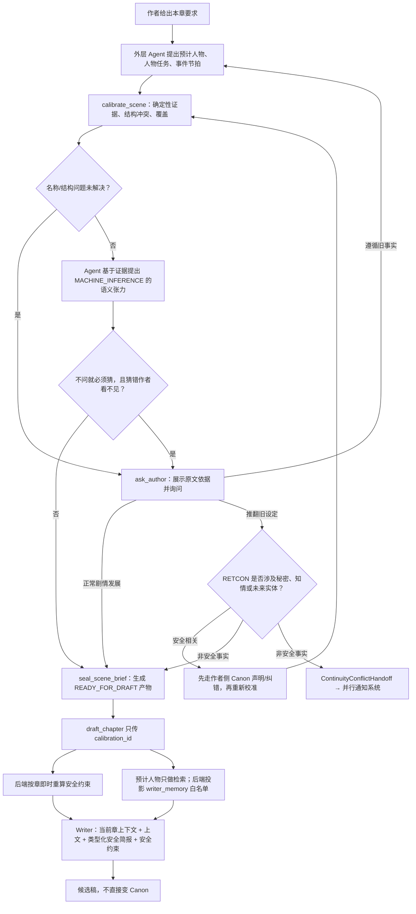

# 2026-08-17 模式二写前校准与写作执行简报任务

> **这份不是权威。** 它记录维护者与 Codex 围绕模式二写前数据链讨论后定下的任务范围。
> 真正实施前，涉及工具权限、Writer 边界和产品记忆的决定必须落进 `docs/` 或新 ADR；
> 涉及 `draft/` 时仍须先复核冻结的评测协议、九份修正案和 ADR 0010/0011。

**状态**：方案已定，尚未实现；本文只新增任务文档，不代表代码问题已经修好。

**决定了什么**：模式二新增一个对正文和 Canon 只读、类型化的“写前校准”能力。外层 Agent 先根据作者当前要求
提出预计人物、人物任务和本章事件概括；校准层再按第 N 章时点读取有来源的数据，区分可靠事实、
机器抽取、原文观察、机器推演和未知，形成两份结果：一份给 Agent 审阅和解释，一份由后端从
Writer-safe 的类型项与封闭指令渲染成写作简报。Agent 的自由文本不直接成为 Writer 事实或指令。
校准过程会写一份可过期、可重建的非 Canon 派生产物；安全约束仍由后端按章即时重算，校准结果
不能写入 Canon。

**为什么**：当前空白新章会从目标章空正文推导出空 cast，进入 `UnknownCastConstraints` 后，
产品记忆整段被跳过。最常见的“新建下一章再让助手写”反而只剩上一章上下文、简短 goal 和禁令。
同时，真正写正文的 Writer 不会自动看到目标章当前正文，外层 Agent 查到的状态、关系、事件和
校准结果没有一条结构化、不可丢失的通道进入 Writer。`write_rule` 已有通道，但当前会替换默认
Writer 写作提示。现状尚无机制保证人物状态、关系、伏笔、事件连续性和知情边界长期保持，真实
错误率仍是未知，不能把本设计预先写成质量已经提升。

**选择的整体方案**：**写前校准 + 持久通知 + 按需 Agent 修复方案**。本文负责写前校准、Writer
交接，以及向通知系统提供结构化冲突结果；通知的存储、右栏界面、忽略/已解决生命周期由并行任务
负责。作者明确要求修复时，Agent 先给出有范围的修复方案，再按作者授权执行；不自动批量重写前文。

**放弃了什么**：

- 不把预计人物重新做成作者每章必填的表单；它首先由 Agent 根据作者当前话语与上下文提出。
- 不让第二个 LLM 把自己的判断盖成“已核验事实”；语义判断始终标为机器推演。
- 不把人物任务、事件概括或作者接受的写作方向写入 StoryGraph Canon；意图不等于已发生事实。
- 不把校准结果拼成一两句自由文本塞回 `goal`；那会再次丢掉来源、未知项和字段边界。
- 不承诺把任意作者/Agent 任务散文原样交给 Writer；当前 ADR 0010 下，安全 MVP 只能投影封闭指令和
  安全引用，因此会牺牲一部分细腻指令。若要恢复 rich free text，必须先单独重审 Writer 边界。
- 不用预计人物替代写后实际人物识别；两者用途不同。
- 不用现有 `draft_chapter → save_draft` 冒充安全的跨章局部修改器；它今天是整章候选覆盖。
- 不自动重写“可能受影响”的几十或几百章；字符串提及不等于剧情因果依赖。

**什么情况下要推翻它**：真实使用证明写前校准没有降低人物状态漂移、重复事件或知情错误，且在
预注册的同场景盲评 A/B 中“带校准简报”没有优于“不带简报”；或者校准每章都需要作者回答、
打断率达到无法正常写作的程度。届时应退回只展示确定性资料的助手，不再让 Agent 自动组织本章任务。

---

## 一、范围与相邻任务

### 1.1 本任务负责

1. 模式二开始起草前，生成预计人物、人物任务和事件概括。
2. 用章级时态数据、原文证据和覆盖状态校准这些提案。
3. 区分作者原话、结构化作者选择、Agent 推演、数据库记录和未知，禁止混成一段“系统结论”。
4. 返回可确定的结构冲突和带来源事实；Agent 发现语义张力且不问就必须猜时，停下来询问作者。
5. 生成一份详细 `CalibrationReport` 和一份只含类型化 Writer-safe 项的 `SceneBrief`。
6. 保证 `SceneBrief` 在已解析 cast 与未知 cast 两条产品起草路径中都能进入 Writer。
7. 为重写/续写已有章节提供目标章当前正文，而不是只给上一章。
8. 过滤失效摘要，保留来源与覆盖回执，禁止“没查到”被说成“从未发生”。
9. 向统一系统通知产出结构化 `ContinuityConflictHandoff` producer 契约。
10. 定义作者主动要求修复时的 `RepairRequest`、`RepairPlan` 与 `ExecutionReceipt` adapter 契约。

### 1.2 本任务不负责

- 系统通知表、右栏 tab、badge、已读/忽略/解决状态和通知 UI；这些由并行通知任务实现。
- 写完正文后的实际人物识别、正文验证、总结生成、抽取和 Canon 晋升；这些由保存后闭环任务实现。
- 自动判断人物动机、关系弧、因果链或伏笔是否“写得好”。
- 自动抽取或自动回收伏笔；当前生产链没有可靠的开放伏笔查询。
- 为修复任务新增通用图读取权限；Agent 仍只使用窄工具。
- 未经作者明确授权的跨章修改。
- M2 三臂实验定义的改动；产品路径与冻结评测路径必须继续分开。

### 1.3 与并行系统通知任务的唯一交界

本文只产出 `ContinuityConflictHandoff`。通知任务消费它并负责持久化和展示，不得重新调用 LLM
再判断一次“是否冲突”，否则两套逻辑会给同一件事下出不同结论。

通知任务至少需要接收：

- 当前项目、章节和作者当前原话；
- 冲突的旧事实、来源等级、有效章区间和证据锚；
- Agent 原始提案与校准后的提案；
- 作者选择：遵循旧事实、正常剧情发展、推翻旧设定；
- 确定受影响项、待复核项、未知项；
- 触发时的正文快照与 Canon 水位，用于去重和判断后来是否过期。

通知的 ID、生命周期、右栏动作和视觉文案归通知任务所有。

---

## 二、当前实现为什么没有解决原问题

### 2.1 空白新章在最需要记忆时丢掉记忆

当前 Agent 从目标章正文提取 cast。只有标题或正文为空时，得到空集合，随后成为
`UnknownCastConstraints`。产品起草在这种状态下直接退回普通装配，不加载人物档案、历史事件或
滚动总结：

- [`agent/tools.py`](../src/novel_harness/agent/tools.py) 的 `_derived_cast` / `_scene_context`；
- [`draft/product_draft.py`](../src/novel_harness/draft/product_draft.py) 的 `_with_memory`。

安全方向是 fail-closed，没有泄密；错误在于把“安全 cast 不确定”和“正向记忆不能加载”绑定成了
同一开关。两者必须拆开。

### 2.2 Writer 没有目标章当前正文

`DraftAsk` 目前只有 `chapter + goal`。`ChapterDesk` 构造真正的 `ChapterDraftRequest` 时只传 goal、
长度、上一章上下文和 write rule；读取目标章正文只用于保存前的 SHA 并发保护，不进入 Writer。

后果：

- “保留本章前半段、重写后半段”无法可靠执行；
- 重写旧章时 cast 来自旧正文，但 Writer 看不到这份正文；
- 外层 Agent 即使调用 `chapter_text`，也只能把关键信息再次压成 goal，仍会丢细节。

相关入口：[`agent/ports.py`](../src/novel_harness/agent/ports.py)、
[`agent/drafting.py`](../src/novel_harness/agent/drafting.py)、
[`draft/product_draft.py`](../src/novel_harness/draft/product_draft.py)。

### 2.3 `CANON` 已不等于“作者确认”

ADR 0020 允许没有进入异常 bucket 的 event/edge 由系统自动升为 Canon。因此写前校准不能只看
`information_scope == CANON` 就输出“已由作者确认”。至少还要保留：

- `source`；
- `confidence`；
- `evidence_id` / `evidence_status`；
- `valid_from_chapter` / `valid_to_chapter`；
- 当前正文快照是否仍与证据一致。

当前人物状态工具会把这些来源字段丢掉；人物档案自身还没有章级有效期和完整来源字段。它们不能
被统一包装成硬事实。

### 2.4 当前能查的数据并不等于能回答所有问题

| 作者关心的问题 | 当前数据能力 | 本任务中的处理 |
|---|---|---|
| 陈舟是否受伤 | `state_at(chapter)` 能查章级状态 | 作者来源可作硬依据；当前机器抽取只能作带证据提示 |
| 两人关系到哪一步 | 底层有时态 `RELATED_TO`，当前 Agent 工具没有暴露 | 新增窄读口；只返回记录的关系阶段，不声称情感解释正确 |
| 林葵知道什么 | 知识矩阵与场景约束可确定性计算 | 有生效 KNOWS/BELIEVES 就按记录处理；无边时 Writer 操作上按 UNKNOWN/不知道处理，但不能宣称认识论上“确实不知道” |
| 仓库伏笔是否已用过 | schema 有预留，生产声明/查询链不完整 | 明确返回 `UNKNOWN`；不得用字面提及冒充已回收 |
| 是否和已发生事件冲突 | 能列当前证据有效的事件 | 结构冲突可判；语义冲突只能列为机器推演 |
| 更早发生了什么 | 有章节总结和事件索引 | 仅使用与当前正文快照一致的数据；机器总结只作背景 |

### 2.5 旧摘要可能污染新稿

产品 Writer 当前直接读取每章最新 ACTIVE 总结，不核对该总结是否对应磁盘上当前正文。旧章改写后，
Agent 查询路径可能提示摘要陈旧，但产品起草路径仍可能把旧总结送给 Writer。本任务必须把摘要新鲜度
判断收敛为同一条读路径：无法证明与当前快照一致的总结不得进入当前 Writer 背景。

### 2.6 当前跨章写能力不是局部修复能力

Agent 可以读取任意章，也可以为任意已存在章节生成候选并逐章 `save_draft`；但：

- 候选是整章替代，不是段落 patch；
- Writer 不自动看到目标章正文；
- 一次改多章没有跨章事务，可能只成功一部分；
- 保存后旧机器抽取会变 STALE，新抽取不会由 `save_draft` 自动补齐；
- 旧总结可能仍继续进入后续起草。

所以通知里的“让 Agent 修复”不能直接绑定现有 `save_draft` 并宣称安全完成。

---

## 三、目标体验

作者说：

> 写第十一章：陈舟和林葵进入仓库找钥匙线索，两个人仍然互相怀疑，暂时不要揭开花瓶秘密。

### 3.1 外层 Agent 先提出临时计划

```text
预计人物
- 陈舟
- 林葵

人物任务
- 陈舟：进入仓库，同时试探林葵
- 林葵：寻找钥匙线索，但不能表现出知道花瓶秘密

本章事件概括
- 两人在互相怀疑的状态下进入仓库
- 发现上一章伏笔留下的痕迹
- 推进仓库线索，但暂不揭开钥匙真相
```

这一步是给作者/Agent 阅读的创意提案，不是事实，也不是 Writer 入参。每一项都必须标记来源：作者
明确说过，还是 Agent 根据上下文补出的；封存前只能把可表达为封闭指令码和安全引用的部分投影给
Writer，剩余散文留在会话里。

### 3.2 校准工具查真实数据

校准层按第十一章时点依次核对：

1. “陈舟”“林葵”是否唯一解析；
2. 两人是否已经登场、是否死亡、当前地点和状态；
3. 当前关系阶段及其来源；
4. 与本场相关的当前证据有效事件；
5. 知识矩阵和后端即时计算的安全约束；
6. 相关章节原文与新鲜摘要；
7. 数据覆盖是否完整，查询是否被截断；
8. 伏笔等当前不能可靠回答的项目是否需要明确标成未知。

### 3.3 详细报告给 Agent，精简简报给 Writer

Agent 可以看到：

```text
核对结果
✓ 陈舟右腿仍在受伤状态。
  来源：作者 Canon 的章级状态；第 10 章生效；证据仍有效。

✓ 两人当前记录为“互相怀疑”。
  来源：当前有效关系边；第 9 章生效。

✓ 当前没有林葵 `KNOWS` “花瓶秘密”的生效记录。
  操作结论：Writer 必须按“不知道”处理；这不证明人物在故事世界里事实上绝不可能知道。

? “仓库伏笔已经使用到什么程度”目前没有可靠生产数据，不能核验。

机器推演：可让陈舟的伤势影响动作，并通过试探性对白表现关系；这不是既有事实。
```

Writer 接收后端从类型项固定渲染的短版本。下面是**展示效果**，不是允许 Agent 提交的自由文本：

```text
【Agent 对作者请求的结构化理解（未确认时为机器推演）】
- 陈舟与林葵进入仓库寻找线索；本章暂不揭开钥匙真相。

【连续性依据】
- 陈舟：行动受限。（后端封闭的公开身体限制类型；作者 Canon 事实）

【机器写作建议】
- 可让陈舟在行动受限的同时试探林葵；可让林葵从仓库痕迹推进线索。

【未知，不得擅自断言】
- “仓库伏笔是否已经回收”目前没有可靠数据。

【后端即时安全约束——不属于 SceneBrief】
- 林葵必须按“不知道『花瓶秘密』”处理；不得提前说破。
```

其中“进入”“寻找”“暂不揭开”来自封闭指令码和安全 NodeRef/秘密显示名；连续性文字由后端按
fact type 固定渲染。Writer 不需要看到数据库字段、置信度数字和长篇审计说明；但它收到的每条执行
要求必须能反查回 `CalibrationReport`。作者聊天原文、Agent 的任务散文和事件散文都不直接转发。
若作者看过这张类型化任务卡并明确选择“按此写”，服务端才把这些指令放入 `author_instructions`；
未确认时仍可起草，但它们留在 `projected_request_directives`，认识状态和强度都是
`MACHINE_INFERENCE`，界面与 prompt 都不能写“作者已经确认”。
如果现有“右腿受伤”或“互相怀疑”只存为任意字符串，而没有封闭类型与公开性证明，它们在空白章
UnknownCast 下只能留在 Agent 报告，不能为了让简报看起来丰富就送入 Writer。补齐可证明安全的类型
模型是恢复这类正向记忆的前提；在此之前宁可少给，不伪造“已经安全”。

---

## 四、核心概念必须拆开

### 4.1 作者原话、Agent 推演、事实和未知

固定使用八类认识状态，不用模型自报百分比：

| 类型 | 含义 | 能否当硬依据 |
|---|---|---|
| `AUTHOR_INTENT` | 作者看过类型化任务卡后明确确认，服务端把整张指令联合、参数、turn/hash 绑定成的本次意图 | 是本稿最高创作意图，但不是已经发生的 Canon 事实；模型不能自报此类型 |
| `AUTHOR_CANON_FACT` | 作者经声明/修正链让其生效的章级事实 | 可以；仍要服从有效期和当前状态 |
| `AUTHOR_BACKGROUND` | 作者手写、但未走 Canon 声明/修正链的总结、人物档案等背景 | 只作作者来源的软背景；不得自动升格为已发生事实 |
| `EXTRACTED_CURRENT` | 机器抽取，证据与当前正文快照一致 | 只能作有证据提示，不能冒充作者确认 |
| `OBSERVED_TEXT` | 原文精确提及、共同出现等字符串观察 | 只能证明“写过/提到过”，不能证明语义关系 |
| `MACHINE_SUMMARY` | 与当前正文一致的机器章节总结 | 只作背景，不能用于硬冲突 |
| `MACHINE_INFERENCE` | Agent 对任务、动机、关系推进和情节走向的推演 | 只作写作建议 |
| `UNKNOWN` | 缺数据、陈旧、被截断、歧义或当前能力不可回答 | 不得补写成事实 |

`CANON` 是生效范围，不再单独代表来源等级。

### 4.2 预计人物与实际人物

- **预计人物**：写前由作者原话和 Agent 临时计划得出，用于检索候选记忆、编排人物任务和帮助 Writer。
- **实际人物**：正文完成后从真实文本识别，用于保存后检查和数据更新。

预计人物不得写回 Canon，也不得伪装成“本章实际在场”。实际人物的后处理由保存后闭环任务负责。

### 4.3 检索 cast、安全 cast 与 Writer 可见记忆

必须拆成三层，不能把“查到了”直接等同于“可以给 Writer 看”：

1. `retrieval_cast`：使用已解析的预计人物，为校准层寻找候选档案、状态、关系、事件和相关摘要。
2. `safety_cast`：决定 `must_not_reveal` / `forbidden_entities`，只能由后端按章即时计算。
3. `writer_memory`：把候选资料经过确定性的 Writer 可见性白名单后，才允许进入 prompt。

空白新章即使 `safety_cast` 仍然未知并保持“全部秘密禁止说破”的 fail-closed 结果，
也可以用 `retrieval_cast` 帮 Agent 组织任务；但不得把全部检索结果直接交给 Writer。

预计人物**永远不能把空白章的安全基集从 UnknownCast 变成 Resolved**。安全基集只从目标章当前
正文的实际提及派生：正文基集为空时始终保持 UnknownCast / 全秘密禁止说破；正文基集已经非空时，
预计人物最多作为“只增不减”的 include 与它取并集，防止重写计划新增人物后仍按旧稿人物计算。
预计人物无论来自作者还是 Agent，都只能扩大检索候选，不能单独放宽安全约束。Writer 可以同时收到
“不得自行引入未列出的命名人物”的执行要求，但这只是软写作要求，不能替代后端 fail-closed 约束。
任何情况下，模型都不能传入或覆盖秘密约束。

UnknownCast 下的 Writer 可见规则写死为：

- 作者当前聊天原文不自动进入；只允许服务端已结构化、能逐字段证明安全的选择和标签；
- 后端白名单只允许封闭枚举、机器键、NodeRef 显示名、布尔/纯数值和章号；
- `EdgeProps.value`、关系/状态值、人物备注等即使挂在结构化记录上，只要底层仍是任意字符串就隐藏；
- 自由文本人物背景、事件 summary 和章节 summary 默认不进入；
- 事件只有在能机械证明对全体可能人物公开时才进入，不能只证明预计人物都是 knower；
- 无法证明安全的资料留在模型不可见审计层，或只转译成不含事实正文的标签/禁令。

所谓“禁止内容检查”只能作为附加纵深防御，不能把一个任意字符串变成 Writer-safe。作者若在原话里
写出完整未来设定或秘密 tell，外层 Agent 可以理解并据此与作者交互，但 Writer 只收到秘密显示名、
禁止揭露标签和安全的封闭指令；不得把原句或改写后的 tell 传过去。若产品确实要让任意作者原话进入
Writer，必须另开 ADR 明确修改 ADR 0010 的 labels-only 边界和风险，不能藏在本任务实现里。

这意味着本任务不是“UnknownCast 时恢复全部记忆”，而是“UnknownCast 不再把检索、校准和 Writer
可见性绑成同一个总开关”。能安全恢复多少由白名单和实际数据决定，不能预先承诺全部恢复。

### 4.4 正常剧情发展与推翻旧设定

作者坚持与旧事实表面不同的新写法时，必须区分：

- **正常剧情发展**：陈舟依然受伤，但强忍疼痛跑起来。旧事实仍成立，本章是状态变化或例外。
- **推翻旧设定**：陈舟其实从未受伤。旧正文、状态、总结和后续引用可能需要复核。

校准工具不能自己替作者选。正常剧情发展只形成当轮作者决议；只有作者选择推翻旧设定时才生成
`ContinuityConflictHandoff`，且 handoff 本身不修改 Canon。

---

## 五、方案比较与最终选择

### 5.1 方案 A：把校准结果压回 `goal`

优点是现有接口几乎不用改。缺点是来源、未知、人物任务和事件节拍全部退化成自由文本；外层 Agent
可能漏抄、改写或把机器推演说成事实。**不采用。**

### 5.2 方案 B：内联一个可编辑 `SceneBrief`

新增结构化 `SceneBrief`，由 Agent 在下一步随 `draft_chapter` 原样传入。接线较少，但同一个模型仍可
在复制时改字段，且很难机械证明 Writer 用的是校准工具刚返回的那一版。可作为短期原型，不作为
“数据不要有错”的最终保证。

### 5.3 方案 C：不可变校准产物 + 引用 ID（采用）

采用“确定性检查 → Agent 推演/必要时询问 → 服务端封存”三步：

1. `calibrate_scene` 只返回 Agent 可见的确定性证据、结构冲突、覆盖和未知，不负责理解自由文本后
   自动改写任务。
2. Agent 根据这些材料形成语义推演；只有不问就必须猜、且猜错作者看不见时才调用 `ask_author`。
   它提交给封存器的只能是事实 ID、封闭指令码和安全 NodeRef；自由文本推演仅供 Agent/作者阅读。
3. `seal_scene_brief` 重新校验所有事实引用和可见性，由后端固定模板渲染 Writer 简报，生成一个
   不可变 `calibration_id`。

无冲突的普通自然语言请求可以直接封存，但 Agent 对原话的结构化投影只能是
`MACHINE_INFERENCE`。如果产品要把它提升为 `AUTHOR_INTENT` 或给予“作者要求”的更高强度，必须先向
作者展示固定渲染的类型化任务卡并取得明确“按此写”选择；不得只给模型生成的文字套一个 answer ID。

完整报告、唯一的类型化 `goal_spec` 与 Writer 简报作为非 Canon 的临时工具产物保存；`draft_chapter` 只接收
`chapter + calibration_id`，后端按 ID 取回原件并核对：

- 同一项目；
- 同一章；
- 不可变的作者 turn ID 与作者原话哈希；
- Canon version；
- 相关正文快照/摘要水位。

任何水位变化都返回“校准结果已过期，请重新校准”，不得悄悄继续使用。外层 Agent 也不能在
`draft_chapter` 时另传第二份 `goal_spec`；Writer 使用的目标就是校准产物里由安全字段渲染的那一份。这样
外层 Agent 不负责复制事实文字或目标散文，Writer 拿到的是校准层实际产出的版本。校准产物是可重建候选，
不进入图谱、章节总结、RememberedRule 或稳定 system 前缀。

不可变 ID 只证明“这就是被封存的那版”，不能证明自由文本语义正确。因此封存器绝不接收需要它
判断含义的 Writer-bound 字符串：作者意图只能来自绑定完整任务卡和指令参数的服务端确认记录；连续性事实只接
Writer-safe `item_id` 并由后端渲染；Agent 新增内容一律固定为 `AGENT_INFERRED`，且只能使用封闭
directive kind 与安全参数。详细 Agent 报告可以更宽，但 Writer-bound 投影不能继承其中
`writer_visibility=HIDDEN` 的项；任何生成 Writer 指令的独立步骤也只能看到 writer-visible 投影，
不能继承外层 Agent 的对话与工具历史。

短报告和 ID 可以复用现有 ToolOutcome 消息运输；不可变原件必须放在独立、按 ID 可寻址且不受
prompt 裁剪影响的非 Canon artifact store。写入按内容/水位幂等，Agent resume 后仍可读取；不能只做
进程内字典。旧模型可见报告不会因 artifact 过期自动消失，所以投影层还必须把失效详情替换成短提示。

---

## 六、建议的数据契约

以下是字段约束，不要求照抄类名；真正代码仍使用 frozen Pydantic、`extra="forbid"`。

### 6.1 `SceneProposal`：Agent 的临时创意提案

```text
chapter
intended_cast[]
  surface
  basis                        固定 AGENT_INFERRED；模型不能自报作者来源
directive_candidates[]
  kind                         后端封闭枚举，如 ENTER_LOCATION / SEARCH_FOR /
                               TEST_CHARACTER / DEFER_REVEAL
  actor_surface?
  target_surface?
  object_surface?              只能解析为允许的 NodeRef/安全标签
  location_surface?
  basis                        固定 AGENT_INFERRED
viewpoint_surface?             只解析 NodeRef
tone_code?                     封闭枚举
pacing_code?                   封闭枚举
ending_code?                   封闭枚举
```

作者当前原话不由 Agent 回填。handler 从当前会话直接绑定不可变的 `author_turn_id +
author_request_sha256`，原文仍以会话记录为唯一来源，但不进入 Writer。作者点击的结构化答案或选择由
handler 另建 `AuthorInstructionRef{turn_id, request_sha256, card_hash, directive_union, safe_args,
confirmation_id}`；只有作者看过固定渲染卡后产生的这个确认记录能形成 `AUTHOR_INTENT`。普通请求
投影只有 author turn 来源引用，认识状态仍是 `MACHINE_INFERENCE`。
模型入参不允许出现任意任务散文、event beat 散文、`must_not_reveal`、`forbidden_entities`、秘密正文、
Canon 写入或章号有效期字段。不在封闭指令集里的创作细节只能留作 Agent 对作者的建议；要进入 Writer
必须先增加一种可机械验证的类型，不能塞进 `other` / `notes` / `custom_text`。

### 6.2 `EvidenceEnvelope`：校准证据

```text
item_id
kind                           AUTHOR_INTENT / AUTHOR_CANON_FACT / AUTHOR_BACKGROUND /
                               EXTRACTED_CURRENT / OBSERVED_TEXT / MACHINE_SUMMARY /
                               MACHINE_INFERENCE / UNKNOWN
fact_type                      后端封闭类型，不接受任意图节点类型
display_text                   由后端按 fact_type 渲染，不接受 Agent 自填
chapter?
valid_from_chapter?
valid_to_chapter?
source
confidence?
evidence_id?
evidence_status?
anchor?                        仅非敏感事实可给 Agent；仍使用 para_index + quote_text + occurrence_k
snapshot_id?
freshness                      CURRENT / STALE / UNVERIFIED
completeness                   COMPLETE / PARTIAL / MISSING
truncated                      true / false
blind_reasons[]
agent_visibility               SAFE_FACT / SAFE_LABEL_ONLY / HIDDEN
writer_visibility              SAFE_FACT / SAFE_LABEL_ONLY / HIDDEN
```

不得在图层外重新实现时态过滤；所有 edge/event 必须从 StoryGraph 的窄 Pydantic 读口取得。
`agent_visibility` / `writer_visibility` 由后端封闭类型规则派生，Agent 和 LLM 都不能填写。
PLANNED、Secret props/tell、完整秘密正文、任意 Node props 和不对称知识事件不得进入模型可见报告；
秘密侧最多复用既有的显示名禁令、未来实体显示名与首现章。敏感证据只保留模型不可见审计记录和
`evidence_id`，不把含 tell 的 quote 放进 Agent 对话。

### 6.3 `CalibrationReport`：给 Agent 和审计使用

```text
id                             inspection_id
project_id
chapter
author_turn_id
author_request_sha256
source_watermark
sealability                    READY_TO_SEAL / NEEDS_AUTHOR / STALE
normalized_cast[]              已解析 node id + 显示名 + basis
agent_safe_facts[]             只含 agent_visibility != HIDDEN 的 EvidenceEnvelope
writer_safe_fact_ids[]         后端派生的 writer_visibility != HIDDEN 子集，仅供封存器引用
deterministic_conflicts[]      名称歧义、同结构键不可能、R2/R3 等集合结果
warnings[]
unknowns[]
coverage_receipt
```

报告必须说明查到哪里、哪些章缺摘要、哪些结果被截断；空结果不能裸解释为“从未发生”。
自由文本任务与旧事实“是不是矛盾”不属于 `deterministic_conflicts`。Agent 可以基于证据提出
`MACHINE_INFERENCE` 的 `inferred_tension`，但不能把它改名成硬校验。

存在未解决名称歧义或确定性结构冲突时，报告必须是 `NEEDS_AUTHOR`，不能封存。语义张力是否需要问
作者由 Agent 按 ADR 0024 判断；服务端无法假装确定性保证模型一定识别了所有语义冲突。作者回答后
重新运行检查，旧 inspection 保持不可变。

### 6.4 `SealedCalibration`：不可变、可起草的产物

```text
calibration_id
project_id
chapter
author_turn_id
author_request_sha256
goal_spec                      由结构化作者选择、封闭指令码与安全引用组成；不存任意目标散文
author_resolution?             FOLLOW_OLD / STORY_PROGRESSION / RETCON_NON_SAFETY
source_watermark
source_inspection_id
scene_brief
status                         READY_FOR_DRAFT / STALE / REVOKED
```

`seal_scene_brief` 必须重新验证所有 `report_item_id`、可见性、项目、章节和水位。未解决问题、敏感事实
引用、任意字符串字段或第二份 `goal_spec` 都拒绝。`draft_chapter` 只接受 `READY_FOR_DRAFT` 的产物；
不能依赖模型自觉。

### 6.5 `SceneBrief`：给 Writer 的短执行简报

```text
chapter
intended_cast[]
author_instructions[]
  item_id + directive_kind + safe_args[] + author_instruction_ref
projected_request_directives[]
  item_id + directive_kind + safe_args[] + basis=MACHINE_INFERENCE + author_turn_ref
continuity_facts[]
  item_id + report_item_id + basis + strength
machine_directives[]
  item_id + directive_kind + safe_args[] + basis=MACHINE_INFERENCE + source_refs[]
event_beats[]
  item_id + directive_kind + safe_args[] + basis + source_refs[]
do_not_assume[]
  item_id + reason_code + source_refs[]
viewpoint_ref?
tone_code?
pacing_code?
ending_code?
```

`SceneBrief` 不携带秘密安全约束。安全约束由起草后端重算并作为另一块输入。每项都必须通过
`report_item_id/source_refs` 反查来源；所有展示文字由后端按类型和安全参数固定渲染，不接受 Agent
提供 `text`。已确认作者指令、未确认请求投影、作者 Canon、机器抽取和机器建议分块渲染，不能压成
同强度字符串。
`strength` 只能由来源规则派生，不能让模型把 `EXTRACTED_CURRENT` 升格成硬命令。
`author_instructions` 只能由 handler 根据完整 `AuthorInstructionRef` 构造；未确认的普通请求投影只能
进入 `projected_request_directives`，模型也只能提出 `machine_directives`。`event_beats.basis` 同样由
来源类型派生，不能由模型填成作者来源。
权限顺序固定为：后端安全约束最高；已确认的作者指令其次；作者 Canon 连续性作为事实依据；未确认
的请求投影、机器抽取与机器建议都只能作参考。SceneBrief 属于本稿临时用户层执行计划，不进入稳定
system 前缀或 write rule。

### 6.6 `ContinuityConflictHandoff`：交给通知系统

```text
calibration_id
project_id
chapter
author_turn_id
proposal_item
inferred_tension               明标 MACHINE_INFERENCE
referenced_facts[]             只放事实 ID、来源等级和有效区间；敏感引语另由作者 UI 读取
author_choice                  RETCON
prospective_structural_impacts[]  would_stale / would_supersede / would_change_interval
review_candidates[]            后续精确提及、相关事件、相关摘要
unknowns[]
source_watermark
```

只有 `RETCON` 生成持久 handoff。`FOLLOW_OLD` 不生成通知；`STORY_PROGRESSION` 只保留当轮选择，除非
后来真的出现确定性 issue。修改尚未发生时只能叫 `prospective_structural_impacts`；保存或 Canon 修正
成功后的回执才能写 `STALE`、`superseded` 等已发生结果。`review_candidates` 不能在通知层改名成
“确定受影响章节”。

### 6.7 `RepairPlan`：作者主动要求修复后生成

```text
notice_id
repair_goal                    给作者看的方案目标，不直接转发给正文 Writer
authorization                  PLAN_ONLY / GENERATE_CANDIDATE / APPLY_EXACT_SCOPE
actions[]
  kind                         ADJUST_CURRENT_BRIEF / REQUEST_CANON_CORRECTION /
                               REVISE_CHAPTER / REGENERATE_SUMMARY /
                               RERUN_EXTRACTION / MANUAL_REVIEW
  target
  reason
  source_refs[]
  prerequisites[]
  reversible
definite_scope
review_scope
unknown_scope
```

修复计划本身不是 Canon。通知里的“看看怎么修”默认只有 `PLAN_ONLY`；生成候选和应用候选是两级
独立授权。作者说“帮我改”只授权他明确指向的章/锚和动作，不同时授权整章覆盖、Canon 修改、付费
重抽或新增章节。`REQUEST_CANON_CORRECTION` 只能跳转或调用现有作者侧声明/纠错链；在另开 ADR、
新增窄命令、CAS 和逐目标授权之前，Agent 本身没有写 Canon 权限。若计划扩展到更多章节，必须先把
新增范围说清楚再执行。

---

## 七、完整数据流



校准和起草必须是两个模型 step。同一批工具调用的参数在看到结果前已经全部生成，不能让
`calibrate_scene` 和依赖其结果的 `draft_chapter` 在同一批并发调用中假装有数据依赖。

---

## 八、上下文与检索规则

### 8.1 不是“把前面所有章节全部塞进去”

产品路径按 token 预算和确定性相关性逐层装配：

1. 从结构化作者选择、封闭指令码和安全引用固定渲染的 `goal_spec`；作者聊天原文不转发；
2. 目标章当前正文：重写/续写时必须提供，空白新章则为空；
3. 上一章：预算容得下时取更多，超预算时按产品档的确定性上限取尾部；
4. 预计人物的章级状态、关系与知识边界候选，再按可见性决定哪些进入 Writer；
5. 与预计人物相关、且能对完整安全 cast 证明可见的历史事件；UnknownCast 时自由文本事件默认排除；
6. 最近章节与确定性索引定位到的更早章节总结候选；UnknownCast 时不进入 Writer；
7. 仍不足时，明确告诉 Agent 哪些资料没有装入，而不是静默截断。

不引入向量检索，不把整本书正文或全部总结无差别塞入 prompt。

### 8.2 摘要必须证明新鲜

- 模型总结只能作背景，不能进入“作者 Canon 事实”标题下；
- 摘要必须能关联当前章节快照或正文哈希；
- 旧正文对应的摘要标 `STALE` 并从 Writer 记忆中排除；
- 作者手写总结也要说明它是否对应当前正文，不能只因 `source=author` 就忽略正文已改；
- 缺摘要时报告缺口，不自动把空白解释为该章无重要事件。

### 8.3 事件与不对称知识

Writer 只收到能对**完整安全 cast** 证明可见的事件内容。“所有预计人物都是 knower”不等于安全，
因为预计人物可能只是实际人物的子集。UnknownCast 下自由文本事件和章节总结默认排除；只有后端能
机械证明为公开/全员可知的事件才可例外进入。校准层也不得把不安全事实先告诉 Agent，再让 Agent
换句话塞进角色任务。系统检索到的完整 PLANNED、Secret props/tell 和秘密正文不得进入 Agent 报告或
Writer；作者自己在当前聊天里写出的原话仍属于会话输入，但不得再由 brief 原样或改写转发给 Writer。

UnknownCast 下的“结构化”按**字段**判定，不按表名判定：只允许封闭 enum/key、NodeRef 名称、布尔、
纯数值和章号。`HAS_STATE.value`、`RELATED_TO.value`、人物简介/备注等任意字符串全部 HIDDEN，哪怕它们
来自 CANON 行；关键词扫描只能再拦一道，不能负责证明安全。

### 8.4 同一次起草只允许一份目标章快照

handler 必须一次读取形成不可变的 `TargetChapterSnapshot{text, sha256}`。下列动作全部使用这同一个
对象，禁止各自重读磁盘：

- 从当前正文派生 safety cast；
- 校验 calibration 水位；
- 给 Writer 提供目标章正文；
- 记录候选的 `base_sha256`。

任一阶段发现磁盘哈希变化，都拒绝本次起草并要求重新校准。`source_watermark` 明确由
`schema_version + author_turn_id/hash + canon_version + target_sha256 + supporting_chapter_hashes +
summary_row/snapshot_ids` 组成，不是一个含义不明的字符串。校准读取其他章节时也要核对磁盘哈希；
磁盘是正文真相源，数据库不存在与该哈希一致的 current snapshot 时只能标缺口或先走既有 reconcile，
不能仅因数据库某行写着 current 就继续。
旧报告即使已经进入 Agent 历史，投影时也应缩成“该结果已过期，请重查”，不能让过期散文继续影响
推理。

### 8.5 `write_rule` 与默认 Writer 约束

作者的 write rule 必须在**产品专用路径**作为附加写作要求，不得替换默认 Writer system prompt。
实现本任务时要确保输出格式、长度、禁止解释过程等默认约束始终保留；不得直接修改三臂共用的
`assemble()` 字节。write rule 同样是自由文本入口：它只能表达稳定文风/格式，不能承载 PLANNED 或
秘密 tell；这一点依 ADR 0010 仍靠产品边界与 review，不能把字符串扫描写成语义保证。若产品路径
无法隔离，先做评测协议影响审查。

---

## 九、冲突和提问规则

### 9.1 必须问作者

确定性工具只能因下列结构问题阻止封存：

1. 人名查无此人或一名多解，而且不同选择会改变本章人物任务；
2. 同一结构键、章级区间或集合约束出现机械上不可能同时成立的值；
3. 作者选择涉及揭露秘密、修改 KNOWS/BELIEVES 或提前使用未来实体，但 Canon 尚未修正。

“作者这句话是否与旧事实冲突”“人物为什么这么做”“关系是否合理”是语义判断。Agent 只能将它们
标为带事实引用的 `MACHINE_INFERENCE` 张力；只有不问就必须猜、而猜错作者又看不见时，才调用
`ask_author`。工具和 UI 不得把这类推演渲染成确定性规则命中。

询问必须带具体依据，不问“你想怎么写”这种空问题。

### 9.2 不打扰作者

- Agent 自己补出的内容与事实存在语义张力：Agent 将自己的提案改掉并保留 `MACHINE_INFERENCE`
  标记，不质问作者；
- 机器摘要或自动抽取与作者说法不一致：标警告，不拿弱数据质问作者；
- 缺少非关键背景：标 `UNKNOWN`，生成保守简报继续；
- 同一语义张力作者已经作出结构化选择：不重复提问；只有 RETCON 交给通知系统追踪。

### 9.3 作者坚持新写法

- `STORY_PROGRESSION`：旧事实仍成立，本章表达状态变化或例外；简报必须包含如何保持连续性。
- `RETCON_NON_SAFETY`：伤势、普通状态或非安全关系等可以作为 `AUTHOR_INTENT` 进入本稿，同时产出
  通知 handoff；旧 Canon 尚未更正这一点必须显式可见。
- 安全相关 RETCON：只要涉及 Secret、KNOWS/BELIEVES、future entity 或会放松安全约束，必须先走
  现有作者侧声明/纠错链并重新校准；若今天没有编辑入口，就停在计划/人工处理，不能让 SceneBrief
  绕过旧 Canon 的后端约束。

---

## 十、Agent 修复方案边界

### 10.1 作者决定何时修

通知只是持续记录。作者可以忽略，系统不反复弹问；作者点击或明确说“帮我修”时，通知系统将
`notice_id + 结构化影响资料` 交给 Agent，Agent 才生成 `RepairPlan`。

### 10.2 先方案，后执行

修复分两步：

1. **制定方案**：列出建议修改的正文、需要作者走的 Canon 纠错、总结/抽取重建和需要人工复核的章；
   不写任何文件。
2. **执行授权范围**：作者明确同意精确章/锚后，生成或应用正文候选并给每项收据；Canon 仍走作者侧
   纠错链。

一章内的小改，作者“帮我改这一处”就是该处授权；多章修复若 Agent 新发现更多目标，新增范围必须
再次说明。可能影响几十或几百章时，默认只给方案，不启动批量覆盖。

### 10.3 正文修改不能复用假能力

要让 Agent 真正修改旧章，先补一个独立的“基于当前章全文生成修订候选”能力：

- 输入必须包含目标章当前全文或明确、可重寻的三元锚；
- 产出仍是候选，不直接写盘；
- 展示与当前版本的变更范围；
- 保存继续使用正文 SHA 乐观锁和版本历史；
- 多章逐章提交，每章单独报告成功/失败，不宣称原子批改；
- 保存后只产出 `ExecutionReceipt` 给并行保存闭环消费；摘要、抽取、通知解决状态不由本任务编排。

在该能力完成前，Agent 只能提供修复方案或让作者手工修改，不能把整章自由重写说成“只改了冲突处”。

### 10.4 严重影响的诚实措辞

系统只能区分：

- `LOCAL`：未发现可确定的跨章触达；不等于保证无影响；
- `CROSS_CHAPTER`：存在时态区间、硬规则、失效证据或后续精确提及，需要列章复核；
- `POSSIBLE_RESTRUCTURE`：可能需要大改，必须由作者确认，系统不能断言“必须重写几百章”。

通知中“确定影响”和“待复核候选”必须分开计数。

---

## 十一、实施任务顺序

### Task 1：先冻结契约与失败样例

- [ ] 新开 ADR，确认预计人物只用于检索/写作意图、实际人物用于写后验证。
- [ ] 明确它补充或修改 ADR 0018/0019 的哪一条：`retrieval_cast`、`safety_cast`、`writer_memory`
      三层分离，安全约束仍由后端即时重算。
- [ ] 说明非 Canon artifact 不成为第二真相源，补齐 ADR 0017/0023 的可重建、过期和裁剪边界。
- [ ] 说明 SceneBrief 只走产品专用装配，补齐 ADR 0010 的 Writer 边界。
- [ ] 在 ADR 中明确：本任务采用类型化安全简报，不把作者/Agent 任意散文带入 Writer；若以后需要
      rich free-text brief，必须另案修改 labels-only 边界，不能靠关键词过滤暗中放行。
- [ ] 用硬测试证明 eval runner/gate 不导入 calibration/SceneBrief，三臂冻结 prompt 字节不变。
- [ ] 为本文第 3 节的陈舟/林葵样例建立端到端 fixture。
- [ ] 先写会失败的测试：空白新章今天只能拿到上一章和禁令，人物记忆为空。

### Task 2：补齐带来源的窄读模型

- [ ] 状态查询向校准层保留 source、confidence、evidence、有效区间和覆盖信息。
- [ ] 新增关系阶段的窄读口，不给 Agent 通用 `subgraph` 权限。
- [ ] 知识格保留来源和覆盖状态；未知格不能无条件翻译为“确定不知道”。
- [ ] 事件读口保留 source、evidence status 和知情/参与集合。
- [ ] 人物档案在缺来源/时态时固定标为软背景，不能渲染成作者 Canon 事实。
- [ ] 伏笔生产读口未完成前固定返回能力缺失，不造空实现。
- [ ] 为每种 fact type 定义后端 `agent_visibility` / `writer_visibility` 白名单。
- [ ] PLANNED、Secret props/tell、任意 Node props 和不安全事件通过 poison 测试证明无法进入 Agent 报告。

### Task 3：实现 `calibrate_scene`

- [ ] 新增严格 `SceneProposal` 入参和名称规范化；模型只能提交封闭指令码、安全引用和固定
      `AGENT_INFERRED`，不能提交任务/event/goal 散文或自报作者来源。
- [ ] 只做确定性的身份、时态、集合、覆盖和证据校准。
- [ ] 输出 Agent-safe `CalibrationReport`；不在此工具内自动改写任务或宣判自由文本语义冲突。
- [ ] Agent 对关系推进、任务分配、事件语义张力的判断始终保留为 `MACHINE_INFERENCE`。
- [ ] 保证工具结果分开记录 freshness、completeness、truncated 和盲区收据。
- [ ] 对 graph、event、summary、manuscript、Canon 和 RememberedRule 只读。

### Task 4：实现 `seal_scene_brief` 与不可变校准产物

- [ ] 为当前作者消息提供服务端稳定 turn 标识和原话哈希；模型不能自报或替换。
- [ ] 普通自然语言请求的投影固定为 `MACHINE_INFERENCE`；只有作者确认过固定渲染任务卡，且确认记录
      绑定完整 directive 联合、safe args、turn/hash/card hash，才生成 `AuthorInstructionRef`。
- [ ] 给校准产物分配 ULID，并绑定 project、chapter、Canon version 和正文快照水位。
- [ ] 使用可跨 Agent resume 的非 Canon 存储，不用纯进程内 registry。
- [ ] 允许重建、撤销和过期；不允许晋升为事实。
- [ ] seal 时重新验证每个 report item、可见性和来源强度；禁止第二份 `goal_spec`。
- [ ] seal 拒绝任意 Writer-bound 字符串；事实文字和指令文字全部由后端从 writer-safe 类型项固定渲染。
- [ ] 未解决结构问题、敏感引用或安全相关 RETCON 未完成 Canon 纠错时，不签发 READY 产物。
- [ ] 水位变化后 `draft_chapter` 明确拒绝旧 ID，并要求重新校准。
- [ ] 对话裁剪后仍能按 ID 找回；过期的旧报告在模型投影中缩为失效提示，不常驻稳定前缀。

### Task 5：把简报可靠接进 Writer

- [ ] 模式二 `DraftAsk` 改为 `chapter + calibration_id`；`goal_spec` 只从 sealed artifact 读取，仍禁止约束字段。
- [ ] handler 机械校验 READY、作者 turn/hash、项目、章节和全部水位。
- [ ] 一次读取 `TargetChapterSnapshot{text, sha256}`，安全 cast、Writer 当前章和候选基线共用它。
- [ ] `_handle_draft_chapter` 独立按章重算安全 `DraftContext`。
- [ ] `ChapterDesk` 将精简 `SceneBrief` 传到产品 `ChapterDraftRequest`。
- [ ] 在 ResolvedConstraints 与 UnknownCastConstraints 两条路径汇合后统一渲染简报。
- [ ] 简报使用独立“本稿执行计划”分区，不拼进 write rule、约束块或另一份 `goal_spec`。
- [ ] 给 Writer 的事实只接 writer-safe item ID，给 Writer 的机器指令只接封闭 kind + safe args；外层
      Agent 的自由文本和 agent-only 事实无法穿过 handler。
- [ ] 起草候选保存所依据的 Canon version/上下文指纹，避免旧 Canon 生成的候选无提示落盘。

### Task 6：拆开未知 cast、检索与 Writer 可见记忆

- [ ] 空白新章用预计人物建立 `retrieval_cast`，但不把它视为实际场景人物。
- [ ] 预计人物不得把空 safety base 变成 Resolved；UnknownCast 继续 full-ban。
- [ ] 正文 safety base 非空时，预计人物只能以 union/include 只增不减；解析失败退回 Unknown 或询问。
- [ ] UnknownCast 下自由文本人物背景、事件和总结默认不进 Writer；只允许后端白名单内容。
- [ ] UnknownCast 白名单按字段限制为 enum/key、NodeRef 显示名、布尔、纯数值和章号；所有任意字符串
      value/备注/关系描述/状态描述隐藏，字符串扫描只作附加防御。
- [ ] 作者聊天原文不自动进入 Writer；只有完整 `AuthorInstructionRef`、封闭指令和安全标签能由后端
      渲染为已确认作者指令。
- [ ] 未确认请求进入独立 `projected_request_directives` 并保持机器强度；不得放入
      `author_instructions` 或展示为作者已确认。
- [ ] “不得新增人物”仅作软要求，不作为安全证明；写后实际人物由外部闭环核对。

### Task 7：补目标章上下文与摘要新鲜度

- [ ] 重写/续写已有章时，把目标章当前正文作为明确分区传入 Writer。
- [ ] 超预算时确定性截断并给覆盖回执；不能静默只取章首或只靠 goal 概括。
- [ ] 产品摘要读取核对当前正文快照/哈希；陈旧摘要不进入 Writer。
- [ ] 缺失摘要时允许按索引读必要原文，不把整本书全部注入。
- [ ] 保持上一章产品档按模型窗口计算的上下文预算，不退回冻结实验档 800 字。

### Task 8：冲突提问与通知 handoff

- [ ] Agent 只能把自由文本矛盾称为带来源的 `MACHINE_INFERENCE` 张力；确定性工具不宣判语义冲突。
- [ ] 仅在不问就必须猜且猜错作者看不见时调用 `ask_author`。
- [ ] 问题展示旧事实、章号、证据和三个选择：遵循旧事实、正常剧情发展、推翻旧设定。
- [ ] 三个选择返回稳定确认记录；它必须绑定作者实际看过的 directive 联合、safe args、turn/hash 和
      card hash，不能只给模型文字套 answer ID。模型不能把自写文本标成作者决定；作者补充自由文本
      时视为新的 author turn，重新投影而非直接转发。
- [ ] FOLLOW_OLD 不产通知；STORY_PROGRESSION 默认只留当轮；只有 RETCON 产持久 handoff。
- [ ] 安全相关 RETCON 在作者侧 Canon 纠错成功前不得封存或起草。
- [ ] 与通知任务对齐唯一字段契约，通知侧不二次做语义判断。
- [ ] 相同作者决策和水位不重复提问。

### Task 9：定义按需 Agent 修复 adapter，不接管通知生命周期

- [ ] 定义版本化 `RepairRequest`：通知系统用结构化 notice ID 启动 Agent，不重贴散文。
- [ ] 定义 `RepairPlan`：区分建议范围、复核范围、未知范围和授权等级。
- [ ] 定义 `ExecutionReceipt`：逐章说明候选/保存/作者侧纠错请求结果，供外部保存闭环消费。
- [ ] Canon 修正只生成 `REQUEST_CANON_CORRECTION`，不扩张 Agent 写图权限。
- [ ] 本任务不实现 notice 状态、不决定 resolved、不编排总结/抽取；安全修订候选能力完成前不暴露
      “自动修复”。

### Task 10：修正产品 prompt 组合

- [ ] 仅在产品专用路径把 write rule 作为附加作者要求，不替换默认 Writer system prompt。
- [ ] 已确认作者指令、未确认请求投影、Canon 连续性、机器指令、当前章正文、机器背景和安全约束使用
      不同标题分区和强度；作者聊天原文和 Agent 任务散文不进入 Writer。
- [ ] 完整 PLANNED、Secret props/tell、秘密正文和校准审计元数据不得进入 Agent 或 Writer。
- [ ] 三臂共用 `assemble()` 不改字节；若无法隔离，先开协议影响修正。

### Task 11：验证与质量证据

- [ ] Python 单元测试覆盖模型、来源分级、时态、水位和过期拒绝。
- [ ] Agent 工具测试覆盖“两步调用”、问作者停止条件和 resume。
- [ ] 产品 prompt snapshot 覆盖 Resolved/Unknown、空白新章/已有章、摘要 fresh/stale。
- [ ] poison/leak 测试覆盖 PLANNED、Secret tell、敏感证据 quote、UnknownCast 事件/总结和不完整 cast。
- [ ] 并发测试证明 safety cast、当前章正文、calibration 水位和候选 SHA 来自同一快照。
- [ ] 前后端契约测试只在通知字段真正对齐后更新真实 fixture，禁止手写两份假契约。
- [ ] 跑完整 pytest、vitest、ruff 和 `demo.sh`。
- [ ] 若要声称“提高小说质量”，在第一次真实生成前另开并提交评测协议：真实长篇取样、同场景
      “带简报 vs 不带简报”、盲评维度、长度/provider 等价、裁判、阈值、无效轮和停止规则；结构
      测试与现有 M2 泄漏判分都不能替代文学质量证据。

---

## 十二、必须钉住的验收样例

### 12.1 空白新章不再丢记忆

给定：第 11 章只有标题，作者要求陈舟与林葵进入仓库；库中预置一条封闭类型且可证明公开的
陈舟身体限制、一个只存任意字符串的伤势说明、机器抽取关系、一条只对预计人物安全的事件和一份
新鲜机器摘要。

必须满足：

- 预计人物成功解析为陈舟、林葵；
- 校准报告能按预计人物找到状态、关系、事件和摘要，并正确标来源；
- 未额外确认任务卡时，Writer 只收到由封闭指令与安全引用渲染、明确标为 `MACHINE_INFERENCE` 的
  请求投影，以及白名单允许的公开身体限制；作者聊天原文和任意字符串伤势说明不进入；
- 若作者确认固定渲染的任务卡，同一组指令才进入 `author_instructions`，且确认记录绑定整张卡；
- 因 safety cast 仍是 Unknown，事件与摘要不能只因对预计人物安全就进入 Writer；
- Writer 收到 SceneBrief，而不是只收到“上一章 + goal + 全禁标签”。

另设稀疏库样例：没有状态、关系、事件或摘要时，系统必须返回带覆盖回执的 `UNKNOWN`，不得补造
“记忆”，也不得把空结果说成“从未发生”。

### 12.2 可靠事实和机器提示不混淆

给定：陈舟受伤是作者 Canon；人物档案是作者手写但未声明为 Canon；两人关系是 extractor 自动
Canon；章节总结是模型生成。

必须满足：

- 受伤显示为 `AUTHOR_CANON_FACT`；
- 人物档案显示为 `AUTHOR_BACKGROUND`，不得因作者手写就升格为已发生事实；
- 关系显示为 `EXTRACTED_CURRENT`，不得写“作者已确认”；
- 总结显示为 `MACHINE_SUMMARY`；
- Writer 简报可以使用这些资料，但措辞强度不同且可反查来源。

### 12.3 陈旧摘要不进 Writer

给定：第 8 章正文已修改，但最新 ACTIVE 摘要对应旧正文。

必须满足：

- 校准报告显示该摘要 `STALE`；
- Writer prompt 不包含旧摘要；
- 系统不得据旧摘要质问作者或断言新要求冲突。

### 12.4 作者意图冲突只问一次

给定：作者明确要求陈舟无伤奔跑，旧事实是作者确认的右腿重伤。

必须满足：

- 系统展示第几章哪段旧依据；
- 作者可选“强忍伤势跑起来”或“推翻旧设定”；
- 前者形成剧情发展简报，后者形成通知 handoff；
- 同一选择在水位未变时不重复提问；
- 该张力在报告中标为 Agent 的 `MACHINE_INFERENCE`，不伪装成确定性规则命中；
- 若换成“林葵现在就知道某秘密”一类安全相关 RETCON，作者侧 Canon 纠错完成前不能起草。

### 12.5 Agent 自己猜错时不打扰作者

给定：作者只说“进入仓库”，Agent 擅自补成“陈舟健步如飞”。

必须满足：确定性校准层只返回伤势事实；Agent 把自己的建议改成符合伤势的动作并继续标为
`MACHINE_INFERENCE`，不询问作者，也不产生冲突通知。

### 12.6 新人物不形成 fail-open

给定：旧稿人物只有陈舟、林葵，重写计划新增周宁，而周宁不知某秘密。

必须满足：

- 周宁进入预计人物解析和 `retrieval_cast`；
- 旧正文 safety base 非空时，只能把周宁以 union/include 并入，不能替换或收窄旧基集；
- 目标章正文为空时，安全侧仍保持 Unknown/full-ban，周宁不能把它变成 Resolved；
- 若周宁身份不明则询问，不静默丢掉；
- Writer 不得因旧稿 cast 中没有周宁而漏掉相关禁令。

### 12.7 当前章重写能看到当前章

给定：作者要求保留第 11 章前半段，只重写后半段。

必须满足：Writer 得到目标章当前正文或明确选定范围；候选能证明基于哪一版 SHA；作者期间修改后，
旧候选不得覆盖新正文。仅注入全文时，产物仍明确叫“整章替代候选”；只有专用 revision/patch 能力
存在并验证过三元锚时，才可以声称“只修改选定范围”。

### 12.8 不存在的能力诚实返回未知

给定：作者问“仓库伏笔是否已经回收”。

必须满足：当前伏笔生产链未实现时返回 `UNKNOWN` 和能力说明，不能用“仓库”字面出现次数下结论。

### 12.9 严重跨章影响不自动重写

给定：作者推翻一个覆盖上百章的核心人物事实。

必须满足：系统分开列预期结构影响与待复核章节，标记 `POSSIBLE_RESTRUCTURE`；默认只生成修复方案，
没有作者对具体范围的明确授权时不修改任何旧章。

### 12.10 自由文本不能借校准 ID 穿透

给定：作者原话包含完整秘密 tell；Agent 报告中另有一条 `agent_visibility=SAFE_FACT`、但
`writer_visibility=HIDDEN` 的任意字符串状态；Agent 尝试把两者改写进 goal、人物任务或事件节拍，
并把自己的话标成 `AUTHOR_INTENT`。

必须满足：

- `SceneProposal` schema 没有 goal/task/event 自由文本字段，也不接受模型自报 `AUTHOR_INTENT`；
- seal 只接受绑定完整任务卡与指令参数的作者确认记录、writer-safe item ID、封闭 directive kind 和
  安全参数；仅有指向模型文字的 answer ID 不算作者确认；
- 后端渲染出的 Writer prompt 不含作者原始 tell、不含改写 tell，也不含 writer-hidden 状态；
- UnknownCast 下任意字符串 `EdgeProps.value` 即使属于 CANON 也不能因关键词扫描未命中而放行；
- 失败时返回结构化拒绝，不签发一个“不可变但不安全”的 calibration ID。

---

## 十三、完成判据

只有同时满足以下条件，才可以说最初的问题在实现层面解决：

1. 空白新章可以靠预计人物完成检索和写前校准；UnknownCast 只允许白名单记忆进入 Writer，
   不再用一个总开关混淆“没查”和“查到但不安全”。
2. 预计人物、人物任务和事件概括经过来源可追溯的数据校准。
3. `CANON`、作者当前意图、作者非 Canon 背景、作者 Canon、机器抽取和机器总结不再混称为同一种
   事实。
4. Writer 通过不可变校准引用收到完整 `SceneBrief`，外层 Agent 不需要手抄进 goal。
5. 重写已有章时 Writer 能看到目标章当前正文。
6. 陈旧摘要不会进入产品 Writer。
7. 确定性结构问题由服务端阻止；语义张力只由 Agent 作为推演提出，并按必要性询问作者。
8. RETCON 可以通过版本化 handoff 交给统一通知系统；修复请求、方案和回执契约可对接外部任务。
9. 安全约束始终由后端按当前章重算，模型没有传入或放松约束的接口。
10. 所有新增 prompt 路径有 Resolved/Unknown 双分支测试，完整测试与打包心跳全绿。

在这些代码完成之前，只能说“解决方案已经设计清楚”，不能说“模式二已经修好”。
